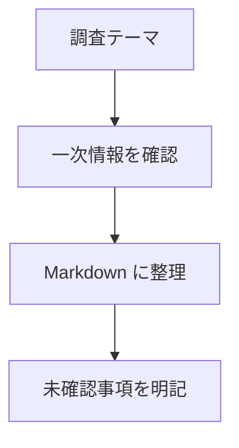

# Knowledge Research

## Overview

Use this skill to turn technical research into clear Markdown notes under this repository's source directories. Treat `AGENTS.md` as the repository-level source of truth for folder policy and writing rules.

## Workflow

1. Identify the topic and destination:
   - AI, LLMs, OpenAI, Apple Foundation Models: `ai/`
   - iOS, macOS, visionOS, Swift, SwiftUI, Apple Developer: `apple/`
   - Android, Kotlin, Jetpack, Google Play, Android Studio: `android/`
   - Local preview or generation helpers: `scripts/`
2. Check whether a related note already exists with `rg --files` and targeted `rg` searches.
3. For current technical facts, verify with primary sources when possible. Official docs, release notes, standards, source code, and vendor announcements are preferred.
4. Write the note as a readable synthesis, not just a collection of links.
5. Add a Mermaid diagram when it makes relationships, flows, states, architecture, or comparisons easier to understand.
6. Preserve uncertainty. Mark stale, conflicting, inferred, or untested information explicitly.
7. Do not manually edit `public/`; it is generated output.

## Note Shape

Prefer this structure unless an existing nearby note uses a clearer pattern:

```md
# Title

- 調査日: YYYY-MM-DD
- 対象: Product, OS, SDK, library, API, or version
- 状態: 調査中 / 検証済み / 要更新

## 要約

## 背景

## 分かったこと

## 実装・利用メモ

## 注意点

## 未確認事項

## 参考
```

## Writing Rules

- Use Japanese as the main language, with English terms where they help searchability.
- Keep filenames lowercase with hyphens, for example `ai/openai-responses-api-notes.md`.
- Include dates for unstable facts such as API behavior, pricing, OS support, model availability, and SDK requirements.
- Separate observed behavior, official claims, and inference.
- When updating an existing note, keep useful historical context instead of silently erasing it.

## Mermaid Diagrams

- Use Mermaid only when it clarifies the note; do not force diagrams into simple summaries.
- Prefer common diagram types:
  - `flowchart TD` for process flow and decision paths.
  - `sequenceDiagram` for API or component interactions.
  - `stateDiagram-v2` for lifecycle and UI state transitions.
  - `classDiagram` or `erDiagram` for model relationships.
- Keep node labels concise and Japanese-readable.
- Put diagrams near the explanation they support.
- Use fenced code blocks:

````md

````

## Jekyll / Just the Docs

- Use Just the Docs as the Jekyll theme for this repository.
- Treat `public/` as generated output; source Markdown stays in directories such as `ai/`, `apple/`, and `android/`.
- Keep the Just the Docs navigation hierarchy aligned with the source directory hierarchy.
- Category `index.md` pages such as `ai/index.md`, `apple/index.md`, and `android/index.md` should be parent pages with `has_children: true`.
- Child notes should appear under their directory's index page in the left navigation. For plain Markdown without front matter, keep `_plugins/plain_markdown_pages.rb` assigning the correct `parent` automatically.
- When creating or updating Jekyll config, include Mermaid support through Just the Docs:

```yml
theme: just-the-docs

mermaid:
  version: "10.9.1"
```

- If a project uses a local Mermaid bundle instead of a CDN, use Just the Docs' `mermaid.path` option and keep the asset under a source-controlled assets directory, not `public/`.
- If changing theme or Mermaid behavior, verify with a local Jekyll build or preview when dependencies are available.

## Before Finishing

- Run `git status --short`.
- Mention any facts that could not be verified.
- If source links were used, include them in the note or final response as appropriate.
