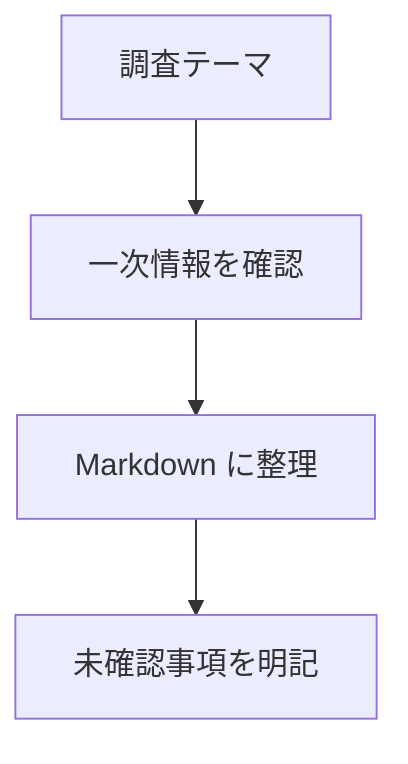

# Knowledge Repository Guide

このリポジトリは、技術や知識を調査した結果を、あとから読み返しやすい Markdown として整理するための知識ベースです。

## 基本方針

- 調査メモは、日本語で読みやすく、必要に応じて英語の原語を併記する。
- 単なるリンク集ではなく、「何が分かったか」「どう使えるか」「注意点は何か」が分かる形にまとめる。
- 公式ドキュメント、一次情報、実装・検証結果を優先する。推測や未確認事項は明示する。
- 技術情報は変わりやすいため、日付を残す。仕様、価格、対応環境、API、OS機能、ライブラリ挙動などは最新性を確認する。
- 既存ページを更新するときは、古い記述を無言で消さず、必要に応じて「更新」「非推奨」「未検証」として扱う。

## ディレクトリ構成

- `ai/`: AIに関する調査。OpenAI、LLM、生成AI、Apple Foundation Models など。
- `apple/`: iOS、macOS、visionOS、Swift、SwiftUI、Apple Developer 関連。
- `android/`: Android、Kotlin、Jetpack、Google Play、Android Studio 関連。
- `idea/`: アプリ・サービス・プロダクト・ツールなどのアイディアメモ。
- `scripts/`: Jekyll ローカルサーバ、Markdown 変換、補助処理などのスクリプト。
- `_plugins/`: Jekyll の補助 plugin。front matter なしの調査 Markdown を HTML ページとして扱う処理など。
- `public/`: Jekyll で生成した HTML 出力先。生成物として扱い、Git には含めない。

## Markdown 作成ルール

- 1ページ1テーマを基本にする。複数テーマが混ざる場合は、分割を検討する。
- `idea/` では 1ページ1アイディアを基本にし、背景、想定ユーザー、価値仮説、MVP、検証方法、未決事項を整理する。
- ファイル名は英小文字、数字、ハイフンを使う。
  - 例: `apple/foundation-models-framework.md`
  - 例: `ai/openai-responses-api-notes.md`
- ページ冒頭に、分かる範囲で調査日と対象バージョンを置く。
- 見出しは短く具体的にする。読者が検索や流し読みをしやすい構成を優先する。
- コード例は、実行環境、前提条件、確認した挙動を添える。
- 関係性、処理フロー、状態遷移、アーキテクチャ、比較構造が文章だけでは追いにくい場合は、Mermaid 図を使ってよい。
- 出典リンクは本文末尾か関連セクションにまとめ、参照した日付を必要に応じて書く。

推奨フォーマット:

```md
# タイトル

- 調査日: YYYY-MM-DD
- 対象: 製品名、OS、SDK、ライブラリ、API など
- 状態: 調査中 / 検証済み / 要更新

## 要約

## 背景

## 分かったこと

## 実装・利用メモ

## 注意点

## 未確認事項

## 参考
```

## 調査時の注意

- 「最新」「現在」「対応している」などの記述は、可能な限り調査日を添える。
- Apple、Android、AI API、クラウドサービスなど、仕様変更があり得る情報は一次情報を確認する。
- AI に関する情報は、モデル名、API 名、公開日、ドキュメントの対象バージョンを混同しない。
- Apple Foundation Models は `ai/` に置いてよい。ただし Swift や OS 実装の詳細が中心なら `apple/` への配置も検討する。
- Android と Apple の比較記事は、主題が片方に寄るなら該当ディレクトリへ、横断的な AI 技術比較なら `ai/` へ置く。

## Jekyll / 生成物

- Jekyll テーマは Just the Docs を前提にする。
- Jekyll の左メニューは、ソースディレクトリと同じ階層構造を維持する。
- `ai/index.md`、`apple/index.md`、`android/index.md`、`idea/index.md` のようなカテゴリ目次は親ページとして扱い、配下の記事はその子として表示する。
- Mermaid は Just the Docs の Mermaid support を使い、Markdown では fenced code block の `mermaid` を使う。
- `_config.yml` を作成・更新するときは、少なくとも `theme: just-the-docs` と `mermaid.version` を設定する。
- `ai/`、`apple/`、`android/`、`idea/` 配下の Markdown は、front matter がなくても `_plugins/plain_markdown_pages.rb` で HTML 化する。
- `public/` は生成物置き場として扱い、直接編集しない。
- Markdown の正本は `ai/`、`apple/`、`android/`、`idea/` などのソースディレクトリに置く。
- `scripts/` のスクリプトは、ローカルプレビューや HTML 生成を再現できるように、引数や前提条件を分かりやすく保つ。
- 生成処理を追加した場合は、このガイドか関連ドキュメントに実行方法を残す。

最小設定例:

```yml
theme: just-the-docs

mermaid:
  version: "10.9.1"
```

Mermaid 例:

````md

````

## Codex への作業指示

- 調査依頼では、必要に応じて Web を確認し、公式ドキュメントや一次情報を優先して参照する。
- 調査結果を Markdown 化するときは、結論、使いどころ、制約、未確認事項が分かるように整理する。
- 図示が有効な調査では Mermaid を提案し、必要なら本文に追加する。
- ファイル追加時は、上記ディレクトリ構成と命名規則に合わせる。
- 生成物である `public/` を手編集しない。
- 変更後は `git status --short` を確認し、意図しないファイルが含まれていないか見る。
