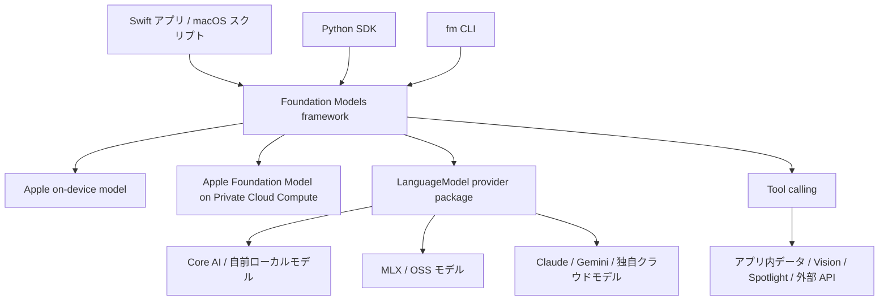

# Apple Foundation Models framework

- 調査日: 2026-06-11
- 対象: Apple Foundation Models framework、Apple Intelligence、Private Cloud Compute、fm CLI、Foundation Models SDK for Python
- 状態: 調査中

## 要約

Foundation Models framework は、Apple Intelligence を支える Apple Foundation Models をアプリから使うためのフレームワークである。WWDC25 時点では、Swift からオンデバイス LLM を呼び出すための API として導入され、構造化出力、ストリーミング、ツール呼び出し、状態を持つセッションが主な機能だった。WWDC26 では対象が広がり、Private Cloud Compute のサーバーモデル、外部・自前・OSS モデルを扱う `LanguageModel` protocol、fm CLI、Python SDK が追加されている。

重要な整理は次の通り。

- Apple のオンデバイスモデルは、データが端末内に留まり、オフラインでも動き、API キーやトークン課金はない。
- Private Cloud Compute は Apple のサーバーモデルを使う経路で、iCloud / OS と統合され、開発者が API キーや認証を扱わない設計になっている。ただしインターネット接続、対応デバイス、利用上限、アプリ規模などの条件がある。
- 外部モデル連携は `LanguageModel` / `LanguageModelExecutor` を実装した Swift package として提供する方向。クラウドモデルの場合、認証は provider 側の責務で、Apple は token provider / sign-in flow、Keychain、App Attest の利用を推奨している。
- Foundation Models SDK for Python は、macOS 上で Swift の Foundation Models framework を裏側で呼び、評価・プロトタイピング・スクリプト用途に使うもの。汎用のリモート API ではない。

## 背景

Apple は Apple Intelligence の中で、オンデバイスモデルと Private Cloud Compute 上のサーバーモデルを使い分けている。Foundation Models framework は、このうち Apple Foundation Models の一部を開発者が扱えるようにする入り口である。

WWDC25 の導入では、Apple はオンデバイス LLM をアプリから直接使える Swift API として紹介していた。モデルは Apple Intelligence が有効なデバイスで動作し、アプリサイズを増やさず、データが端末内に留まり、オフラインでも使える点が強調されていた。一方で、端末スケールのモデルなので、世界知識や高度な推論より、要約、抽出、分類、アプリ内データに基づく生成に向く。

WWDC26 では、Apple Developer の AI & Machine Learning ページ上で、Foundation Models framework は「on device and in Private Cloud Compute」だけでなく、`Language Model` protocol に準拠する任意の provider を扱える Swift API と説明されている。

## 全体像

Foundation Models framework は単に「プロンプトを投げて文字列を返す」API ではなく、セッション、構造化出力、ツール、モデル切り替えをまとめて扱う抽象レイヤーになっている。

## Local と Cloud

| 経路 | 実行場所 | 主な用途 | 認証 | 制約 |
| --- | --- | --- | --- | --- |
| Apple on-device model | ユーザーの Apple Intelligence 対応デバイス | 要約、抽出、分類、短い生成、アプリ内文脈を使う処理 | 開発者側の API キー不要。OS の Apple Intelligence availability を確認する | 対応デバイス・地域・Apple Intelligence 設定に依存。端末スケールなので高度な推論や大きな文脈は苦手 |
| Apple Foundation Model on Private Cloud Compute | Apple の Private Cloud Compute | 大きい文脈、複雑な推論、多数の tool call、大きい出力 | OS / iCloud と統合。Apple の説明では開発者が API キーや認証処理を持たない | インターネット接続が必要。ユーザーごとの daily limit がある。Apple Intelligence 対応デバイスが必要。アプリの first-time App Store downloads が 200 万未満などの条件が示されている |
| 外部 provider model | provider による。ローカル、PCC 以外のクラウド、OSS など | Claude / Gemini / 自前モデル / MLX / Core AI などを同じセッション API で扱う | provider package 側で設計する。token provider、sign-in flow、Keychain、App Attest が推奨されている | provider の料金、プライバシー、利用規約、認証方式、ネットワーク要件に依存 |

2026-06-11 時点で、PCC の Apple Foundation Model は「Apple が提供するサーバーモデルを、アプリから API キーなしで使う」方向に見える。ただし、これは一般的な REST API として外部サーバーから叩くものではなく、Foundation Models framework を通じた Apple platform アプリ向けの機能として理解するのが安全である。

## Swift API の主要概念

### LanguageModelSession

`LanguageModelSession` は Foundation Models framework の中心で、モデルとのやり取りを保持する状態付きセッションである。セッションには instructions、prompt、tool call、tool output、model response などが transcript として蓄積される。

注意点として、instructions は開発者が与える静的な方針、prompt はユーザー入力として扱う。Apple は、prompt injection 対策として、信頼できないユーザー入力を instructions に埋め込まないことを推奨している。

### Guided generation

`@Generable` と `@Guide` を使い、モデル出力を Swift の型として生成させる仕組み。JSON を文字列として吐かせて後でパースするのではなく、型定義と constrained decoding により構造的に正しい出力を得ることを狙う。

使いどころ:

- 検索候補、タグ、分類結果などの配列を返す
- UI に直接マッピングできる structured data を返す
- tool call の引数を型安全に生成する

### Snapshot streaming

通常の token delta ではなく、部分的に生成された構造体の snapshot を流す。SwiftUI で構造化されたレスポンスを段階的に表示しやすい。

### Tool calling

モデルが必要に応じてアプリ側のコードを呼び出す仕組み。Tool は名前、説明、引数型、`call` 実装を持つ。引数型にも `@Generable` を使えるため、不正な tool 名や引数が生成されにくい。

Tool の用途:

- アプリ内データを検索する
- MapKit、WeatherKit、Vision、Core Spotlight などの OS API を呼ぶ
- 外部 API を呼ぶ
- ユーザーの許可やアプリの権限の範囲内でアクションを実行する

ただし、tool はモデルに能力と権限を与える境界でもある。外部 API やユーザーデータを扱う tool では、ユーザー許可、監査ログ、入力検証、実行前確認を別途設計する必要がある。

## 外部連携

WWDC26 で重要なのは、Foundation Models framework が Apple のモデル専用 API から、複数モデルを扱う抽象レイヤーに広がっている点である。

### LanguageModel protocol

外部 provider は Swift package として `LanguageModel` / `LanguageModelExecutor` を実装することで、Foundation Models framework に統合できる。アプリ開発者は、Apple on-device model、PCC model、Core AI、MLX、Claude、Gemini、自前クラウドモデルを、同じ `LanguageModelSession` 経由で扱える方向になっている。

provider 実装で考えること:

- モデルの capability 宣言
- transcript を provider の推論エンジン形式へ変換
- context size や generation options の扱い
- streaming response、metadata、custom segment
- KV cache などのセッション状態
- エラーを `LanguageModelError` または独自エラーにマッピング

### 外部から使う場合の認証

ここは利用形態ごとに分ける必要がある。

#### Apple on-device model

アプリや Python SDK が同じ Mac / iPhone / iPad / Vision Pro 上の Apple Foundation Model を使う場合、開発者が API キーを発行してモデルにアクセスする形ではない。アプリは Foundation Models framework の availability API を確認し、利用可能なら OS の機能としてモデルを呼ぶ。

外部サーバーから Apple on-device model を直接呼ぶための公開 API としては扱われていない。サーバーから使いたい場合は、少なくとも公式情報上は「Apple の on-device model を外部 API として利用する」設計ではなく、ユーザーの Apple device 上で動くアプリ・スクリプト・補助プロセスから呼ぶものと考える。

#### Apple PCC model

PCC はクラウドだが、Apple は OS / iCloud と統合されているため、開発者が API key や認証を扱わなくてよいと説明している。ユーザーは Apple Intelligence 対応デバイスを持ち、PCC の利用条件と daily limit の範囲で利用する。iCloud+ により上限が増える説明もある。

つまり、アプリ開発者視点では「Apple のサーバー LLM 用 API key をアプリに入れる」設計ではない。availability、usage limit、ネットワーク接続、fallback UI を扱うのが主な実装責務になる。

#### Third-party / cloud provider

Claude、Gemini、自社クラウドなどを Foundation Models framework の provider package として出す場合、認証は provider 側の設計になる。Apple の WWDC26 セッションでは、initializer に API key 文字列を直接渡させるのではなく、token provider や sign-in flow を提供し、取得した token は Keychain に保存すること、クラウド型 provider では App Attest による device attestation を検討することが推奨されている。

この場合の現実的な設計は次のようになる。

- ユーザーが provider アカウントにサインインする
- アプリまたは provider SDK が短命 token を取得する
- token は Keychain に保存する
- サーバー側では App Attest などで改ざんアプリや不正 traffic を抑制する
- API key をアプリ bundle に埋め込まない

## fm CLI

WWDC26 では、macOS 27 に `fm` コマンドが導入されると説明されている。`fm respond` でプロンプトに応答し、`fm chat` で対話し、`fm schema object` で構造化出力の schema を作れる。

`fm` は既定では macOS 上のオンデバイスモデルを使い、オプションで PCC model や image prompt を指定できる。ファイル整理のような shell automation に組み込み、自然言語判断をスクリプトの一部に入れる例が示されている。

位置づけとしては、サーバー API の CLI client ではなく、Mac 上の Foundation Models をターミナルから呼び出す developer / automation tool と見るのがよい。

## Foundation Models SDK for Python

Foundation Models SDK for Python は、Python から Apple の Foundation Models framework を使うための SDK である。GitHub の Apple 公式 repository では `apple-fm-sdk` として公開され、`pip install apple-fm-sdk` でインストールする。

要件:

- macOS 26.0+
- Xcode 26.0+ と Apple SDKs agreement への同意
- Python 3.10+
- Apple Intelligence が有効な対応 Mac

できること:

- `SystemLanguageModel` の availability 確認
- `LanguageModelSession` で応答生成
- streaming
- guided generation
- Python decorator による型付き structured output
- tool / function calling
- Swift app から export した transcript の評価
- Pandas、matplotlib、Jupyter など Python ecosystem を使った評価パイプライン

注意点:

- Python SDK は、macOS 上で Swift の Foundation Models framework を裏側で呼ぶための Python binding である。
- Linux サーバーや CI から Apple Foundation Models を直接呼ぶ SDK としては使えない。
- 主な用途は、Swift 実装前のプロトタイピング、prompt 評価、batch inference、ローカル automation である。

## 実装・利用メモ

### 使い分け

- 端末内の短い文脈で足りる: on-device model
- 大きな文脈、推論、長い tool chain が必要: PCC model を検討
- 自社の既存 LLM 基盤、Claude / Gemini、OSS model を使いたい: `LanguageModel` provider package
- prompt 評価や notebook 分析をしたい: Python SDK
- Mac のローカル automation に組み込みたい: `fm` CLI

### fallback 設計

Foundation Models は availability に依存する。実装では、次を UI / UX として設計する。

- Apple Intelligence 非対応デバイス
- 対応地域・言語でない
- ユーザーが Apple Intelligence を無効化している
- guardrail violation
- unsupported language
- context window exceeded
- PCC の daily limit 到達
- ネットワークなし

### セキュリティ境界

「on-device だから安全」と短絡しない。モデルに渡す context、tool がアクセスできるデータ、tool が実行できる action、transcript の保存、ログ出力、ユーザー確認が別のリスクになる。

特に外部 API tool やファイル操作 tool では、モデルの提案をそのまま実行せず、権限境界と確認 UX を設ける。

## 気になる点

### 外部 API として提供されるのか

2026-06-11 時点で確認した情報では、Apple Foundation Models は OpenAI API のような汎用 HTTP API として外部サーバーから呼ぶものではなく、Apple platform 上の Foundation Models framework、macOS の fm CLI、macOS の Python SDK から使うものとして説明されている。

外部サービスから Apple model を使いたい場合、公式に見える選択肢は次のどちらかである。

- ユーザーの Apple device 上で動くアプリ・スクリプトとして処理する
- 自社や third-party provider の model を `LanguageModel` provider として統合する

### PCC の利用条件

Apple Developer のページと WWDC26 transcript では、PCC の Apple Foundation Model について、2M first-time App Store downloads 未満のアプリ、申請、daily limit、iCloud+ による上限増加が述べられている。ただし、詳細な審査条件、地域、料金、商用利用上の細則は、今後の公式ドキュメントで確認が必要である。

### Python SDK のモデル範囲

GitHub README と documentation では、Python SDK は主に macOS 上の on-device foundation model への access として説明されている。一方、WWDC26 の fm CLI セッションでは、CLI は PCC model option を持つと説明されている。Python SDK が PCC や provider model をどの範囲まで扱うかは、実際の SDK API reference とリリースごとの挙動で確認する必要がある。

## 未確認事項

- PCC model の正式な申請手順、地域制限、審査条件、usage limit の具体値
- macOS 27 / iOS 27 の正式リリース時点での API 名、availability、料金条件
- `LanguageModel` provider package の実装詳細と、Claude / Gemini 公式 package の配布形態
- Python SDK が PCC / third-party provider / image prompt をどこまで扱えるか
- App Store Review Guidelines 上、外部 provider や tool calling を使う場合に追加で必要な開示

## 参考

- Apple Developer, [AI & Machine Learning](https://developer.apple.com/machine-learning/), 参照日: 2026-06-11
- Apple Developer, [What’s new in AI & machine learning](https://developer.apple.com/machine-learning/whats-new/), 参照日: 2026-06-11
- Apple Developer, [Meet the Foundation Models framework - WWDC25](https://developer.apple.com/videos/play/wwdc2025/286/), 参照日: 2026-06-11
- Apple Developer, [What’s new in the Foundation Models framework - WWDC26](https://developer.apple.com/videos/play/wwdc2026/241/), 参照日: 2026-06-11
- Apple Developer, [Build with the new Apple Foundation Model on Private Cloud Compute - WWDC26](https://developer.apple.com/videos/play/wwdc2026/319/), 参照日: 2026-06-11
- Apple Developer, [Bring an LLM provider to the Foundation Models framework - WWDC26](https://developer.apple.com/videos/play/wwdc2026/339/), 参照日: 2026-06-11
- Apple Developer, [Build AI-powered scripts with the fm CLI and Python SDK - WWDC26](https://developer.apple.com/videos/play/wwdc2026/334/), 参照日: 2026-06-11
- Apple, [python-apple-fm-sdk](https://github.com/apple/python-apple-fm-sdk), 参照日: 2026-06-11
- Apple, [Foundation Models SDK for Python Documentation](https://apple.github.io/python-apple-fm-sdk/), 参照日: 2026-06-11
