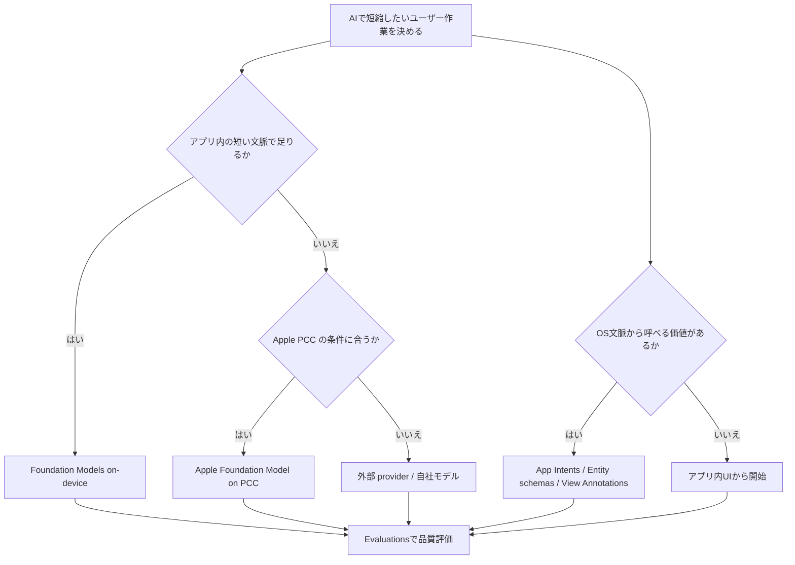
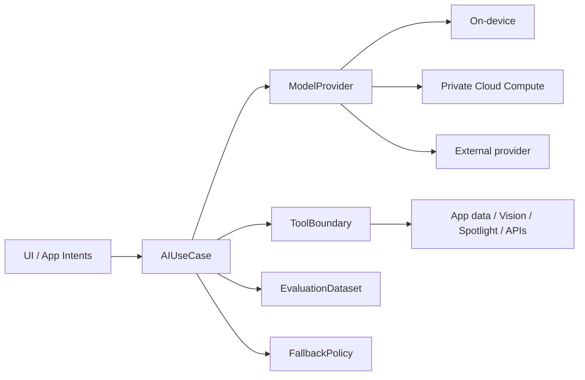

# WWDC26 Apple Intelligence / Machine Learning から見る AI プロダクト導入

- 調査日: 2026-06-27
- 対象: WWDC26 Apple Intelligence guide、WWDC26 Machine Learning guide
- 状態: 調査中

## 要約

Apple の WWDC26 ガイドからプロダクト導入の観点で学ぶべきことは、個別の AI API よりも「AI をアプリ体験、OS 文脈、評価プロセスへどう接続するか」である。

学習優先度は次の順が実用的。

1. Foundation Models framework
2. App Intents framework
3. Evaluations framework
4. Visual Intelligence / Vision / Image Playground
5. Core AI
6. MLX

特に重要なのは、Foundation Models framework、App Intents、Evaluations の 3 つである。Foundation Models framework はアプリ内 AI 機能の実装基盤、App Intents は Siri / Spotlight / Shortcuts / 画面文脈へ機能を公開する接続面、Evaluations は AI 機能をプロダクト品質として扱うための検証基盤になる。

## 背景

Apple は WWDC26 の Apple Intelligence guide と Machine Learning guide で、AI 機能を次の方向へ広げている。

- Apple Intelligence のオンデバイスモデルをアプリから直接使う。
- Apple Foundation Models だけでなく、Claude、Gemini、その他 provider を `Language Model` protocol 経由で扱う。
- テキストだけでなく画像を含む multimodal prompt を扱う。
- OCR や barcode reader など Vision framework tools をモデルから呼べるようにする。
- Dynamic Profiles で、継続セッション中にモデル、ツール、指示を切り替える。
- App Intents schemas で、アプリのデータと操作を Siri / Spotlight / Shortcuts / Apple Intelligence へ接続する。
- Evaluations framework で、プロンプトや agentic な AI 機能を開発プロセス内で評価する。

これは「アプリに AI チャットを足す」だけの話ではない。Apple platform 上では、AI 導入の主戦場が、アプリ内 UI、OS の個人文脈、オンデバイス処理、プライバシー、評価、失敗時の fallback 設計まで広がっている。

## 学習順

### 1. Foundation Models framework

最初に学ぶべき中心技術。Apple のガイドでは、Apple Intelligence を支えるオンデバイスモデルにアクセスできる Swift API として説明されている。WWDC26 では、Apple Foundation Models に加えて、Claude、Gemini、その他 `Language Model` protocol に準拠する provider も扱える方向が示されている。

プロダクト導入で見るべき点:

- オンデバイスモデルで十分なユースケースは何か。
- Private Cloud Compute や外部クラウドモデルへ切り替える基準は何か。
- `Language Model` protocol を前提に、モデル依存をアプリの中核ロジックから分離できるか。
- multimodal prompt により、画像や画面上の情報を機能価値に変換できるか。
- Dynamic Profiles で、同じセッション内でもユーザー状況に応じてモデル、ツール、指示を切り替えられるか。

プロダクトでは、まず「AI が生成する文章」ではなく「ユーザーのどの作業を短く、自然に、確実にするか」を決める。そのうえで、Foundation Models framework を AI 実行基盤として捉える。

### 2. App Intents framework

次に学ぶべきは App Intents。Apple のガイドでは、アプリを Apple Intelligence や Siri AI につなぐ方法として説明されている。

プロダクト導入で見るべき点:

- アプリ内のデータを Entity schemas として定義できるか。
- ユーザーが自然言語で実行したい操作を Intent schemas として定義できるか。
- Spotlight semantic index へアプリのコンテンツを寄与させ、個人文脈から発見できるようにするか。
- View Annotations API で、画面上の UI とアプリ内 entity を対応づけられるか。
- App Intents Testing framework で、Siri、Shortcuts、Spotlight 経由の統合を検証できるか。

App Intents は、AI 機能を「アプリ内のボタン」から「OS 全体の自然言語インターフェース」へ広げるための技術である。AI 導入の効果を大きくするには、単独の生成機能よりも、アプリのデータモデルと操作を AI が理解できる形にすることが重要になる。

### 3. Evaluations framework

AI をプロダクトに入れるなら、Evaluations は後回しにしない。Apple は、AI 機能が動的条件下で正しく振る舞うかを、unit test だけではなく Evaluations で検証する流れを示している。

プロダクト導入で見るべき点:

- プロンプト変更が出力品質を悪化させていないか。
- tool call の選択や引数が期待通りか。
- agentic な処理が途中で破綻しないか。
- ユーザー入力、言語、端末状態、ネットワーク状態、モデル差分で挙動が崩れないか。
- リリース判定に使える評価データセットを継続的に育てられるか。

AI 機能は「作ったら終わり」ではなく、モデル、OS、プロンプト、データ、利用者の入力で挙動が変わる。Evaluations は、AI 機能をプロダクト品質として扱うための土台になる。

### 4. Visual Intelligence / Vision / Image Playground

画像、カメラ、写真、画面内容、コンテンツ探索がプロダクト価値に関係する場合に学ぶ。Apple Intelligence guide では、Visual Intelligence は content discovery、entity 定義、画像処理、複数 result type、速度と relevance、intent による直接 action という観点で説明されている。

プロダクト導入で見るべき点:

- 画像や画面上のものを、ユーザーの次の action につなげられるか。
- OCR、barcode reader、画像理解を、Foundation Models の tool として使えるか。
- Image Playground API による画像生成が、本当にユーザー価値を増やすか。
- 生成画像が主機能なのか、補助機能なのかを明確にできるか。

### 5. Core AI

自社モデルや OSS モデルをオンデバイスで動かしたい場合に学ぶ。Apple の Machine Learning guide では、Core AI は Apple Silicon 向けに、モデルの load、specialize、run をオンデバイスで行う新 framework として説明されている。

プロダクト導入で見るべき点:

- サーバー依存や token cost を避ける必要があるか。
- ユーザーデータを端末外へ出せない要件があるか。
- 自社モデルを Apple platform 全体で動かす価値があるか。
- モデルサイズ、メモリ、起動時間、バッテリー、端末差分を受け止められるか。

Core AI は強力だが、最初の AI 導入で必ず必要になるとは限らない。まず Foundation Models framework で価値検証し、独自モデルが必要になった段階で検討するのが現実的。

### 6. MLX

MLX は、Apple silicon 上での実験、学習、fine-tuning、研究開発寄りの技術。WWDC26 では Metal 4、GPU Neural Accelerators、Thunderbolt 経由の RDMA による複数 Mac training などが示されている。

プロダクト導入で見るべき点:

- モデルを自社で調整・実験する必要があるか。
- Mac 上のローカル開発環境で agentic AI や LLM を検証したいか。
- 研究開発とアプリ組み込みの境界をどう分けるか。

プロダクトの初期導入では優先度は低め。ただし、将来的に独自モデルや fine-tuning を持つなら、R&D 基盤として重要になる。

## 導入判断

最初の検討では、モデル名よりも次を先に決める。

- ユーザーが AI に任せたい作業は何か。
- 入力はテキストだけか、画像や画面文脈も必要か。
- 出力は文章か、構造化データか、アプリ内 action か。
- 失敗したときにユーザーが安全に戻れるか。
- その機能をどう評価し、どう改善するか。

## MVP の切り方

### まず狙うべき MVP

最初の MVP は、次の条件を満たすものがよい。

- アプリ内の既存データだけで価値が出る。
- 出力が UI に収まる構造化データである。
- 失敗してもユーザーのデータを破壊しない。
- 手動操作に戻れる。
- 評価データを 20 から 50 ケース程度作れる。

例:

- メモや記録の要約。
- 入力内容からタグ候補を出す。
- ユーザーの過去データから次の操作候補を出す。
- 画像からテキストやバーコードを読み取り、フォーム入力を補助する。
- アプリ内コンテンツを自然言語で検索する。

### いきなり避けたい MVP

初期導入では、次のような機能はリスクが高い。

- AI がユーザーデータを直接変更・削除する。
- 外部 API や決済など不可逆な action を自動実行する。
- 長い agentic workflow を一度に任せる。
- 正解判定が曖昧で、評価データを作れない。
- 端末、地域、言語、Apple Intelligence availability による fallback がない。

## アーキテクチャの考え方

AI 導入では、モデル呼び出しを UI に直書きしない。最低限、次の境界を分ける。

- `AIUseCase`: ユーザー価値単位の処理。要約、分類、提案など。
- `ModelProvider`: on-device、PCC、外部 provider、自社モデルの切り替え。
- `ToolBoundary`: AI が呼べるアプリ内機能や外部 API。
- `EvaluationDataset`: 期待入力、期待出力、許容条件、失敗例。
- `FallbackPolicy`: availability、guardrail、ネットワーク、limit 到達時の挙動。

この形にしておくと、最初は on-device model で始め、必要に応じて PCC や外部 provider へ切り替えやすい。評価も use case 単位で蓄積できる。

## 注意点

### Availability を前提にしない

Apple のガイドは、機能やサービスが地域、言語、法律・規制により利用できない場合があると明記している。Apple Intelligence、PCC、Image Playground、Visual Intelligence などは、対応デバイス、OS、地域、言語、ユーザー設定、利用上限に依存する。

プロダクトでは、AI が使えない状態を正常系として扱う。

### Small Business / 2M downloads 条件

Apple Intelligence guide では、App Store Small Business Program に enrolled しており、first-time App Store downloads が 200 万未満のアプリは、Private Cloud Compute 上の次世代 Apple Foundation Models を cloud API cost なしで利用できると説明されている。Machine Learning guide では、200 万未満の first-time App Store downloads という条件が説明されている。

ただし、詳細な利用条件、申請手順、上限、地域、商用条件は公式ドキュメントで都度確認が必要。

### AI の権限境界を設計する

AI が tool を呼べるようになるほど、便利さとリスクは同時に増える。特に次は明示的に設計する。

- tool が読めるデータの範囲。
- tool が変更できるデータの範囲。
- 実行前にユーザー確認が必要な action。
- transcript やログに残してよい情報。
- prompt injection や不正な入力への対策。
- 外部 provider 利用時の認証、課金、プライバシー。

### 評価なしにリリースしない

AI 機能はデモでよく見えても、実ユーザーの入力では簡単に崩れる。最低限、次を評価する。

- 成功例だけでなく失敗例を含む。
- 言語、表記ゆれ、短文、長文、画像品質の差を含む。
- tool call の選択と引数を確認する。
- fallback が期待通り出るか確認する。
- プロンプト変更前後で品質が悪化していないか見る。

## 学習ロードマップ

### 1 週目: 価値仮説と Foundation Models

- 既存プロダクト内で、AI が短縮できる作業を 3 つ挙げる。
- そのうち、データ破壊がなく、評価しやすい 1 つを MVP にする。
- Foundation Models framework の session、structured output、tool calling、multimodal prompt を読む。
- on-device / PCC / external provider の使い分けを整理する。

### 2 週目: App Intents と OS 文脈

- アプリ内の主要 entity を 3 つ選ぶ。
- ユーザーが自然言語で実行したい intent を 3 つ定義する。
- Spotlight semantic index や View Annotations が使える画面を探す。
- AI 機能をアプリ内 UI だけでなく、Siri / Spotlight / Shortcuts から呼ぶ価値があるか判断する。

### 3 週目: Evaluations

- MVP の評価データを 20 から 50 ケース作る。
- 期待出力、許容条件、禁止出力、fallback 条件を定義する。
- prompt、tool、provider を変えたときに評価を回す。
- リリース基準を「主観」ではなく評価結果で決める。

### 4 週目以降: 拡張判断

- 画像やカメラが価値に直結するなら Visual Intelligence / Vision / Image Playground を検討する。
- 自社モデルやサーバーコスト削減が重要なら Core AI を検討する。
- 独自モデルの実験や fine-tuning が必要なら MLX を検討する。

## 未確認事項

- 2026-06-27 時点では、WWDC26 ガイド本文を中心に整理している。各 framework の API 詳細、availability、申請手順、利用上限は個別ドキュメントで確認が必要。
- Private Cloud Compute 上の Apple Foundation Models の具体的な審査・申請・上限・地域条件は、今後の公式更新で変わる可能性がある。
- `Language Model` provider の実装詳細や外部モデル provider の提供状況は、実際の SDK / sample / documentation で確認が必要。

## 参考

- [WWDC26 Apple Intelligence guide - Apple Developer](https://developer.apple.com/wwdc26/guides/apple-intelligence/)（参照日: 2026-06-27）
- [WWDC26 Machine Learning guide - Apple Developer](https://developer.apple.com/wwdc26/guides/machine-learning/)（参照日: 2026-06-27）
- [Apple Foundation Models framework](apple-foundation-models-framework.html)
