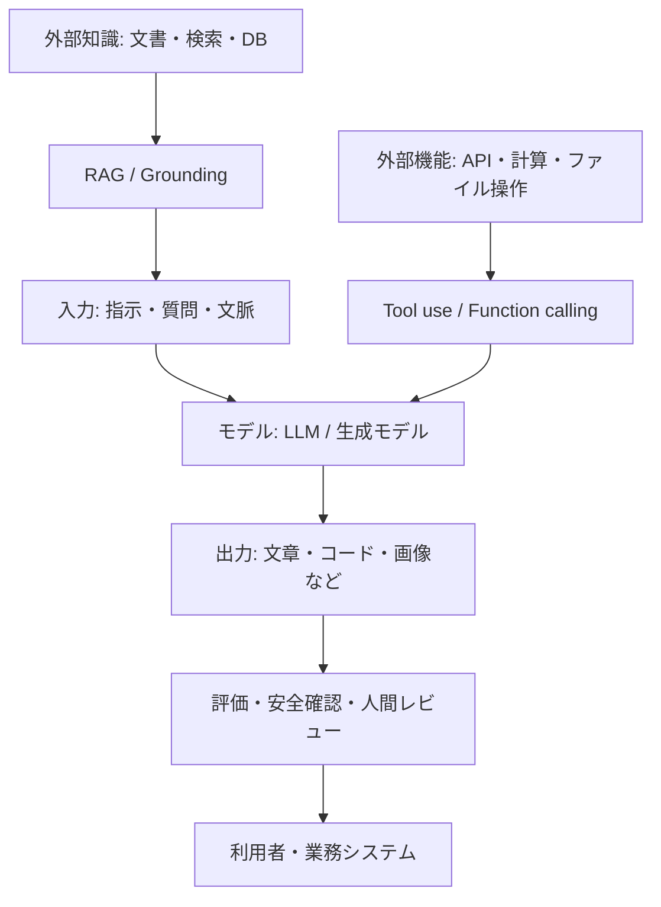
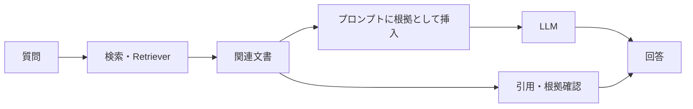

# 生成 AI と LLM

- 調査日: 2026-06-11
- 対象: 生成 AI、LLM、基盤モデル、RAG、プロンプト設計、評価、リスク管理
- 状態: 調査中

## 要約

生成 AI は、入力データの構造や特徴を学び、テキスト、画像、音声、動画、コードなどの新しいコンテンツを作る AI の総称である。LLM はその中でも、主に自然言語を扱う大規模なモデルで、質問応答、要約、翻訳、分類、文章生成、コード生成、ツール利用などに使われる。

LLM は「知識データベース」そのものではなく、入力された文脈と学習済みのパターンから、もっともありそうな出力を生成するモデルとして理解するとよい。便利な一方で、誤情報、根拠のない断定、プロンプトインジェクション、データ漏えい、著作権・プライバシー・バイアスなどのリスクがある。実務では、プロンプト設計、RAG、ツール利用、構造化出力、評価、監視、人間の確認を組み合わせて使う。

## 全体像

基本の見方は次の通り。

- **生成 AI (Generative AI)**: 既存データのパターンを学び、新しいコンテンツを生成する AI。テキスト生成、画像生成、音声合成、動画生成、コード生成などが含まれる。
- **LLM (Large Language Model)**: 大量の言語データなどで学習された大規模モデル。自然言語の入力を受け取り、文脈に沿った出力を生成する。
- **基盤モデル (Foundation Model)**: 広いデータで大規模に学習され、さまざまな下流タスクに転用できるモデル。LLM は基盤モデルの代表例。
- **マルチモーダルモデル (Multimodal Model)**: テキストだけでなく、画像、音声、動画、ファイルなど複数種類の入力や出力を扱うモデル。
- **AI アプリケーション**: モデル単体ではなく、UI、プロンプト、外部データ、ツール、権限、ログ、評価、人間確認を含む実際の利用システム。

## 何ができるか

LLM の強みは、自然言語をインターフェースにして、曖昧な入力をある程度扱える点にある。

代表的な用途:

- **質問応答**: 与えられた文脈や外部資料に基づいて回答する。
- **要約**: 長い文章、会議メモ、メール、ログなどを短く整理する。
- **分類**: 問い合わせ、レビュー、チケットなどをカテゴリに分ける。
- **抽出**: 文章から名前、日付、金額、判断、TODO などを取り出す。
- **変換**: 文体変更、翻訳、表形式化、JSON 化、コード変換などを行う。
- **生成**: 文章、企画案、説明文、メール、テストケース、コードなどを作る。
- **対話**: 会話の流れを踏まえて、追加質問や提案を行う。
- **ツール操作**: 検索、計算、API 呼び出し、ファイル操作などを組み合わせる。

ただし、「できる」は「常に正しい」ではない。特に事実確認、法務、医療、金融、セキュリティ、個人情報を扱う場面では、根拠確認と人間のレビューが必要になる。

## どう動くか

### トークン化

LLM は文章をそのまま文字列として理解するのではなく、トークンという単位に分けて処理する。トークンは単語と一致するとは限らず、単語の一部、記号、空白、改行なども含まれる。

トークンは主に次の制約に関係する。

- **コンテキスト長**: 一度に入力・出力できる量の上限。
- **料金**: 多くの API では入力トークンと出力トークンに応じて課金される。
- **速度**: 長い入力や長い出力ほど遅くなりやすい。
- **設計**: 大量資料をそのまま入れるより、必要な部分だけ取り出す設計が重要になる。

### 次トークン予測

多くの LLM は、文脈から次に来るトークンを予測する学習を基礎にしている。これにより、文章の続き、質問への回答、コード、説明、要約などを生成できる。

この性質から、LLM は「真実を保存して取り出すデータベース」ではなく、「文脈に対してもっともらしい出力を構成するモデル」と見るほうが安全である。正しそうに見える誤り、つまりハルシネーションが起きる理由もここにある。

### Transformer と Attention

現代の多くの LLM は Transformer 系の構造を使う。Transformer は Attention によって、入力中のどの部分を重視するかを計算する。これにより、長い文脈内の関連語句、前後関係、指示、例を参照しながら出力しやすくなる。

ただし、Attention があるからといって、人間のような理解や意図を持つわけではない。モデルは統計的・表現学習的に文脈を処理している。

### 事前学習と調整

LLM は通常、複数段階を経て使いやすくなる。

- **事前学習 (Pretraining)**: 大量のデータから言語やパターンの基礎を学ぶ。
- **教師ありファインチューニング (Supervised Fine-tuning)**: 指示と望ましい回答の例から、利用者の指示に従いやすくする。
- **選好調整 (Preference Tuning)**: 複数の回答候補への人間やモデルの評価を使い、望ましい回答を出しやすくする。
- **安全性調整**: 危険な出力、ポリシー違反、個人情報漏えいなどを減らすための調整。
- **アプリ側の制御**: プロンプト、RAG、ツール、構造化出力、ガードレール、評価で用途に合わせる。

## プロンプト設計

プロンプトは、モデルへの依頼文だけでなく、役割、背景、制約、出力形式、例、参照資料を含む設計対象である。

よいプロンプトに含めたいもの:

- **目的**: 何を達成したいか。
- **役割**: どの立場・専門性で答えるか。
- **文脈**: 前提、利用者、業務背景、参照情報。
- **制約**: してよいこと、してはいけないこと、確認が必要なこと。
- **出力形式**: Markdown、JSON、表、箇条書き、短文など。
- **判断基準**: 良い回答・悪い回答の基準。
- **例**: 入力と出力の例。少数の例で挙動を寄せることを few-shot learning と呼ぶ。

設計のコツ:

- 曖昧な依頼ほど、モデルは一般論に寄りやすい。
- 長いプロンプトは強力だが、重要な指示が埋もれることがある。
- 変更しやすい業務ルールは、プロンプト内に明示したほうが運用しやすい。
- 本番では、プロンプトもコードと同じようにレビュー、テスト、バージョン管理する。

## RAG と Grounding

RAG (Retrieval-Augmented Generation) は、検索で関連文書を取り出し、その内容を文脈として LLM に渡して回答させる方法である。Grounding は、回答を外部資料や根拠に結びつける考え方で、RAG はその代表的な実装である。

RAG が向いている場面:

- 社内文書、仕様書、FAQ、議事録など、モデルの学習データにない情報を使いたい。
- 最新情報や頻繁に変わる情報を扱いたい。
- 回答に根拠や引用を付けたい。
- ファインチューニングせずに知識を差し替えたい。

RAG の注意点:

- 検索が失敗すると、回答も外れる。
- 取得した文書に答えがない場合、モデルが推測で埋めることがある。
- 長い文書を詰め込みすぎると、重要箇所が埋もれる。
- 引用がある回答でも、引用箇所が主張を本当に支えているか確認が必要。
- 文書の権限管理を間違えると、見せてはいけない情報を回答に含める可能性がある。

## ツール利用とエージェント

LLM は外部ツールと組み合わせると、学習済み知識だけではできないことを実行できる。

例:

- 検索で最新情報を調べる。
- 電卓やコード実行で計算する。
- データベースを検索する。
- カレンダーやメールなどの API を呼ぶ。
- ファイルを読み書きする。
- ワークフローを複数ステップで進める。

Function calling / Tool calling では、モデルが「どのツールを、どの引数で呼ぶべきか」を構造化して返し、アプリケーション側が実際の処理を行う。重要なのは、モデルに直接権限を渡すのではなく、アプリケーション側で許可、検証、監査、ユーザー確認を設計すること。

エージェント的なシステムでは、モデルが計画、実行、観察、修正を繰り返す。便利だが、誤った計画、過剰な操作、権限の使いすぎ、コスト増加が起こりやすいため、操作範囲と停止条件を明確にする。

## 構造化出力

LLM の自然文出力は人間には読みやすいが、システム連携では扱いにくい。分類、抽出、ワークフロー連携では、JSON などの構造化出力を使うと安定しやすい。

構造化出力が向いている例:

- 問い合わせを `billing`、`bug`、`sales` に分類する。
- メールから `date`、`person`、`todo` を抽出する。
- UI に表示するカード情報を決まったスキーマで返す。
- ツール呼び出しの引数を安全に組み立てる。

注意点:

- スキーマにない値をどう扱うか決める。
- 必須項目、型、列挙値、空値を明確にする。
- 生成後にアプリケーション側でも検証する。
- 構造は正しくても、値の事実性は別途確認する。

## ファインチューニングとの使い分け

LLM アプリケーションの改善手段は、ファインチューニングだけではない。

| 手段 | 向いていること | 注意点 |
| --- | --- | --- |
| プロンプト改善 | 指示、形式、判断基準の調整 | 複雑になると保守しにくい |
| RAG | 外部知識、最新情報、社内文書 | 検索品質と権限管理が重要 |
| ツール利用 | 計算、検索、DB、API 操作 | 誤操作を防ぐ設計が必要 |
| 構造化出力 | システム連携、抽出、分類 | スキーマ検証が必要 |
| ファインチューニング | 特定の文体、分類基準、専門的パターンの定着 | データ作成、評価、再学習コストがかかる |

一般には、まずプロンプト、RAG、構造化出力、評価を整え、それでも安定しない反復パターンがある場合にファインチューニングを検討する。

## 評価

LLM は出力が非決定的で、同じ入力でも設定やモデル更新で結果が変わることがある。そのため、実務では「良さそうに見える」だけでなく、評価セットと基準を持つ必要がある。

評価したい観点:

- **正確性**: 事実や計算が正しいか。
- **根拠性**: 回答が参照資料に支えられているか。
- **完全性**: 必要な情報を漏らしていないか。
- **形式遵守**: 指定した JSON、表、文体、長さを守るか。
- **安全性**: 危険な助言、個人情報、差別的表現を避けるか。
- **堅牢性**: 曖昧な入力、長い入力、悪意ある入力でも壊れにくいか。
- **コストと速度**: 料金、レイテンシ、スループットが要件に合うか。

評価方法:

- **ゴールデンデータ**: 入力と期待出力を人間が用意して比較する。
- **ルーブリック評価**: 複数の観点で採点基準を定義する。
- **LLM-as-a-judge**: 別のモデルに採点させる。便利だが、採点モデルの偏りや見落としも評価する。
- **A/B テスト**: モデル、プロンプト、RAG 設定を比較する。
- **回帰テスト**: 変更前にできていたことが壊れていないか確認する。
- **レッドチーミング**: 悪用、脱獄、プロンプトインジェクション、情報漏えいを試す。

## リスク

NIST の生成 AI リスクプロファイルでは、生成 AI 特有または増幅されるリスクとして、誤情報、危険な助言、データプライバシー、情報完全性、知的財産、セキュリティ、バイアス、環境負荷などが整理されている。

実務で特に意識したいリスク:

- **ハルシネーション / Confabulation**: 自信ありげだが誤った内容を出す。
- **根拠の取り違え**: RAG で取得した資料を誤読したり、引用と主張が対応しなかったりする。
- **プロンプトインジェクション**: 文書やユーザー入力に混ぜられた悪意ある指示で、本来の制約を破らせる攻撃。
- **データ漏えい**: 入力、ログ、RAG、ツール出力、会話履歴から機密情報が漏れる。
- **過信**: 利用者が AI の出力を検証せず、専門判断や意思決定に使ってしまう。
- **バイアス**: 学習データや設計の偏りが、出力や判断に反映される。
- **著作権・ライセンス**: 入力データ、生成物、学習済みモデル、外部文書の扱いに法的・契約的な問題が生じる。
- **モデル更新による挙動変化**: API モデルや安全設定の更新で、同じプロンプトの結果が変わる。
- **コスト暴走**: 長い入力、長い出力、エージェントの反復、不要な検索やツール利用で費用が増える。

## 実装・利用メモ

LLM アプリケーションを作るときは、次の順で考えると整理しやすい。

1. **タスクを決める**: 生成、要約、分類、抽出、検索支援、操作代行のどれか。
2. **失敗時の影響を見積もる**: 誤回答が軽微か、金銭・健康・法務・セキュリティに関わるか。
3. **根拠が必要か決める**: 必要なら RAG、引用、検索、DB 参照を設計する。
4. **出力形式を決める**: 人間向け自然文か、システム向け JSON か。
5. **権限を絞る**: ツール利用は読み取り・書き込み・送信・削除などを分ける。
6. **評価セットを作る**: 典型例、境界例、失敗しやすい例、悪意ある例を含める。
7. **ログと監視を設計する**: 品質、エラー、コスト、レイテンシ、安全性の兆候を見る。
8. **人間確認を入れる**: 重要な送信、削除、契約、医療・金融・法務判断は承認を挟む。

### 設計チェックリスト

- モデルに渡す入力に個人情報や機密情報が含まれるか。
- 出力が事実として扱われるのか、草案として扱われるのか。
- 参照資料が古い、矛盾している、権限外である場合にどうするか。
- モデルが「分からない」と言える設計になっているか。
- 出力を保存する場合、保存期間と閲覧権限は適切か。
- モデルや API の変更を検知する評価があるか。
- ユーザーに AI の制約を伝える必要があるか。

## 注意点

- LLM は文脈に敏感で、プロンプトの小さな変更でも挙動が変わることがある。
- 長いコンテキストを使えるモデルでも、すべての情報を均等に正確に使えるとは限らない。
- RAG はハルシネーションを減らす助けになるが、完全には防げない。
- ツール利用は能力を広げる一方で、権限設計と監査が弱いと危険になる。
- 生成 AI のリスクは、モデルだけでなく、利用者、業務フロー、外部データ、UI、運用体制からも生じる。

## 未確認事項

- モデルごとの最新仕様、コンテキスト長、料金、利用制限はこのページでは扱わない。利用時点の公式ドキュメントを確認する。
- 法的判断、著作権、個人情報保護、業界規制については国・地域・契約によって異なるため、専門家確認が必要。
- LLM の内部動作には未解明な点が多く、説明は実務理解のために単純化している。

## 参考

- NIST, [Artificial Intelligence Risk Management Framework: Generative Artificial Intelligence Profile](https://nvlpubs.nist.gov/nistpubs/ai/NIST.AI.600-1.pdf), 2024-07, 参照日: 2026-06-11
- OpenAI, [Prompt engineering](https://developers.openai.com/api/docs/guides/prompt-engineering), 参照日: 2026-06-11
- OpenAI, [Function calling](https://developers.openai.com/api/docs/guides/function-calling), 参照日: 2026-06-11
- OpenAI, [Working with evals](https://developers.openai.com/api/docs/guides/evals), 参照日: 2026-06-11
- Google Cloud, [Grounding overview](https://docs.cloud.google.com/gemini-enterprise-agent-platform/models/grounding/overview), 参照日: 2026-06-11
- Rishi Bommasani et al., [On the Opportunities and Risks of Foundation Models](https://arxiv.org/abs/2108.07258), arXiv, 2021-08-16 / revised 2022-07-12, 参照日: 2026-06-11
- Ashish Vaswani et al., [Attention Is All You Need](https://arxiv.org/abs/1706.03762), arXiv, 2017-06-12, 参照日: 2026-06-11
