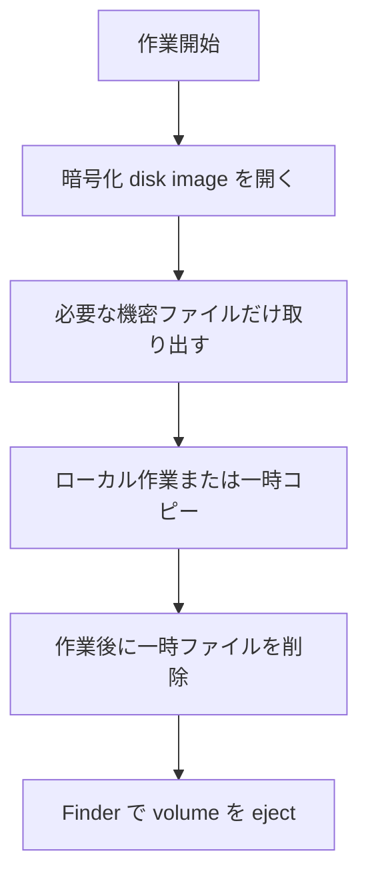

# Disk Utility の暗号化ディスクで機密情報を管理する

- 調査日: 2026-06-20
- 対象: macOS Disk Utility、暗号化 disk image、Firebase / Google Cloud 関連設定ファイル
- 状態: 調査中

## 要約

Firebase や Google Cloud などの設定ファイルをローカルに置く必要がある場合、Git 管理下のプロジェクトには置かず、macOS の Disk Utility で作成した暗号化 disk image にまとめて保管する。

この運用で守りたいことは、次の 3 点。

- 機密ファイルをリポジトリ、同期フォルダ、チャット添付、スクリーンショットに混ぜない。
- 必要なときだけ暗号化 disk image をマウントし、作業後は必ず eject する。
- Firebase の API key のように「公開前提の識別子」と、service account JSON のような「漏えいしてはいけない秘密鍵」を区別する。

## 背景

Firebase の設定では、`GoogleService-Info.plist`、`google-services.json`、`.env`、service account JSON、CI 用 token など、似た名前でも扱いが違うファイルが出てくる。

Firebase の公式ドキュメントでは、Firebase services 用の API key はプロジェクトやアプリを識別するためのもので、Firebase Security Rules や App Check などで保護する設計になっている。一方で、Gemini Developer API key や service account の private key などは、公開コードや設定ファイルに含めてはいけない。

このページでは、ローカル開発中に「手元には必要だが、Git には絶対に入れたくない」ファイルを、macOS 標準の Disk Utility で作った暗号化 disk image に退避する手順をまとめる。

## 対象にするファイル

暗号化 disk image に入れる候補:

- Firebase Admin SDK の service account JSON
- Google Cloud service account key
- `.env.local`、`.env.production` などの実秘密値を含む env ファイル
- App Store Connect API key、Push 通知証明書、秘密鍵
- CI/CD 用 token、個人 access token、deploy token
- 本番環境のバックアップ、検証用の個人情報入りデータ

通常は機密扱いしないが、プロジェクト方針として分離してもよいもの:

- Firebase client SDK 用の `GoogleService-Info.plist`
- Firebase Android 用の `google-services.json`
- Firebase Web config の `apiKey`

ただし、これらに Firebase 以外の API key や非公開の値を混ぜている場合は、機密ファイルとして扱う。

## 推奨する保存場所

暗号化 disk image の保存先は、通常の作業フォルダとは分ける。

例:

```text
~/Documents/SecureDisks/project-secrets.sparseimage
```

運用ルール:

- リポジトリ配下には置かない。
- iCloud Drive、Dropbox、Google Drive など同期フォルダに置く場合は、同期先の端末・アカウント・バックアップ方針を確認してからにする。
- ファイル名にはプロジェクト名程度を入れ、具体的な秘密値や顧客名は入れない。
- パスワードは password manager に保存し、disk image の中には保存しない。

## 作成手順

Disk Utility で空の暗号化 disk image を作る。

1. `Disk Utility` を開く。
2. メニューから `File > New Image > Blank Image` を選ぶ。
3. 保存先とファイル名を指定する。
4. `Name` に、マウント時に Finder に表示される volume 名を入れる。
5. `Size` に、保管するファイルより少し大きめの容量を指定する。
6. `Format` は、macOS 10.13 以降で使う前提なら `APFS` を選ぶ。
7. `Encryption` で暗号化方式を選び、強いパスワードを設定する。
8. `Partitions` は `Single partition - GUID Partition Map` を選ぶ。
9. `Image Format` は、更新しながら使う場合は `read/write` または sparse 系の image を選ぶ。
10. `Save` して作成する。

Apple の Disk Utility ガイドでは、暗号化 disk image のパスワードを忘れると中身を開けない、と注意されている。復旧用の手段は別途用意しておく。

## 日常運用

暗号化 disk image は「必要なときだけ開く」ことを基本にする。



手順:

1. Finder で `.dmg`、`.sparseimage`、または `.sparsebundle` を開く。
2. パスワードを入力してマウントする。
3. 必要なファイルだけ参照またはコピーする。
4. 作業が終わったら、一時コピーを削除する。
5. Finder の sidebar またはデスクトップから暗号化 volume を eject する。

注意:

- マウント中は、同じ Mac にアクセスできる人やプロセスから中身を読める可能性がある。
- `Downloads`、`Desktop`、リポジトリ直下に一時コピーを残さない。
- IDE や build tool が生成した cache に秘密値が残る可能性がある場合は、cache の場所も確認する。

## Git への混入防止

各プロジェクト側では、実ファイルを置かず、必要なら template だけを管理する。

例:

```text
.env.example
GoogleService-Info.example.plist
service-account.example.json
```

`.gitignore` の例:

```gitignore
.env
.env.*
!.env.example

*service-account*.json
*.p8
*.cer
*.mobileprovision
GoogleService-Info.plist
google-services.json
```

プロジェクトによっては `GoogleService-Info.plist` や `google-services.json` を Git 管理する方針もあり得る。その場合でも、Firebase 以外の API key、private key、token、個人情報を混ぜない。

作業前後に確認するコマンド:

```sh
git status --short
git diff --cached
git diff
```

## Firebase での判断基準

Firebase client SDK の API key は、一般的な secret と同じ扱いではない。Firebase 公式ドキュメントでは、Firebase services 用 API key は公開前提であり、Security Rules、Google Cloud IAM、Firebase App Check などで認可・保護する、と説明されている。

ただし、次のものは公開しない。

- Firebase Admin SDK の service account JSON
- Google Cloud service account private key
- Gemini Developer API key
- Google Maps Platform など、Firebase 以外の API を許可した API key
- 本番データにアクセスできる token や cookie

判断に迷う場合は、「漏えいしたときに第三者が本番データへアクセスできるか」「課金や quota を消費できるか」「鍵の rotation が必要になるか」で判断する。

## バックアップ

暗号化 disk image 自体は、通常のファイルとしてバックアップできる。ただし、バックアップ先の保護も必要になる。

Time Machine の保存先として、iCloud Drive は選択できない。Apple の Time Machine ガイドで示されている保存先は、Mac に直接接続した外部ストレージ、別の Mac で共有したバックアップ先、Time Machine over SMB に対応した NAS、AirPort Time Capsule / AirPort Extreme 系の保存先である。

そのため、iCloud Drive は「暗号化 disk image ファイルを同期する場所」としては使える可能性があるが、「Time Machine のバックアップ先」とは別物として考える。機密情報用 disk image を iCloud Drive に置く場合は、同期対象の端末、Apple Account の保護、iCloud バックアップ・復旧時の扱いを確認してからにする。

### バックアップしない運用

機密情報用 disk image を Time Machine に含めず、消えた場合は機密情報を再発行・再作成する、という運用も選択肢になる。

この運用が向いている条件:

- 中身が Firebase / Google Cloud / CI などで再発行できる key、token、設定ファイルである。
- 再発行手順、必要な管理画面、権限を把握している。
- パスワードは Apple Passwords などの password manager に保存しており、disk image の中だけに置いていない。
- 消失時に多少の復旧作業が発生しても許容できる。

この運用では、可用性よりも漏えい面の縮小を優先する。バックアップ先を増やさないぶん、Time Machine や外部ディスク、同期サービスから機密ファイルが複製される範囲を抑えられる。一方で、Mac の故障、disk image の破損、誤削除が起きた場合は、復元ではなく key rotation / token 再発行 / 設定ファイル再作成で復旧する。

推奨:

- Time Machine や外部 SSD にバックアップする場合、バックアップ先も暗号化する。
- password manager に disk image のパスワードを保存する。
- 重要な service account key は、可能なら再発行できる手順もメモしておく。
- Time Machine を使う場合は、専用の外部 SSD/HDD か Time Machine 対応 NAS を選ぶ。
- バックアップしない運用にする場合は、再発行できないファイルや証明書が混ざっていないか確認する。

避ける:

- パスワードを disk image と同じ場所に置く。
- 暗号化していない USB メモリにコピーする。
- Slack、メール、チャットに添付して共有する。
- iCloud Drive を Time Machine の代替バックアップとして扱う。
- 再発行できない秘密鍵や証明書を、唯一のコピーとしてバックアップなしで保管する。

## 注意点

- 暗号化 disk image は、マウントしている間は通常の volume として扱われる。作業後の eject を忘れない。
- パスワードを忘れると、Apple のガイド上も中身を開けなくなる。
- この方法は「ローカル保管」の対策であり、チーム共有や CI/CD の secret 管理には、GitHub Actions secrets、Google Secret Manager、1Password、Bitwarden、Vault などの専用 secret management を使う。
- Firebase client config を隠すことだけに頼らない。Firestore、Realtime Database、Cloud Storage は Security Rules を確認する。
- 公開済みの秘密鍵は、暗号化 disk image に移しても安全にならない。漏えいした可能性がある場合は key を revoke / rotate する。

## 未確認事項

- 手元の macOS バージョンでの Disk Utility の日本語 UI 表記。
- `Apple Sparse Image (ASIF)` と `read/write disk image` のどちらを標準運用にするか。
- プロジェクトごとの `GoogleService-Info.plist` / `google-services.json` の Git 管理方針。

## 参考

- Apple Support, [Create a disk image using Disk Utility on Mac](https://support.apple.com/guide/disk-utility/create-a-disk-image-dskutl11888/mac), 参照日: 2026-06-20
- Apple Support, [Backup disks you can use with Time Machine](https://support.apple.com/en-us/102423), 参照日: 2026-06-20
- Apple Support, [Back up your Mac with Time Machine](https://support.apple.com/en-us/104984), 参照日: 2026-06-20
- Firebase Documentation, [Learn about using and managing API keys for Firebase](https://firebase.google.com/docs/projects/api-keys), 参照日: 2026-06-20
