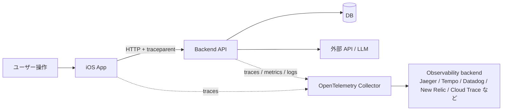
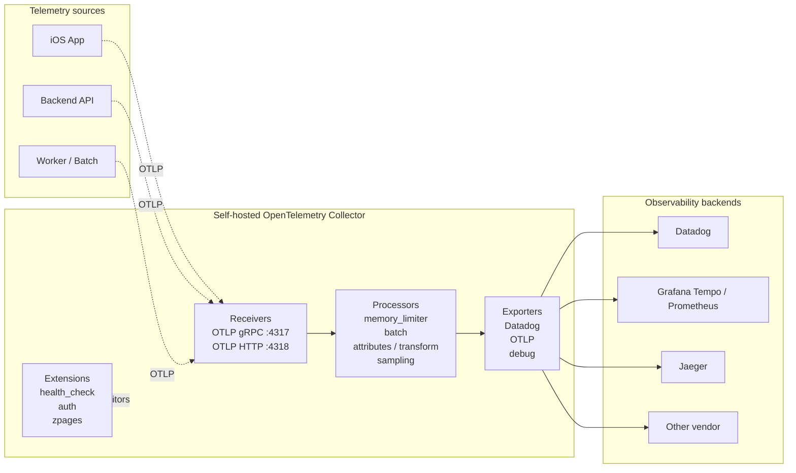
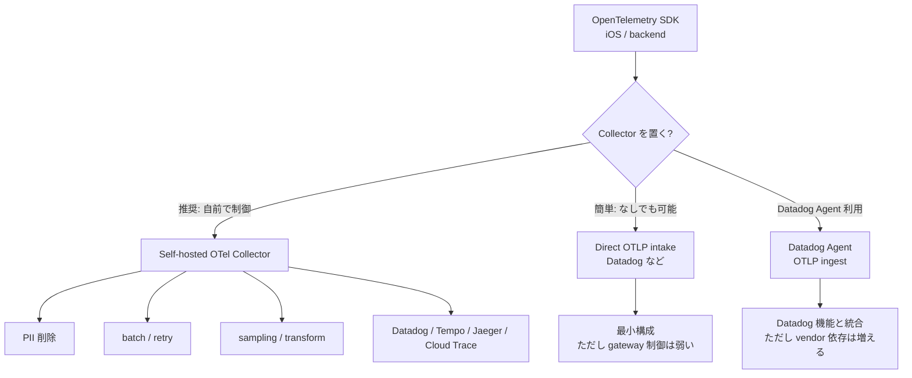
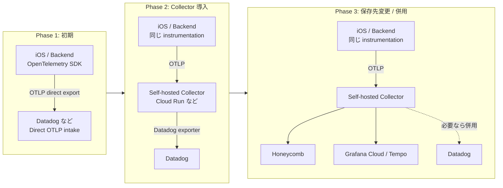
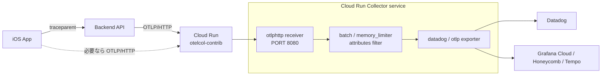
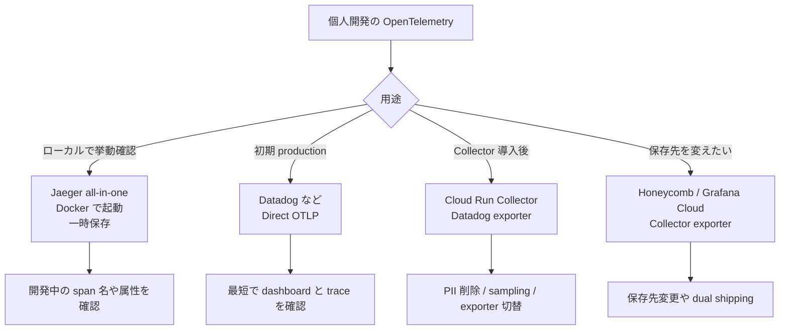
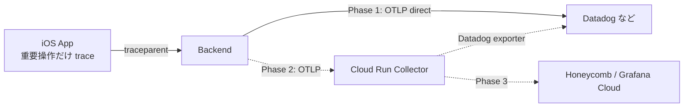
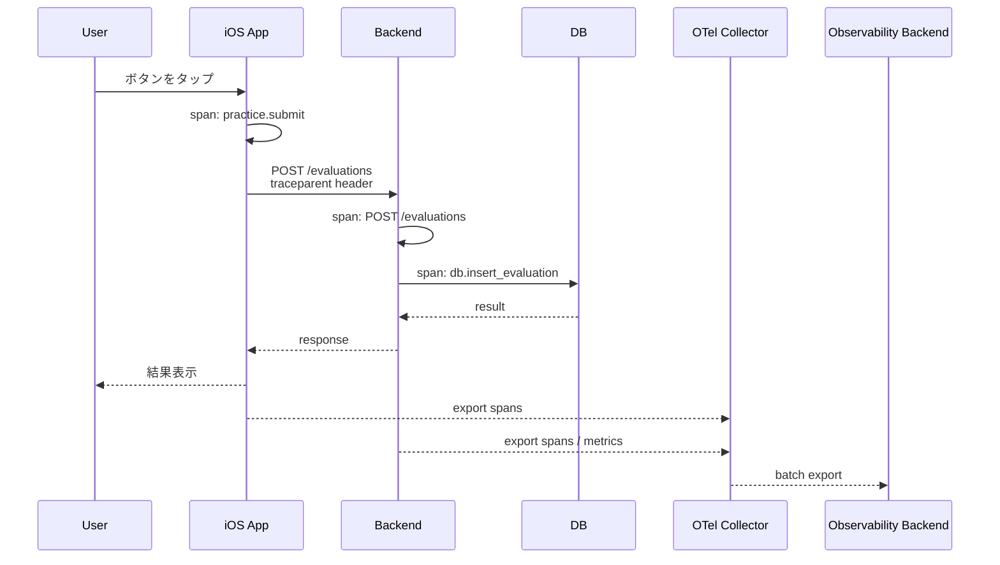
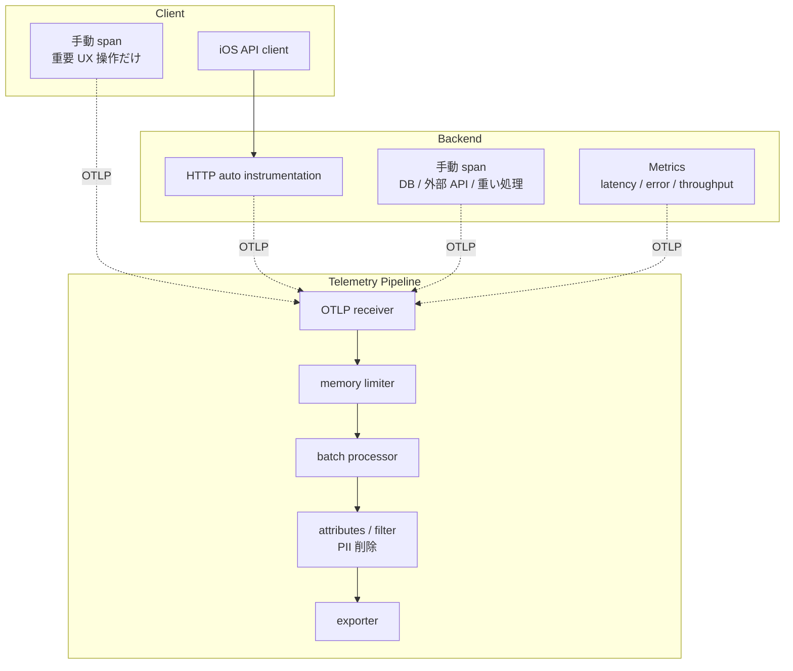
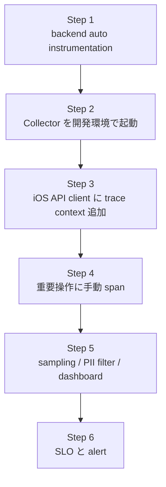

# OpenTelemetry で iOS / backend のパフォーマンスを計測する

- 調査日: 2026-06-29
- 対象: OpenTelemetry、OpenTelemetry Swift、OpenTelemetry Collector、Python / Node.js backend
- 状態: 調査中

## 要約

iOS から backend までのパフォーマンスを計測するなら、まず OpenTelemetry の **分散トレース (distributed tracing)** を入れる。1 回のユーザー操作、iOS の HTTP request、backend の request handler、DB / 外部 API 呼び出しを同じ `trace_id` でつなぐことで、「遅い」の原因が端末側、ネットワーク、backend、DB、外部サービスのどこにあるかを追いやすくなる。

導入順は次が現実的。

1. backend に OpenTelemetry を入れ、HTTP request の span と metrics を取る。
2. iOS の API client に span を追加し、`traceparent` header で backend に context を渡す。
3. 初期は Collector を挟まず、OpenTelemetry SDK / exporter から Datadog などへ直接送る。
4. 対応可能になった段階で、自前 OpenTelemetry Collector を挟み、Datadog へ送る。
5. さらに必要になったら、Collector の exporter を変えて Honeycomb / Grafana Cloud / Tempo などへ移行または併用する。

Collector は最初から必須ではない。Datadog などの observability backend は、OpenTelemetry SDK からの直接 OTLP intake や Agent 経由の取り込みを提供している場合がある。個人開発では、まず direct export で trace 設計を固め、運用上の必要が出てから Collector を telemetry gateway として挟む方が始めやすい。

OpenTelemetry Swift は、2026-06-27 時点の公式ドキュメントでは Traces が Stable、Metrics と Logs が Development 扱い。iOS では最初から何でも計測しようとせず、trace を中心に始めるのがよい。

## 背景

従来のログやサーバー単体のメトリクスだけでは、モバイルアプリで起きる「体感の遅さ」を分解しにくい。

例:

- iOS のボタンタップから API request 発行までが遅い。
- API request は速いが、backend の DB query が遅い。
- backend は速いが、外部 API や LLM API が遅い。
- 一部ユーザーだけネットワークが不安定。
- retry により見かけ上の成功率は高いが、UX は悪い。

OpenTelemetry を使うと、各処理を span として記録し、親子関係を持つ trace として可視化できる。OpenTelemetry の trace は、異なる process、service、VM、data center で生成された span を文脈付きで end-to-end に表現できる。

## 全体像



ポイント:

- `trace_id`: 1 回の操作や request chain を横断する ID。
- `span_id`: 1 つの処理単位の ID。
- `parent_id`: span の親子関係。iOS の API call span の子として backend の request span がぶら下がる。
- `traceparent`: W3C Trace Context の HTTP header。サービス境界を越えて trace context を運ぶ。
- Collector: telemetry を受け取り、加工し、送信先へ export する中継役。

## Collector の構成

OpenTelemetry Collector は「アプリに入る library」ではなく、自分たちの環境に deploy する単体 process / container / sidecar / gateway。公式ドキュメント上も、Collector は単一 binary を用途に応じた形で deploy でき、agent pattern、gateway pattern、agent-to-gateway pattern、no Collector などの構成がある。



Collector の基本部品:

- Receivers: OTLP などで telemetry を受ける入口。
- Processors: batch、memory limit、attribute 削除、resource 付与、sampling などを行う中間処理。
- Exporters: Datadog、OTLP backend、debug exporter などへ送る出口。
- Extensions: health check、認証、service discovery、Collector 自体の診断など。
- Pipelines: traces / metrics / logs ごとに receiver、processor、exporter をつなぐ定義。

Collector を自前で置く理由:

- vendor を Datadog から別の backend へ変えるとき、アプリ側の exporter 設定変更を最小化できる。
- PII / secret を backend に送る前に削除できる。
- production で sampling、batch、retry、memory limit を集中管理できる。
- backend と mobile の送信先を 1 つの OTLP endpoint に寄せられる。
- Datadog と OSS backend への dual shipping などを試しやすい。

### Collector あり / なしの選択肢



Datadog 連携の代表的な選択肢:

- Datadog Agent + DDOT Collector: Datadog 推奨の選択肢。Datadog ecosystem の機能を使いやすい。
- OpenTelemetry Collector + Datadog Exporter: vendor-neutral な構成を保ちながら Datadog に送る。Datadog Agent なしでも送信できる。
- Datadog Agent OTLP ingest: OpenTelemetry SDK から Datadog Agent に OTLP で送る。
- Direct OTLP intake: Datadog の OTLP intake endpoint に直接送る。Datadog Agent も OpenTelemetry Collector も不要だが、host metadata や pipeline 制御などに制約が出る。

この資料の推奨は、初期は `backend -> Datadog などへ direct OTLP export`、次に `backend -> self-hosted Collector -> Datadog`、その後 `Collector -> Honeycomb / Grafana Cloud / Tempo など` へ変更または併用する流れ。iOS からの telemetry は、直接 vendor / Collector に出すか、いったん backend の telemetry endpoint で受けるかを privacy / auth / rate limit / offline queue の観点で決める。

### 段階的な移行ロードマップ

OpenTelemetry の良さは、アプリや backend の instrumentation を vendor-neutral に保ちつつ、保存先と中継構成を後から変えられること。個人開発では、最初から Collector 運用を背負わず、direct export で始めるのが軽い。



Phase 1 でやること:

- backend の auto instrumentation と重要処理の手動 span を入れる。
- iOS は `traceparent` propagation と重要 API call span から始める。
- Datadog などの direct OTLP intake に送って、trace 名、属性、latency、error を見る。
- Collector の設定・運用はまだ持たない。

Phase 2 でやること:

- Cloud Run などに Collector を 1 service として置く。
- アプリ / backend 側の送信先を Datadog から Collector に変える。
- Collector で PII 削除、batch、retry、sampling、debug exporter を管理する。
- 出口はまず Datadog のままにして、可視化環境を変えずに中継層だけ追加する。

Phase 3 でやること:

- Collector の exporter を Honeycomb / Grafana Cloud / Tempo などへ切り替える。
- 必要なら Datadog と Honeycomb の dual shipping を短期間だけ行い、見え方とコストを比較する。
- dashboard、alert、SLO を新しい保存先に移す。

この順番だと、最初の価値確認が速く、あとから Collector による制御も足せる。Datadog SDK 固有の実装に寄せすぎないため、Datadog に足りない機能があっても OpenTelemetry 側の instrumentation を活かし続けられる。

### Collector の実装・デプロイ先

Collector は自分で Go / Python / Node.js などで実装するものではなく、OpenTelemetry Collector の配布 binary / Docker image を使い、`otelcol-contrib` の設定ファイルで receiver、processor、exporter を組み合わせるのが基本。個人開発なら、まず `otel/opentelemetry-collector-contrib` の Docker image を使う。

デプロイ先のおすすめ:

| 実行場所 | 向いている用途 | 注意点 |
| --- | --- | --- |
| ローカル Docker | 開発中の確認、Jaeger と組み合わせた trace propagation 検証 | 本番の保存先ではない |
| Cloud Run | 個人開発 / 小規模 production の telemetry gateway | request-based billing、cold start、1 つの公開入口、認証設計に注意 |
| Cloud Run + min instances 1 + instance-based billing | 低ボリュームでも取りこぼしを減らしたい本番 beta | 常時課金になる |
| GKE / Kubernetes | traffic が増えた後、agent / gateway pattern を本格運用したい場合 | 個人開発には運用が重い |
| VM / VPS | 単純な常駐 process として動かしたい場合 | OS patch、監視、再起動管理が必要 |

Collector が必要になった段階では、個人開発なら **Cloud Run の単独 service として Collector gateway を置く** のがバランスがよい。理由は、コンテナをそのまま deploy でき、HTTPS endpoint、Secret Manager、IAM、Cloud Logging と組み合わせやすく、GKE より運用が軽いから。



Cloud Run での設計メモ:

- まずは OTLP/HTTP を使う。Cloud Run は gRPC も使えるが、入口を 1 つに絞るなら mobile / backend とも OTLP/HTTP に寄せると扱いやすい。
- Collector は Cloud Run の `PORT` で listen する必要がある。`otlphttp` receiver の endpoint を `0.0.0.0:${env:PORT}` にする。
- request-based billing では、CPU は request 処理中に割り当てられる。Collector の batch / retry は background 的に動くので、信頼性を上げたい場合は instance-based billing または min instances 1 を検討する。
- Cloud Run は scale to zero できるが、Collector の in-memory buffer は永続化されない。保存先が落ちているときの長期 buffer には向かない。
- iOS から直接 Cloud Run Collector に送る場合は、public endpoint になる前提で、認証 header、rate limit、PII 削除、送信量制限を考える。個人開発では、まず backend から Collector へ送る構成の方が安全。
- Datadog / Grafana Cloud / Honeycomb の API key は iOS に埋めず、Cloud Run の Secret Manager / environment variable で Collector 側に持たせる。

Cloud Run 用の Collector 設定イメージ:

```yaml
receivers:
  otlp:
    protocols:
      http:
        endpoint: 0.0.0.0:${env:PORT}

processors:
  memory_limiter:
    check_interval: 5s
    limit_mib: 256
  batch:
    timeout: 5s
    send_batch_size: 512
  attributes/drop-sensitive:
    actions:
      - key: user.email
        action: delete
      - key: auth.token
        action: delete

exporters:
  debug:
    verbosity: basic
  # datadog:
  #   api:
  #     key: ${env:DD_API_KEY}
  # otlphttp/grafana:
  #   endpoint: ${env:GRAFANA_OTLP_ENDPOINT}
  #   headers:
  #     Authorization: Basic ${env:GRAFANA_OTLP_BASIC_AUTH}

service:
  pipelines:
    traces:
      receivers: [otlp]
      processors: [memory_limiter, batch, attributes/drop-sensitive]
      exporters: [debug]
      # exporters: [datadog]
```

Collector 導入後の運用案:

1. local: Docker Compose で `otelcol-contrib + Jaeger`。
2. beta: Cloud Run に `otelcol-contrib` を 1 service として deploy。backend は OTLP/HTTP で Collector に送る。
3. iOS: まず backend request の `traceparent` propagation まで。iOS から Collector 直送は後回し。
4. 保存先: まず Datadog のままにし、Collector 経由に切り替える。Honeycomb / Grafana Cloud は exporter 差し替えまたは併用で試す。
5. 本番っぽくなったら: min instances 1、instance-based billing、認証、rate limit、sampling、alert を設定する。

### 個人開発での保存先

個人開発では、最初から重い APM 契約を前提にせず、OpenTelemetry 形式で実装しておき、保存先だけ軽く始めるのがよい。Datadog SDK に足りない機能がある場合でも、アプリ側は OpenTelemetry SDK / API に寄せておくと、Datadog、Grafana Cloud、Honeycomb、Jaeger などへ出口を変えやすい。

おすすめの順番:

1. ローカル開発: Jaeger all-in-one。
2. 初期 production / beta: Collector なしで Datadog などへ直接 OTLP export。
3. 運用上必要になったら: Cloud Run などの Collector を挟み、Datadog に送る。
4. その後: Honeycomb / Grafana Cloud / Tempo などへ exporter を変更または併用する。



保存先ごとの向き不向き:

| 保存先 | 向いている用途 | 注意点 |
| --- | --- | --- |
| Jaeger all-in-one | ローカル検証、span 名と trace propagation の確認 | all-in-one は一時的な in-memory storage なので本番保存先にはしない |
| Grafana Cloud Free | 個人 production の低コストな traces / metrics / logs 保存 | free tier の容量と retention を超えると設計見直しが必要 |
| Honeycomb Free | trace 中心の調査、高 cardinality な属性での探索 | metrics / logs まで含めた統合監視は別設計になる場合がある |
| Datadog | APM、dashboard、alert、既存 Datadog 運用との統合 | 個人開発では host 課金や indexed span の費用を意識する |

個人的な初期構成としては、次が扱いやすい。



最初から OpenTelemetry で実装する利点:

- Datadog SDK 固有の API に寄せすぎず、instrumentation を vendor-neutral に保てる。
- Datadog に足りない機能や合わない点が出ても、保存先を Grafana Cloud / Honeycomb / Jaeger / Tempo に変えやすい。
- iOS と backend の `traceparent` propagation、span 名、attribute 設計を共通化できる。
- Collector を挟めば、あとから Datadog exporter、OTLP exporter、debug exporter を切り替えられる。

ただし、iOS から外部保存先へ直接送る設計は慎重にする。個人開発でも、API key の露出、ユーザー情報、送信量、battery/network、offline queue の問題がある。iOS では重要な操作だけを sampling し、まずは backend trace と結合することを優先する。

## 何を計測するか

最初に入れると効果が高い span:

- iOS: `practice.submit_tap`、`api.evaluate_pronunciation`、`audio.encode`、`upload.audio`
- backend: `POST /v1/evaluations`、`speech.score`、`llm.feedback`、`db.save_result`
- 外部依存: speech recognition、LLM API、object storage、database

最初に見る metrics:

- backend request latency: p50 / p95 / p99
- error rate: route、status code、error type
- request throughput
- DB query latency
- 外部 API latency / timeout / retry count
- iOS では補助的に、アプリ起動、画面表示、API round trip、音声 encode / upload 時間

## Trace の流れ



同じ `trace_id` で見ると、iOS の処理時間、network round trip、backend handler、DB、外部 API のどこが長いかが 1 画面で分かる。

## 推奨アーキテクチャ



backend は Collector へ送る。iOS も直接 vendor backend に送るより、可能なら自前 backend または Collector endpoint に送る。ただし mobile から Collector を直接公開する場合は、認証、rate limit、PII、offline queue、battery/network への影響を設計する必要がある。

## 実装・利用メモ

### Collector 設定例

開発環境では `debug` exporter に出すと確認しやすい。Datadog に送る場合は OpenTelemetry Collector Contrib distribution の Datadog Exporter / Connector を使う。ここでは構成の骨格だけを示す。

```yaml
receivers:
  otlp:
    protocols:
      grpc:
        endpoint: 0.0.0.0:4317
      http:
        endpoint: 0.0.0.0:4318

processors:
  memory_limiter:
    check_interval: 5s
    limit_mib: 256
  batch:
  attributes/drop-sensitive:
    actions:
      - key: user.email
        action: delete
      - key: auth.token
        action: delete

exporters:
  debug:
    verbosity: normal
  # datadog:
  #   api:
  #     key: ${env:DD_API_KEY}
  # otlp/tempo:
  #   endpoint: tempo:4317
  #   tls:
  #     insecure: true

service:
  pipelines:
    traces:
      receivers: [otlp]
      processors: [memory_limiter, batch, attributes/drop-sensitive]
      exporters: [debug]
      # exporters: [datadog, otlp/tempo]
    metrics:
      receivers: [otlp]
      processors: [memory_limiter, batch]
      exporters: [debug]
      # exporters: [datadog]
```

### backend: Python / FastAPI の最小例

OpenTelemetry Python は `opentelemetry-instrument` による zero-code instrumentation から始められる。FastAPI では ASGI / FastAPI instrumentation を入れる。

```sh
pip install \
  opentelemetry-distro \
  opentelemetry-exporter-otlp \
  opentelemetry-instrumentation-fastapi \
  opentelemetry-instrumentation-requests

opentelemetry-bootstrap -a install

OTEL_SERVICE_NAME=accent-fit-backend \
OTEL_EXPORTER_OTLP_ENDPOINT=http://localhost:4317 \
opentelemetry-instrument uvicorn app.main:app --host 0.0.0.0 --port 8080
```

手動 span を足す例:

```python
from opentelemetry import trace

tracer = trace.get_tracer("accent-fit.backend")

async def score_pronunciation(audio_bytes: bytes) -> dict:
    with tracer.start_as_current_span("speech.score") as span:
        span.set_attribute("audio.bytes", len(audio_bytes))
        result = await call_speech_score_api(audio_bytes)
        span.set_attribute("score.total", result["score"])
        return result
```

注意: `audio.bytes` のようなサイズはよいが、音声本文、認証 token、email、自由入力文などの PII / secret は attribute に入れない。

### backend: Node.js / Express の最小例

Node.js では application code より先に instrumentation を読み込む。

```sh
npm install \
  @opentelemetry/sdk-node \
  @opentelemetry/api \
  @opentelemetry/auto-instrumentations-node \
  @opentelemetry/exporter-trace-otlp-grpc \
  @opentelemetry/exporter-metrics-otlp-grpc
```

`instrumentation.mjs`:

```js
import { NodeSDK } from "@opentelemetry/sdk-node";
import { getNodeAutoInstrumentations } from "@opentelemetry/auto-instrumentations-node";

const sdk = new NodeSDK({
  serviceName: "accent-fit-backend",
  instrumentations: [getNodeAutoInstrumentations()],
});

sdk.start();
```

起動:

```sh
OTEL_EXPORTER_OTLP_ENDPOINT=http://localhost:4317 \
node --import ./instrumentation.mjs app.js
```

手動 span:

```js
import { trace } from "@opentelemetry/api";

const tracer = trace.getTracer("accent-fit.backend");

export async function createFeedback(input) {
  return await tracer.startActiveSpan("llm.feedback", async (span) => {
    try {
      span.setAttribute("prompt.kind", input.promptKind);
      const result = await callFeedbackModel(input);
      span.setAttribute("feedback.length", result.text.length);
      return result;
    } catch (error) {
      span.recordException(error);
      throw error;
    } finally {
      span.end();
    }
  });
}
```

### iOS: Swift の導入イメージ

Swift Package Manager の依存例。2026-06-27 時点の GitHub README では `opentelemetry-swift` と `opentelemetry-swift-core` を追加する形が示されている。最新 release と product 名は導入時に確認する。

```swift
// Package.swift のイメージ
.package(url: "https://github.com/open-telemetry/opentelemetry-swift", from: "<current-release>"),
.package(url: "https://github.com/open-telemetry/opentelemetry-swift-core.git", from: "<current-release>")
```

iOS API client でやりたいことは次の 3 つ。

1. API request の前後を span にする。
2. HTTP header に trace context を inject する。
3. response status、通信時間、retry 有無などを attribute に入れる。

概念 snippet:

```swift
import Foundation
import OpenTelemetryApi

final class InstrumentedAPIClient {
    private let tracer = OpenTelemetry.instance.tracerProvider.get(
        instrumentationName: "accent-fit.ios"
    )

    func postEvaluation(audioData: Data) async throws -> EvaluationResponse {
        let span = tracer.spanBuilder(spanName: "api.post_evaluation").startSpan()
        defer { span.end() }

        span.setAttribute(key: "audio.bytes", value: audioData.count)

        var request = URLRequest(url: URL(string: "https://api.example.com/v1/evaluations")!)
        request.httpMethod = "POST"
        request.httpBody = audioData

        // 実装時は SDK の propagator / URLSession instrumentation を使い、
        // W3C traceparent header を request に注入する。
        // 例: GlobalOpenTelemetry.propagators.textMapPropagator.inject(...)

        let (data, response) = try await URLSession.shared.data(for: request)
        if let http = response as? HTTPURLResponse {
            span.setAttribute(key: "http.status_code", value: http.statusCode)
        }

        return try JSONDecoder().decode(EvaluationResponse.self, from: data)
    }
}
```

上の snippet は考え方を示すもの。実プロジェクトでは OpenTelemetry Swift の `URLSession` instrumentation や propagator API の実コードに合わせて調整する。

## 計測名と属性の設計

span 名は「何の処理か」を低 cardinality で表す。

良い例:

- `api.post_evaluation`
- `audio.encode`
- `speech.score`
- `llm.feedback`
- `db.insert_evaluation`

避ける例:

- `api.post_evaluation_user_12345`
- `llm.feedback_prompt_<全文>`
- `GET /users/12345/evaluations/999`

属性に入れる候補:

- `app.version`
- `device.model`
- `os.name` / `os.version`
- `network.type`
- `http.route`
- `http.status_code`
- `retry.count`
- `audio.duration_ms`
- `audio.bytes`
- `score.total`
- `error.type`

属性に入れないもの:

- 認証 token
- email、氏名、電話番号
- 音声本文や transcript 全文
- LLM prompt / response 全文
- ユーザー ID の生値

必要なら user ID は hash 化し、debug 用の短期環境だけに限定する。

## 導入ステップ



Step 1: backend だけで始める。

- route ごとの latency、error rate、DB / external API の遅さが見える。
- iOS なしでも価値が出る。

Step 2: Collector を挟む。

- export 先変更、batch、retry、PII filter、sampling をアプリコードから分離する。

Step 3: iOS から `traceparent` を渡す。

- iOS の API call と backend request を同じ trace にする。

Step 4: UX 上重要な操作だけ手動 span にする。

- 起動、録音、音声 encode、upload、採点、feedback 表示など。

Step 5: dashboard を作る。

- p95 / p99 latency、error rate、slow trace、route 別、app version 別、OS version 別を見る。

Step 6: SLO / alert を決める。

- 例: `POST /v1/evaluations` p95 < 2.5s、error rate < 1%。

## 注意点

- mobile から直接 Collector / vendor backend に送る場合、endpoint の公開、認証、quota、battery、network、offline queue を設計する。
- trace の取りすぎはコストとパフォーマンスに効く。production では sampling を検討する。
- PII と secret は span attribute、log、baggage に入れない。特に baggage はサービス境界を越えて伝播する。
- iOS の Metrics / Logs は OpenTelemetry Swift の maturity を確認しながら導入する。まず Traces を中心にする。
- 低 cardinality を守る。user ID、request ID、全文 prompt などを metric label に入れると、保存コストと検索性能が悪化する。
- span 名は route template や処理名にする。実 ID を含めない。
- 計測自体の遅延を避けるため、export は非同期、batch、timeout を前提にする。

## 未確認事項

- 実際の backend 言語 / framework。資料では Python / FastAPI と Node.js / Express を代表例として扱った。
- iOS から telemetry を直接 Collector に送るか、backend 経由にするか。
- 利用する observability backend。Jaeger / Grafana Tempo / Datadog / New Relic / Google Cloud Trace などで設定が変わる。
- OpenTelemetry Swift の exact API。概念 snippet は導入時に package version に合わせて調整が必要。
- 本番 sampling rate、保存期間、PII redaction 方針、ユーザー同意 / privacy policy への反映。

## 参考

- OpenTelemetry, [Traces](https://opentelemetry.io/docs/concepts/signals/traces/), 参照日: 2026-06-27
- OpenTelemetry, [Context propagation](https://opentelemetry.io/docs/concepts/context-propagation/), 参照日: 2026-06-27
- OpenTelemetry, [Collector](https://opentelemetry.io/docs/collector/), 参照日: 2026-06-27
- OpenTelemetry, [Collector configuration](https://opentelemetry.io/docs/collector/configuration/), 参照日: 2026-06-27
- OpenTelemetry, [Collector deployment](https://opentelemetry.io/docs/collector/deployment/), 参照日: 2026-06-27
- OpenTelemetry, [Swift](https://opentelemetry.io/docs/languages/swift/), 参照日: 2026-06-27
- GitHub, [open-telemetry/opentelemetry-swift](https://github.com/open-telemetry/opentelemetry-swift), 参照日: 2026-06-27
- OpenTelemetry, [Python Getting Started](https://opentelemetry.io/docs/languages/python/getting-started/), 参照日: 2026-06-27
- OpenTelemetry, [JavaScript Node.js Getting Started](https://opentelemetry.io/docs/languages/js/getting-started/nodejs/), 参照日: 2026-06-27
- Jaeger, [Getting Started](https://www.jaegertracing.io/docs/2.7/getting-started/), 参照日: 2026-06-29
- Grafana Labs, [Grafana Cloud Pricing](https://grafana.com/pricing/), 参照日: 2026-06-29
- Honeycomb, [Pricing](https://www.honeycomb.io/pricing/), 参照日: 2026-06-29
- Datadog, [Pricing](https://www.datadoghq.com/pricing/), 参照日: 2026-06-29
- Datadog Docs, [OpenTelemetry in Datadog](https://docs.datadoghq.com/opentelemetry/), 参照日: 2026-06-27
- Datadog Docs, [OpenTelemetry Collector and Datadog Exporter](https://docs.datadoghq.com/opentelemetry/collector_exporter/), 参照日: 2026-06-27
- Datadog Docs, [OTLP ingest in the Agent](https://docs.datadoghq.com/opentelemetry/setup/otlp_ingest_in_the_agent/), 参照日: 2026-06-27
- Datadog Docs, [Direct OTLP ingest](https://docs.datadoghq.com/opentelemetry/setup/direct_otlp_ingest/), 参照日: 2026-06-27
