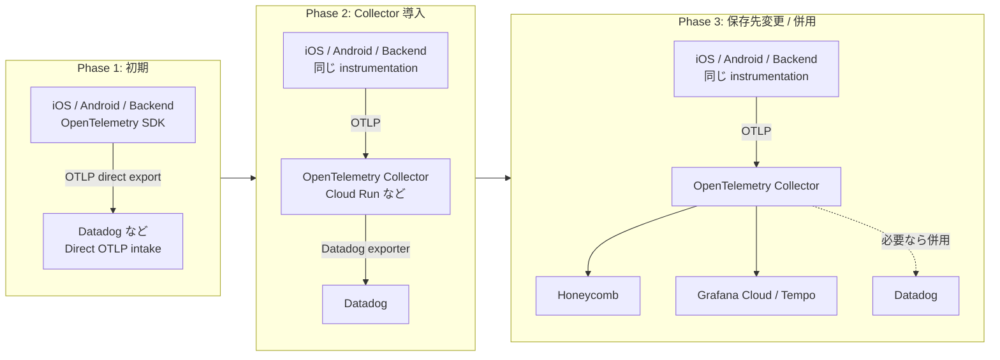
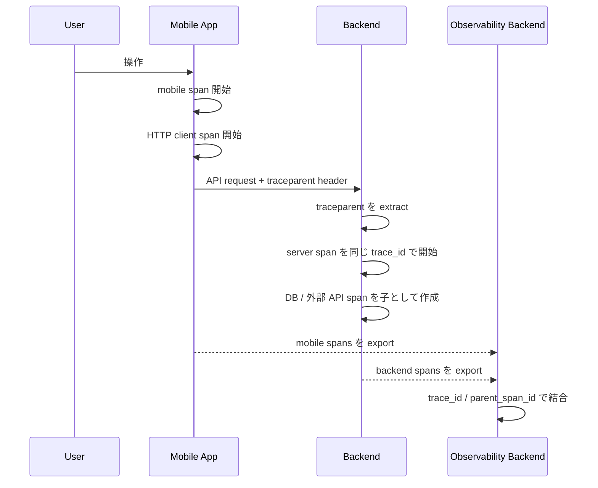
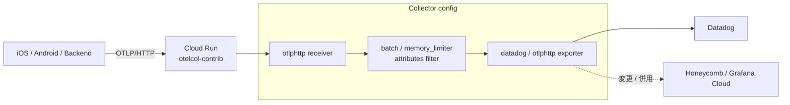
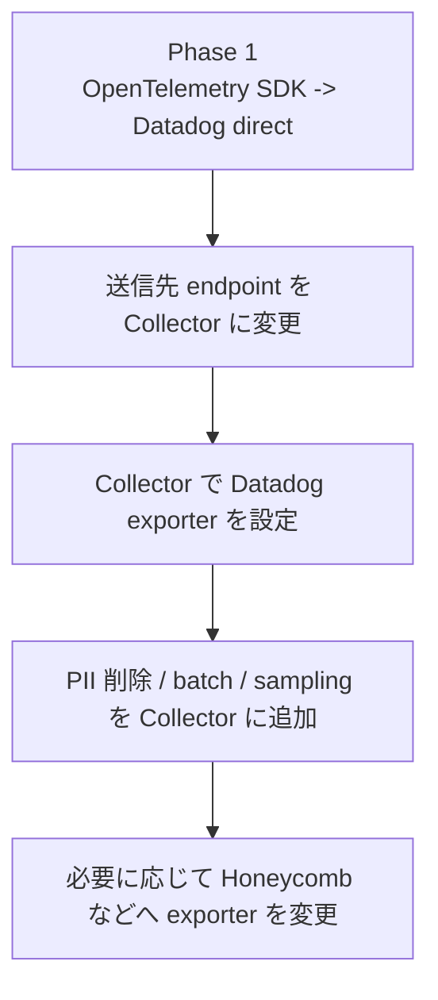

# OpenTelemetry iOS / Android / backend 実装判断 FAQ

- 調査日: 2026-06-29
- 対象: OpenTelemetry、iOS、Android、backend、Datadog、OpenTelemetry Collector
- 状態: 調査中

## 要約

個人開発では、最初から Collector 運用を持たず、まず OpenTelemetry SDK で iOS / Android / backend の trace を作り、Datadog などへ直接送るのが始めやすい。その後、必要になった段階で Cloud Run などに OpenTelemetry Collector を置き、Datadog へ送る。さらに保存先を Honeycomb / Grafana Cloud / Tempo などに変えたい場合は、Collector の exporter を差し替える。

Mobile と backend の span は、HTTP request の `traceparent` header による context propagation で紐付く。Mobile 側で始めた span の `trace_id` と `span_id` を request header に注入し、backend 側がそれを抽出して server span の親にする。

iOS / Android には HTTP client instrumentation がある。ただし「SDK を入れれば全通信に必ず header が入る」ではなく、URLSession、OkHttp、HttpURLConnection など、instrumentation の対象経路を通った通信に限られる。

## 推奨ロードマップ



この順番にすると、最初の実装と可視化を軽く始められる。Datadog SDK 固有の API に寄せすぎず、OpenTelemetry の span 名、attribute、context propagation を育てておけば、保存先は後から変えやすい。

## Q1. Mobile と backend の span はどう紐付くか

紐付けは **context propagation** で行う。代表的には W3C Trace Context の `traceparent` header を使う。

```http
traceparent: 00-<trace_id>-<parent_span_id>-<trace_flags>
```

処理の流れ:



例:

```text
Mobile HTTP client span
trace_id = abc...
span_id  = 111...

HTTP request header
traceparent: 00-abc...-111...-01

Backend server span
trace_id       = abc...
span_id        = 222...
parent_span_id = 111...
```

同じ `trace_id` を持ち、backend span の `parent_span_id` が mobile 側の span を指すため、Datadog などの trace backend が 1 本の distributed trace として組み立てられる。

## Q2. iOS / Android で API 通信に自動で header inject されるか

答えは「instrumentation を有効化した HTTP client 経路ならされる」。OpenTelemetry SDK を入れただけで、全通信に自動で `traceparent` が入るわけではない。

| Platform | 対象 | header inject の考え方 |
| --- | --- | --- |
| iOS | URLSession | OpenTelemetry Swift の URLSession instrumentation を有効化する。`shouldInjectTracingHeaders` が有効な request に trace header を inject する |
| Android | OkHttp / HttpURLConnection など | OpenTelemetry Android Agent や関連 instrumentation を使う。対象 HTTP client を通る request で context propagation される |
| backend | FastAPI / Express / Spring など | server middleware / auto instrumentation が `traceparent` を extract し、server span の親 context にする |

確認ポイント:

- Mobile の実際の API request に `traceparent` header が付いているか。
- Backend 側 middleware が `traceparent` を extract しているか。
- Datadog などで mobile span と backend span が同じ `trace_id` になっているか。
- 独自 HTTP client、SDK 内部通信、WebSocket、background upload、queue 経由の処理では手動 propagation が必要にならないか。

## Q3. 初期の保存先は何が良いか

個人開発では、初期は **Collector なしで Datadog などへ direct OTLP export** が軽い。

理由:

- Collector の deploy / 認証 / batch / retry / scale をまだ持たなくてよい。
- まず span 名、attribute、trace の見え方を確認できる。
- Datadog SDK に寄せず OpenTelemetry で実装しておけば、後から Collector 経由へ移しやすい。

ローカル確認では Jaeger all-in-one が使いやすい。本番 beta では Datadog、Grafana Cloud、Honeycomb などを direct export 先として検討する。Datadog を最初に使う場合でも、アプリ側の instrumentation は OpenTelemetry に寄せる。

## Q4. Collector は何で実装するのが良いか

Collector は自分でアプリとして実装するものではない。OpenTelemetry Collector の配布 binary / Docker image を使い、設定ファイルで receiver、processor、exporter を組み合わせる。

個人開発で Collector が必要になったら、まず **Cloud Run に `otel/opentelemetry-collector-contrib` を 1 service として deploy** するのが扱いやすい。



Cloud Run での注意:

- まずは OTLP/HTTP に寄せる。
- Cloud Run の `PORT` で listen するため、`otlphttp` receiver の endpoint は `0.0.0.0:${env:PORT}` にする。
- Cloud Run は scale to zero できるが、Collector の in-memory buffer は永続化されない。
- retry / batch の信頼性を上げるなら min instances 1 や instance-based billing を検討する。
- Datadog / Honeycomb / Grafana Cloud の API key は mobile app に入れず、Collector 側の Secret Manager / environment variable に置く。

## Q5. Collector なしから Collector ありへ移すとき何を変えるか

変えるのは主に exporter endpoint。span 名、attribute、manual span、backend middleware は基本そのまま活かす。



移行時の確認:

- direct export 時と Collector 経由時で `service.name` が変わっていないか。
- `trace_id` が mobile / backend で維持されているか。
- Collector で attributes filter を入れても必要な検索属性が消えていないか。
- sampling を入れた場合、mobile と backend の片側だけが欠ける trace が増えていないか。

## 実装メモ

### iOS の考え方

URLSession instrumentation を有効化し、API client が URLSession 経由で通信していることを確認する。独自 wrapper や third-party SDK の通信は、実際に `traceparent` が付くか packet capture / debug log / backend log で確認する。

```swift
// 概念例。実際の API は導入する opentelemetry-swift の version に合わせて確認する。
let configuration = URLSessionInstrumentationConfiguration()
configuration.shouldInjectTracingHeaders = true

let instrumentation = URLSessionInstrumentation(configuration: configuration)
```

### Android の考え方

OkHttp / HttpURLConnection を使っているなら、OpenTelemetry Android Agent や OpenTelemetry Java instrumentation の対象になるかを確認する。Retrofit は多くの場合 OkHttp の上に乗るため、OkHttp instrumentation が効く構成なら header inject の対象にしやすい。

確認は backend 側で request header を一時的に見るのが早い。

```text
traceparent: 00-...
tracestate: ...
```

### backend の考え方

backend 側は HTTP server instrumentation で `traceparent` を extract する。FastAPI、Express、Spring などで auto instrumentation を使うと、request handler の server span が mobile 側の client span の子として作られる。

## 注意点

- `baggage` にユーザー情報や認証情報を入れない。サービス境界を越えて伝搬する。
- `traceparent` は紐付け用の技術情報であり、認証には使わない。
- proxy / gateway / CDN が `traceparent` / `tracestate` を落としていないか確認する。
- mobile から vendor に直接送る場合、API key の露出、送信量、battery、offline queue、privacy policy を確認する。
- iOS / Android の SDK maturity は変わるため、導入時に使う version の README / source / release note を確認する。

## 未確認事項

- 実際に使う iOS networking stack。URLSession 直か、Alamofire などの wrapper か。
- 実際に使う Android networking stack。OkHttp / Retrofit / HttpURLConnection / Ktor など。
- Datadog direct OTLP intake を mobile から直接使うか、まず backend だけにするか。
- iOS / Android の span export を production でどの sampling rate にするか。

## 参考

- OpenTelemetry, [Context propagation](https://opentelemetry.io/docs/concepts/context-propagation/), 参照日: 2026-06-29
- OpenTelemetry, [Traces](https://opentelemetry.io/docs/concepts/signals/traces/), 参照日: 2026-06-29
- W3C, [Trace Context](https://www.w3.org/TR/trace-context/), 参照日: 2026-06-29
- GitHub, [open-telemetry/opentelemetry-swift](https://github.com/open-telemetry/opentelemetry-swift), 参照日: 2026-06-29
- GitHub, [OpenTelemetry Swift URLSession instrumentation](https://github.com/open-telemetry/opentelemetry-swift/tree/main/Sources/Instrumentation/URLSession), 参照日: 2026-06-29
- GitHub, [open-telemetry/opentelemetry-android](https://github.com/open-telemetry/opentelemetry-android), 参照日: 2026-06-29
- OpenTelemetry, [Collector](https://opentelemetry.io/docs/collector/), 参照日: 2026-06-29
- OpenTelemetry, [Collector configuration](https://opentelemetry.io/docs/collector/configuration/), 参照日: 2026-06-29
- Datadog Docs, [OpenTelemetry in Datadog](https://docs.datadoghq.com/opentelemetry/), 参照日: 2026-06-29
- Datadog Docs, [Direct OTLP ingest](https://docs.datadoghq.com/opentelemetry/setup/direct_otlp_ingest/), 参照日: 2026-06-29
- Google Cloud, [Use gRPC with Cloud Run services](https://cloud.google.com/run/docs/triggering/grpc), 参照日: 2026-06-29
