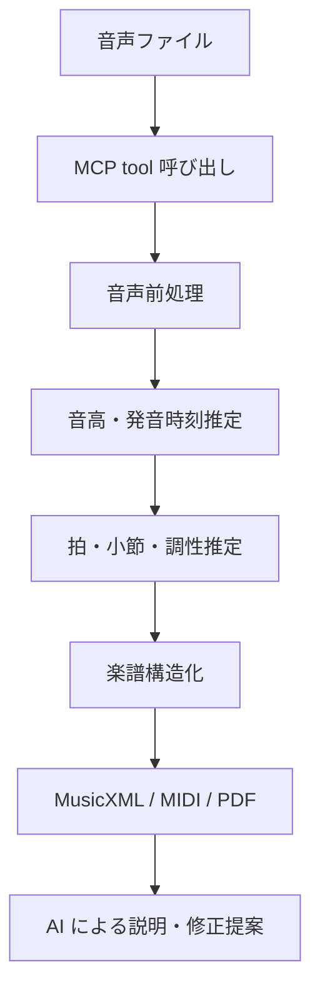

# 音声から楽譜を生成する MCP サービス

- 作成日: 2026-06-11
- 状態: 検討中
- 対象: MCP service、音声解析、採譜、MusicXML、MIDI、MEI

## 要約

音楽の音声ファイルを入力すると、AI エージェントから呼び出せる MCP サービスが楽譜データを生成するアイディア。出力は、編集・共有の主形式を `MusicXML`、中間表現を `MIDI`、研究・アーカイブ用途の拡張候補を `MEI` とするのが現実的に見える。

ユーザーが書いている `MDMI` は、2026-06-11 時点の軽い確認では、一般的な楽譜交換フォーマットとしては確認できなかった。文脈上は `MIDI` の可能性が高く、最終的な「楽譜」としては `MusicXML` を第一候補にする。

## 背景

音源から耳コピして楽譜にする作業は、楽器練習、採譜、作曲、編曲、教育、動画制作で時間がかかる。既存の audio-to-MIDI 技術はあるが、ユーザーが本当に欲しい成果物は、ただのノート列ではなく、拍子・小節・休符・タイ・連符・コード・パート分けまで整理された「読める楽譜」であることが多い。

MCP サービスとして提供すると、ChatGPT や Claude などの AI クライアントから「この音源をピアノ譜にして」「ギター用に簡単にして」「MusicXML と PDF を出して」のような自然言語ワークフローに組み込みやすい。

## 想定ユーザー

- 耳コピや譜面起こしに時間を使っている演奏者。
- レッスン教材を作る音楽講師。
- 自作曲、鼻歌、バンド録音を譜面化したい作曲者。
- DAW の素材を楽譜として共有したい制作者。
- 採譜のたたき台を欲しい編曲者。

## 価値仮説

- 完璧な自動採譜よりも、「手直し可能な下書き」を短時間で作れることに価値がある。
- MCP の強みは、譜面生成単体ではなく、AI エージェントによる後処理にある。例: 難易度調整、移調、楽器別アレンジ、コード解析、練習用コメント生成。
- 出力を MusicXML にすれば、MuseScore、Dorico、Sibelius などの譜面ソフトへ持ち込みやすい。
- MIDI だけを返すサービスより、MusicXML、PDF、プレビュー画像、信頼度付き note events をまとめて返すほうが、ユーザーの次の作業につながりやすい。

## プロダクト観点

### コア体験

1. ユーザーが音声ファイルを指定する。
2. MCP クライアントが `transcribe_audio_to_score` tool を呼ぶ。
3. サービスが音声を解析し、note events、MIDI、MusicXML、簡易 PDF または画像プレビューを生成する。
4. AI エージェントが結果を説明し、ユーザーの目的に合わせて修正指示を受ける。



### MVP

- 入力: `wav`、`mp3`、`m4a` などのローカルファイルパスまたはアップロード済みリソース URI。
- 対象: まずは単一楽器、短い音源、ピアノまたはメロディ楽器。
- 出力:
  - `MusicXML`: 楽譜ソフトで編集する主成果物。
  - `MIDI`: 音高・タイミングの確認用、DAW 連携用。
  - `note_events.json`: 音符ごとの開始時刻、長さ、音高、信頼度。
  - `report.md`: 推定テンポ、拍子、キー、注意点、手直し候補。
- 非目標:
  - 初期版では、フルバンド音源の完全なパート分離は狙わない。
  - 歌詞同期、ドラム譜、ギター TAB、和声解析は後続フェーズに回す。

### 差別化

- 「音声を MIDI に変換する」ではなく、「AI が扱いやすい楽譜生成ワークフロー」として出す。
- MCP tool の structured output に、ファイルだけでなく信頼度・警告・編集候補を含める。
- ユーザーが自然言語で「初心者向けに簡単に」「右手だけ」「半音下げて」「コードネームを追加して」と続けられる。
- 生成物の正しさを過信させず、どこが怪しいかを可視化する。

## テクニカル観点

### MCP tool 設計

MCP では server が tool を公開し、AI クライアントが `tools/list` で発見し、`tools/call` で呼び出す。音声から楽譜への変換は時間がかかるため、初期版では同期 tool でもよいが、長尺音源ではジョブ化が必要になる。

候補 tool:

- `transcribe_audio_to_score`
  - 入力: audio URI、目的楽器、出力形式、難易度、テンポ固定の有無。
  - 出力: MusicXML、MIDI、note events、変換レポートへの resource link。
- `render_score_preview`
  - 入力: MusicXML または job ID。
  - 出力: PDF、PNG、SVG プレビュー。
- `revise_score`
  - 入力: 既存 MusicXML、自然言語の修正指示。
  - 出力: 修正版 MusicXML と変更サマリ。
- `estimate_score_quality`
  - 入力: 音声と生成済み譜面。
  - 出力: タイミング、音高、拍子推定、低信頼箇所のレポート。

structured output の例:

```json
{
  "job_id": "score_20260611_001",
  "status": "completed",
  "detected": {
    "tempo_bpm": 92,
    "time_signature": "4/4",
    "key": "C major"
  },
  "artifacts": {
    "musicxml": "resource://scores/score_20260611_001.musicxml",
    "midi": "resource://scores/score_20260611_001.mid",
    "preview_pdf": "resource://scores/score_20260611_001.pdf",
    "note_events": "resource://scores/score_20260611_001.note-events.json"
  },
  "warnings": [
    "複数楽器が重なる区間は音高推定の信頼度が低い",
    "テンポ揺れが大きいため小節線は手動確認が必要"
  ]
}
```

### 変換パイプライン

1. 音声正規化: サンプルレート変換、モノラル化、無音検出、区間分割。
2. 音楽情報抽出:
   - ピッチ推定、onset 検出、offset 推定、ベロシティ推定。
   - ポリフォニック対応は難度が高く、単音または単一楽器から始める。
3. note events 生成:
   - `start_time`、`duration`、`pitch`、`velocity`、`confidence`。
4. 音楽構造推定:
   - テンポ、拍、拍子、小節線、キー、量子化。
5. 楽譜化:
   - 休符、タイ、連符、臨時記号、声部、パート、譜表を決める。
6. エクスポート:
   - MusicXML を主出力。
   - MIDI を検証・DAW 連携用に出力。
   - PDF / PNG / SVG はプレビュー用途。

### フォーマット方針

- `MusicXML`: 主出力。W3C Music Notation Community Group が公開する楽譜交換フォーマットで、デジタル楽譜の共有・アーカイブを目的としている。2026-06-11 時点で確認した公開仕様は MusicXML 4.0。
- `MIDI`: 中間表現・再生確認・DAW 連携向き。音声そのものではなく、音符・タイミング・コントロール情報の表現として扱う。
- `MEI`: 研究、アーカイブ、詳細な音楽文書表現が必要な場合の候補。初期プロダクトの主出力にはやや重い。
- `MDMI`: 音楽楽譜フォーマットとしては未確認。ユーザーの意図が MIDI なのか、別規格なのか確認が必要。

### 実装候補

- 採譜エンジン:
  - Spotify Basic Pitch は audio-to-MIDI の既存実装候補。単一楽器に強く、MIDI、note events、モデル出力などを扱える。
  - 商用化する場合は、ライセンス、モデル精度、保守状況、依存ランタイムを確認する。
- 楽譜生成:
  - note events から MusicXML を生成する変換層を持つ。
  - 量子化と記譜ルールは独自品質になりやすいので、初期からテストデータを貯める。
- プレビュー:
  - MusicXML から PDF / PNG を生成するレンダリング層を分ける。
  - MCP の返却では大きなバイナリを直接返すより、resource link とメタデータを返すほうが扱いやすい。

### 評価指標

- 音高精度: 推定 pitch が正しいか。
- onset / duration 精度: 発音開始と長さが演奏感と一致するか。
- 記譜品質: 人間が読んで自然なリズム表記か。
- 編集コスト: ユーザーが完成譜にするまでの手直し時間。
- 変換時間: 1分音源あたりの処理時間。
- 失敗説明: 低信頼区間を正しくユーザーに伝えられるか。

## 注意点

- 著作権のある商用音源をアップロードして譜面化するユースケースは、利用規約と法務リスクを慎重に扱う必要がある。
- 音源分離、ポリフォニック採譜、リズム量子化、声部分離はすべて難所。最初から「完全自動」を売りにすると期待値が壊れやすい。
- MCP tool は AI モデルが呼び出せるため、入力検証、ファイルサイズ制限、タイムアウト、レート制限、出力サニタイズが必要。
- 長尺音源は同期実行だとタイムアウトしやすい。ジョブ ID を返して後で取得する設計を検討する。
- 楽譜の「正しさ」は音楽ジャンル、楽器、目的で変わる。クラシック譜、ジャズリードシート、バンドスコア、TAB 譜では最適な表現が違う。

## 検証方法

- 10秒から30秒の単一楽器音源を用意し、MusicXML と MIDI の両方を出す。
- 生成 MusicXML を MuseScore などで開き、読める譜面か、人間がどこを直すかを記録する。
- 同じ音源で Basic Pitch などの既存 audio-to-MIDI と比較し、MCP サービスとして足すべき価値を洗い出す。
- ユーザーに「完成譜」ではなく「下書き」として使ってもらい、手直し時間が減るかを測る。

## 未決事項

- `MDMI` という表記の意図。MIDI のことか、別の音楽・医療・メッセージング系規格のことか。
- 初期ターゲット楽器。ピアノ、ギター、歌メロ、管楽器のどれから始めるか。
- 出力を MusicXML 中心にするか、MIDI 中心にして既存譜面ソフトへ任せるか。
- MCP server をローカル実行にするか、クラウド処理にするか。
- アップロード音源の保存ポリシー、削除ポリシー、著作権対応。
- 採譜エンジンを OSS ベースで始めるか、独自モデルまたは外部 API を使うか。

## 参考

- [Model Context Protocol: What is MCP?](https://modelcontextprotocol.io/docs/getting-started/intro)（参照日: 2026-06-11）
- [Model Context Protocol: Tools specification 2025-06-18](https://modelcontextprotocol.io/specification/2025-06-18/server/tools)（参照日: 2026-06-11）
- [MusicXML 4.0](https://www.w3.org/2021/06/musicxml40/)（参照日: 2026-06-11）
- [The MIDI Association: Official MIDI Specifications](https://www.midi.org/specifications)（参照日: 2026-06-11）
- [Music Encoding Initiative](https://music-encoding.org/)（参照日: 2026-06-11）
- [Spotify Basic Pitch](https://github.com/spotify/basic-pitch)（参照日: 2026-06-11）
