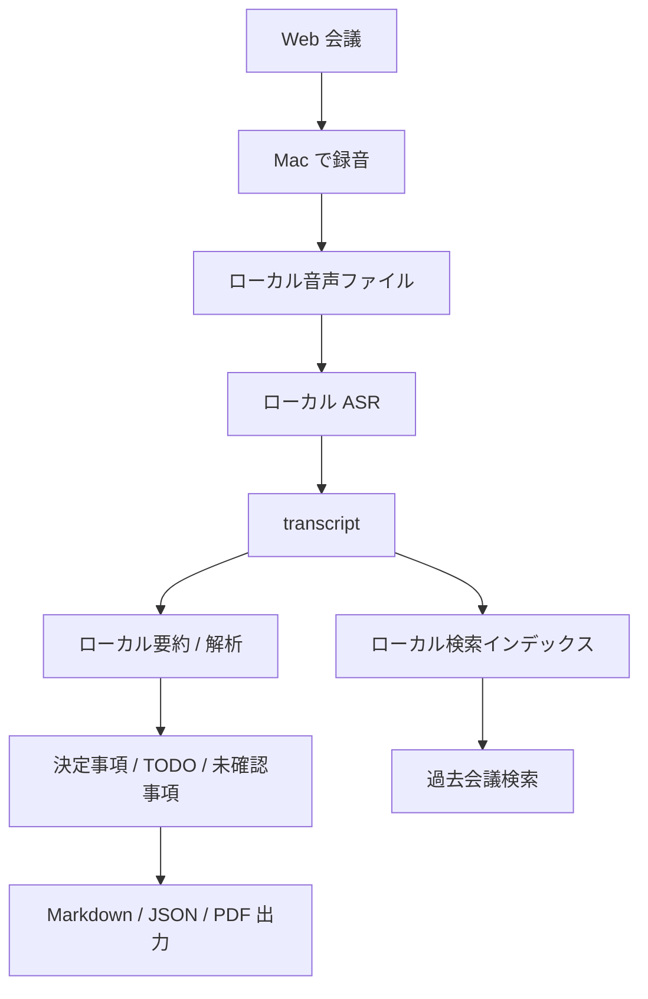

# ローカル Granola 型 Mac 会議メモアプリ

- 作成日: 2026-06-26
- 更新日: 2026-06-27
- 状態: 検討中
- 対象: macOS desktop app、会議録音、ローカル文字起こし、ローカル要約、プライバシー重視ワークフロー

## 要約

社外秘・開発会議・医療・法務・研究など、クラウド AI 議事録を使いづらい人向けに、Mac 上で録音、文字起こし、解析、要約、検索、Markdown 出力まで行うデスクトップアプリを作るアイディア。

「AI 議事録」自体は既に競争が激しい。Granola、Otter、Fathom、Krisp などは、Bot なし録音、文字起こし、要約、アクション抽出、検索、外部連携までかなり進んでいる。したがって勝ち筋は、汎用の便利ツールではなく「データを外に出せない会議のためのローカルファースト会議メモ」に絞ることにある。

仮説は「クラウド AI 議事録は便利だが、機密会議では導入承認・録音同意・データ保持・外部 AI 利用の説明が重い。そこで、音声・transcript・要約・検索インデックスを原則ローカル保存し、必要なときだけ明示的にエクスポートする Mac ネイティブアプリに価値がある」というもの。

初期ターゲットは「開発会議」に絞る。最終的には医療・法務・研究などの機密会議全般へ拡張したいが、最初から規制業界全体を狙うと要件が重くなりすぎる。まずは、自分自身が欲しいものとして「クラウド上でようやくノートを作るのが煩わしい」「会議後すぐにローカルで下書きが欲しい」という痛みを起点にする。

## 背景

Web 会議は、意思決定、仕様確認、障害対応、研究ディスカッション、面談、顧客対応などの一次情報を含む。AI 議事録サービスは、参加者の記憶補助とタスク化に強い一方で、次のような会議では導入しづらい。

- 未公開プロダクト、ソースコード、障害原因、ロードマップを扱う開発会議。
- 医療、法務、労務、人事、研究、M&A、特許など、外部送信が心理的・契約的に難しい会議。
- 顧客やパートナーに「会議内容を外部 AI 事業者に送る」と説明しにくい会議。
- Bot が会議に入ること自体が不自然、または録音同意の運用が重い会議。

既存サービスは「会議内容を組織のナレッジにする」方向へ進んでいる。これは便利だが、機密性が高い利用者には、むしろ「どこまで保存され、誰が見られ、どの AI に渡るのか」が購買阻害になる。

このアイディアの出発点は、個人的な必要性でもある。クラウド AI 議事録は便利だが、会議録音をアップロードし、クラウド上でノートを生成し、そこから手元の作業環境へ戻す流れは煩わしい。Mac 上で録音から下書き作成まで終わり、必要なときだけ Markdown として取り出せるなら、日々の開発会議の摩擦をかなり減らせる可能性がある。

## 想定ユーザー

- スタートアップ、受託開発、SaaS、研究開発チームのエンジニアと PM。
- 顧客情報や契約情報を扱うコンサルタント、弁護士、会計士、医療従事者。
- 研究室、企業 R&D、特許・知財部門。
- 会社のセキュリティポリシーでクラウド AI 議事録が使えない個人・小チーム。
- Notion、Obsidian、Markdown、ローカルファイル管理を好む知識労働者。

初期ターゲットは「Mac を使う開発者・PM・技術リード」に絞る。理由は、ローカル処理の制約を理解し、多少の手動操作やモデル選択を受け入れやすく、Markdown 出力にも価値を感じやすいため。最終的には、同じローカルファースト思想を医療・法務・研究などの機密会議全般へ広げる。

## 価値仮説

- クラウド AI 議事録が使えない会議でも、ローカル処理なら導入しやすい。
- 「完全自動共有」よりも「自分の Mac に保存し、自分で確認してから共有」のほうが、機密会議では安心感が高い。
- 会議メモの品質は、完璧な transcript よりも「決定事項、未決事項、TODO、リスク、仕様変更、発言根拠」を取り出せるかで評価される。
- 日本語と英語が混ざる開発会議では、汎用サービスよりも domain-specific な要約テンプレートに価値が出る。
- ローカル保存の transcript を横断検索できると、「あの仕様、いつ決まったか」を探す個人ナレッジベースになる。
- 自分自身が毎日使う前提で作れば、クラウド連携の派手さよりも「会議終了後すぐに手元で使える」「余計な共有導線がない」「ノート作成のためにサービスをまたがない」といった実用面を磨きやすい。
- プロジェクト名、社内コード名、人名、技術用語、API 名などをローカル辞書として渡せると、開発会議の transcript 品質が上がる。固有名詞が拾えない問題は、汎用議事録サービスとの差別化ポイントになり得る。

## 既存アプリ比較

2026-06-26 時点の公開情報に基づく整理。

| アプリ | 強み | ローカル性・プライバシー観点 | このアイディアから見た隙間 |
| --- | --- | --- | --- |
| Granola | Mac/Windows/iPhone、Bot なし、会議プラットフォーム横断、自然な AI ノート体験 | 公式 security page では、Desktop はマイクとコンピュータ音声を扱い、Deepgram/Assembly などの transcription provider と OpenAI/Anthropic などの AI provider を使うと説明。音声は保存しないが transcript と notes は AWS VPC に保存。匿名化データで自社モデル改善に使うが opt-out 可能 | 便利さは強いが、クラウド処理・外部 provider・モデル改善 opt-out が説明コストになる組織には刺さりにくい |
| Otter | Desktop app、Bot なし録音、リアルタイム文字起こし、話者認識、要約、決定事項、アクション、各種連携 | 公式サイトは Mac/Windows の Desktop app、Bot-free meetings、summary、decisions/action items、meeting knowledge engine を強く訴求。クラウド型の業務ナレッジ基盤寄り | 共有・連携・エージェント化が強い反面、ローカル完結を最優先にしたい人には過剰または導入しづらい |
| Fathom | Bot あり/なし、要約、検索可能 transcript、Ask Fathom、CRM/Slack/Notion 連携、SOC2/GDPR/HIPAA 訴求 | 公式サイトでは bot-free capture、desktop app、ChatGPT/Claude integrations、共有 source of truth を訴求。チーム向け業務連携が強い | 顧客対応・営業・チーム共有に強い。個人のローカル保管、外部送信なし、監査可能な軽量ツールとは方向が違う |
| Krisp | ノイズ除去、Bot なし、会議録音、文字起こし、要約、アクション抽出 | 公式サイトは on-device transcription を訴求する一方、録音は cloud に安全保存と説明。英語は on-device、他言語は server-based と説明 | 音声品質と会議 assistant は強いが、多言語や録音保存まで含む完全ローカルとは言い切れない |
| MacWhisper | Mac 上の Whisper 系文字起こしツールとして認知。ローカル transcription の用途に近い | 会議 assistant というより、ファイル文字起こし・transcription 作業ツール寄り | 録音、会議検出、要約テンプレート、タスク抽出、検索、ワークフロー統合を足せる余地 |
| Limitless / Rewind | 常時記録・会議記録・検索の文脈で近かった | 2025-12-05 以降、Limitless は Meta 買収後に Pendant 以外の機能を縮小。Desktop/Web App での録音不可、Rewind は screen/audio capture を停止と公式に説明 | 「Mac 上でローカルに会議記録を扱う」ポジションに空白が残っている可能性 |

## 勝ち筋

### 1. ローカル処理を機能ではなく購買理由にする

単に「ローカルでもできます」では弱い。競合はクラウド連携、共有、CRM、AI chat、組織ナレッジ化で強い。差別化するなら、プロダクト全体を次の原則で設計する。

- 音声、transcript、要約、埋め込み、検索インデックスはデフォルトで Mac 内に保存。
- 外部送信は明示的な opt-in。クラウド LLM、同期、共有リンクは初期 MVP では非目標でもよい。
- 会議ごとに「録音しない」「transcript のみ」「要約のみ残す」「N 日後に自動削除」を選べる。
- エクスポートは Markdown、JSON、PDF、SRT/VTT などのローカルファイル中心。
- セキュリティ説明をプロダクトの主導線にする。例: データフロー表示、保存場所表示、削除済み確認。

### 2. 開発会議テンプレートに寄せる

汎用要約ではなく、開発会議の成果物に寄せると、機密性の高い会議と相性がよい。

- 決定事項: 何を決めたか、理由、代替案。
- TODO: owner、期限、依存関係。
- 仕様変更: 変更前、変更後、影響範囲。
- リスク: 未検証、ブロッカー、要確認。
- ADR 候補: architecture decision record に残すべき論点。
- バグ・障害対応: 発生条件、仮説、再現手順、次アクション。

この方向なら「ローカル Granola」からさらに「開発会議のローカル記憶装置」へ寄せられる。

### 3. ドメイン語彙をローカルに持つ

開発会議の transcript で失敗しやすいのは、一般語よりも固有名詞である。人名、会社名、プロジェクト名、機能名、クラス名、API 名、略語、チケット ID、社内コードネームが誤認識されると、後段の要約や検索の品質も落ちる。

ここは「学習済みの巨大モデル」ではなく、ユーザーが扱えるローカル辞書として始めるのがよい。

- プロジェクトごとに固有名詞辞書を作る。
- Git リポジトリ、README、Issue、PR、ADR、設計メモから候補語を抽出する。
- 会議前に、その会議の参加者、カレンダー件名、関連リポジトリ、チケット番号を語彙ヒントとして渡す。
- transcript 後に、辞書ベースで誤認識候補を提示する。
- ユーザーが修正した固有名詞を次回以降の辞書に反映する。

Apple Speech では、`SFSpeechRecognitionRequest.contextualStrings` や `customizedLanguageModel` / `SFSpeechLanguageModel` が公式 API として存在する。これらを使ってどこまで日本語の開発会議に効くかは、実機検証が必要。API で足りない場合でも、後処理の固有名詞補正、読み仮名辞書、検索時の同義語展開で補える可能性がある。

### 4. Bot なし、でも録音同意は軽視しない

Bot なし録音は会議体験を邪魔しないが、同意や法務の問題が消えるわけではない。むしろ信頼を売るなら、録音同意をプロダクト上で支援する。

- 録音開始時に同意確認文を表示・読み上げできる。
- 会議メモに「録音同意: 取得済み / 未取得 / 不要判断」を記録できる。
- 地域・組織ルールに応じた注意表示を出す。
- 共有前に「機密語、個人情報、患者情報、顧客名」を簡易検出する。

### 5. ローカルモデルの品質限界を隠さない

ローカル ASR とローカル LLM は、クラウド最上位モデルより遅い・弱い可能性がある。ここを誤魔化すと期待値が壊れる。品質の見せ方を工夫する。

- transcript confidence、聞き取り不明区間、話者推定の不確実性を可視化。
- 要約には「根拠となる transcript 区間」へのリンクを付ける。
- 重要な決定事項はユーザー確認待ちにする。
- 長時間会議はチャンク要約 + 最終統合で処理し、途中結果も保存する。

### 6. founder-problem から始める

「自分が欲しい」は、このアイディアではかなり重要な強みになる。会議メモは細かな摩擦の積み重ねで継続利用が決まるため、ユーザー自身が毎日困っている人でないと、使い勝手の詰めが甘くなりやすい。

勝ち筋は、巨大な会議ナレッジ基盤を作ることではなく、まず「開発会議が終わった瞬間に、Mac 上に確認可能な下書きができている」体験を圧倒的に軽くすること。クラウド上でノートを作り、あとで別ツールへ移す煩わしさを減らす。

### 7. ターゲット設定の結論

正しくターゲットを設定すれば勝ち筋はある。初期は「開発会議 × Mac × ローカル/プライベート重視 × Markdown/開発ワークフロー」を狙うのがよい。

逆に、初期から「すべての会議」「すべての業界」「最高精度の AI 要約」「チーム共有 SaaS」を狙うと、Granola、Otter、Fathom と正面衝突しやすい。勝てる面は、精度や自動連携の総合力ではなく、データを出さずに手元で完結する安心感と、開発会議に特化した実用性にある。

## MVP

### 初期体験

1. メニューバー常駐アプリを起動する。
2. Zoom、Google Meet、Teams、Slack Huddles などの会議中に録音を開始する。
3. マイク音声とシステム音声を取得し、ローカルに一時保存する。
4. 会議終了後、ローカル ASR で文字起こしする。
5. ローカル LLM または Foundation Models framework などの候補を比較し、要約、TODO、決定事項、未確認事項を生成する。
6. ユーザーが確認・修正してから Markdown と JSON にエクスポートする。

### MVP に含める

- macOS メニューバー常駐アプリ。
- 手動録音開始・停止。
- マイク音声とシステム音声の録音。
- Apple Speech から始めるローカル文字起こし。
- 要約テンプレート:
  - 汎用議事録。
  - 開発会議。
  - 1on1 / 面談。
  - 研究ディスカッション。
- Markdown エクスポート。
- ローカル全文検索。
- 会議ごとの保存期間・削除。
- プロジェクト別のローカル固有名詞辞書。
- 認識後の固有名詞補正候補の提示。
- クラウド LLM は使わない。例外として、Apple の Foundation Models framework など、Apple プラットフォーム上のプライベート重視機構は比較対象にする。

### 初期版ではやらない

- 自動で全会議に参加する Bot。
- チーム共有リンク。
- CRM 連携。
- 常時録音。
- 医療・法務向けの公式コンプライアンス認証。
- 完全な話者分離の保証。
- OpenAI、Anthropic、Google などの外部クラウド LLM 連携。

## 技術メモ

### 音声取得

macOS では ScreenCaptureKit がシステム音声・画面キャプチャの実装候補になる。Apple Developer Documentation は JavaScript 必須ページのため本文取得はできなかったが、公式ドキュメント上で ScreenCaptureKit が提供されていることは確認した。実装時は macOS バージョン、権限、App Sandbox、Mac App Store 配布可否を検証する必要がある。

注意点:

- システム音声取得は OS 権限とユーザー説明が重要。
- 会議アプリごとの音声ルーティング差異がある。
- Bluetooth マイク、外部オーディオインターフェース、イヤホン利用時のテストが必要。

### 文字起こし

初期方針:

- Apple Speech framework の on-device recognition。`supportsOnDeviceRecognition` が公式 API として存在するが、対応言語、精度、長時間会議、句読点、話者分離は実機検証が必要。

比較候補:

- WhisperKit。Core ML ベースで Apple Silicon 上の Whisper 推論を扱う候補。
- whisper.cpp。C/C++ 実装で、Mac ローカル推論の実装候補。

日本語・英語混在会議、専門用語、固有名詞、コード名、プロダクト名は追加辞書や後処理が必要になりそう。

### ドメイン語彙・固有名詞補正

固有名詞対応は、開発会議特化の重要機能にする。

入力候補:

- 手入力のプロジェクト辞書。
- Git リポジトリ内のファイル名、型名、関数名、README、docs。
- Issue、PR、ADR、設計メモ、リリースノート。
- カレンダー件名、参加者名、会議タイトル。
- ユーザーが transcript 上で修正した単語。

処理案:

1. 会議前に関連プロジェクトの語彙を選ぶ。
2. Apple Speech の contextual strings / custom language model に渡せるものは渡す。
3. transcript 後に、辞書との類似度で誤認識候補を出す。
4. ユーザーが採用した修正を辞書へ戻す。
5. 検索では、誤認識しやすい表記ゆれも同義語として扱う。

注意点:

- 「学習」と呼ぶ場合でも、最初はモデル再学習ではなく、ローカル辞書、認識ヒント、後処理補正として設計するほうが安全。
- 辞書に機密語が含まれるため、辞書自体もローカル保存・暗号化・削除対象にする。
- Apple Speech の API が固有名詞にどれほど効くかは、言語、OS、端末、音質に依存する可能性がある。

### 要約・解析

候補:

- Ollama / llama.cpp 経由のローカル LLM。
- macOS 26 以降の Foundation Models framework。Apple の Foundation Language Models 技術報告では、on-device model と Private Cloud Compute 側の server model が説明されている。Foundation Models framework の実用 API、対応 OS、モデル能力、利用制約は実装時点で再確認する。

外部クラウド LLM 連携は基本的に許可しない。プライベート重視を価値の中心に置くため、OpenAI、Anthropic、Google などの一般的な外部 API へ transcript を送る設計は初期方針から外す。Apple の Foundation Models framework は、Apple プラットフォーム上のプライベート重視機構として別枠で比較対象にする。

ローカル LLM での要約は、会議全体を一度に読ませず、チャンク化、トピック分割、根拠リンク付き抽出を基本にする。

### データ保存

ローカルファーストの信頼性は、保存設計で決まる。

- `~/Library/Application Support/<AppName>/Meetings/` に会議単位で保存。
- 音声、transcript、要約、metadata、embedding index を分離。
- FileVault 前提にしすぎず、アプリ独自の暗号化オプションも検討。
- 会議ごとに保持期間を設定。
- エクスポート済みファイルとアプリ内データの削除関係を明示。

## 検証方法

### 需要検証

- クラウド AI 議事録を使えない理由を 10 人に聞く。
- 「ローカルなら使いたいか」ではなく、「どの会議なら使えるようになるか」を聞く。
- 既存ツールを禁止・回避している企業やチームに、導入判断の条件を聞く。
- 開発会議 5 本で、手動メモとローカル要約の差分を比較する。

### プロトタイプ検証

- 30 分会議を 5 本、60 分会議を 3 本で処理時間を測る。
- MacBook Air / Pro、メモリ 16GB / 32GB でローカル ASR と LLM の体感を比較する。
- 日本語、英語、日本語英語混在、専門用語ありの会議で品質を見る。
- 決定事項と TODO の抽出精度を、人間の議事録と比較する。
- 要約エンジン候補を同じ transcript で比較し、精度、速度、端末負荷、根拠リンクの作りやすさを見る。
- 固有名詞辞書あり / なしで、プロジェクト名、人名、API 名、コード名の認識率を比較する。

### 成功指標

- 会議後 5 分以内に「共有前に確認できる下書き」が出る。
- 重要な決定事項の見落としが少ない。
- ユーザーが共有前に不安なく内容を確認・削除できる。
- クラウド AI 議事録が使えなかった会議で、実際に使える。
- 既存サービスより高機能でなくても、「この会議にはこれしか使えない」と言われる。

## 注意点

- Bot なし録音でも、法域や社内規程によって同意が必要。法務助言ではなく、同意取得を支援する設計が必要。
- 完全ローカルを掲げるなら、クラッシュレポート、分析 telemetry、モデル更新、ライセンス確認も含めて外部送信を説明する必要がある。
- 医療・法務を初期ターゲットにすると、HIPAA、監査ログ、BAA、データ保持、証拠性など要求が一気に重くなる。まずは「機密開発会議」「研究ディスカッション」から始めるのが現実的。
- ローカルモデルは端末性能に依存する。最低要件と推奨要件を明示しないと、体験がばらつく。
- 会議内容を保存するアプリは、ユーザーの Mac が侵害された場合の影響も大きい。暗号化、ロック、削除、バックアップ除外を検討する。

## 決定事項

- 初期ターゲットは開発会議。最終的には機密会議全般へ広げる。
- ローカル処理を強みにする。外部クラウド LLM は使わない。
- 文字起こしエンジンは Apple Speech から始める。
- 固有名詞・ドメイン語彙は、ローカル辞書と認識ヒント、後処理補正で扱う。
- 価格は買い切り以外を想定し、サブスクとチームライセンスの両方を検討する。

## 未決事項

- 要約エンジンを Ollama 連携、同梱モデル、Foundation Models framework のどれにするか。精度比較後に決める。
- Mac App Store 配布を狙うか、開発者向けに direct distribution から始めるか。
- Apple Speech の品質が開発会議の実用ラインに届かない場合、WhisperKit / whisper.cpp へ切り替えるか、併用するか。
- Foundation Models framework を使う場合、プライバシー説明、対応 OS、利用制約、要約品質をどう扱うか。
- Apple Speech の contextual strings / custom language model が、日本語の固有名詞補正にどれほど効くか。

## 参考

- [Security at Granola](https://www.granola.ai/security)（参照日: 2026-06-26）
- [Otter.ai](https://otter.ai/)（参照日: 2026-06-26）
- [Fathom AI Notetaker](https://www.fathom.ai/)（参照日: 2026-06-26）
- [Krisp AI Meeting Assistant](https://krisp.ai/ai-meeting-assistant/)（参照日: 2026-06-26）
- [MacWhisper](https://goodsnooze.gumroad.com/l/macwhisper)（参照日: 2026-06-26）
- [Limitless](https://www.limitless.ai/)（参照日: 2026-06-26）
- [Apple Developer Documentation: ScreenCaptureKit](https://developer.apple.com/documentation/screencapturekit)（参照日: 2026-06-26）
- [Apple Developer Documentation: SFSpeechRecognizer.supportsOnDeviceRecognition](https://developer.apple.com/documentation/speech/sfspeechrecognizer/supportsondevicerecognition)（参照日: 2026-06-26）
- [Apple Developer Documentation: SFSpeechRecognitionRequest.contextualStrings](https://developer.apple.com/documentation/speech/sfspeechrecognitionrequest/contextualstrings)（参照日: 2026-06-27）
- [Apple Developer Documentation: SFSpeechRecognitionRequest.customizedLanguageModel](https://developer.apple.com/documentation/speech/sfspeechrecognitionrequest/customizedlanguagemodel)（参照日: 2026-06-27）
- [Apple Developer Documentation: SFSpeechLanguageModel](https://developer.apple.com/documentation/speech/sfspeechlanguagemodel)（参照日: 2026-06-27）
- [WhisperKit](https://github.com/argmaxinc/WhisperKit)（参照日: 2026-06-26）
- [whisper.cpp](https://github.com/ggml-org/whisper.cpp)（参照日: 2026-06-26）
- [Ollama](https://ollama.com/)（参照日: 2026-06-26）
- [Apple Intelligence Foundation Language Models](https://arxiv.org/abs/2407.21075)（参照日: 2026-06-26）
