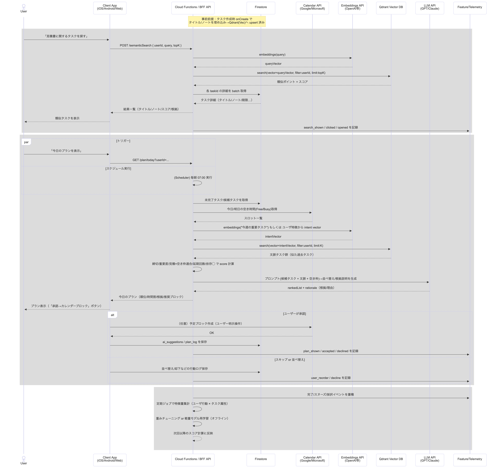

# タスクの検索・推薦


```
sequenceDiagram
    %% 主要アクター
    actor User as User
    participant App as Client App<br/>(iOS/Android/Web)
    participant BFF as Cloud Functions / BFF API
    participant FS as Firestore
    participant Cal as Calendar API<br/>(Google/Microsoft)
    participant Emb as Embeddings API<br/>(OpenAI等)
    participant Vec as Qdrant Vector DB
    participant LLM as LLM API<br/>(GPT/Claude)
    participant Log as Feature/Telemetry

    Note over FS,BFF: 事前前提：タスク作成時 onCreate で<br/>タイトル/ノートを埋め込み→Qdrant(Vec)へ upsert 済み

    %% =========================
    %% A) オンデマンド 検索フロー
    %% =========================
    rect rgb(245,245,255)
      User->>App: 「見積書に関するタスクを探す」
      App->>BFF: POST /semanticSearch { userId, query, topK }
      BFF->>Emb: embeddings(query)
      Emb-->>BFF: queryVector
      BFF->>Vec: search(vector=queryVector, filter:userId, limit:topK)
      Vec-->>BFF: 類似ポイント + スコア
      BFF->>FS: 各 taskId の詳細を batch 取得
      FS-->>BFF: タスク詳細（タイトル/ノート/期限…）
      BFF-->>App: 結果一覧（タイトル/ノート/スコア/根拠）
      App-->>User: 類似タスクを表示
      BFF->>Log: search_shown / clicked / opened を記録
    end

    %% ==========================================
    %% B) 今日のプラン 推薦フロー（オンデマンド/定時）
    %% ==========================================
    rect rgb(245,255,245)
      par トリガー
        User->>App: 「今日のプランを表示」
        App->>BFF: GET /plan/today?userId=...
      and スケジュール実行
        BFF->>BFF: (Scheduler) 毎朝 07:00 実行
      end

      BFF->>FS: 未完了タスク/候補タスクを取得
      BFF->>Cal: 今日/明日の空き時間(Free/Busy)取得
      Cal-->>BFF: スロット一覧

      %% RAGで文脈補強（任意）
      BFF->>Emb: embeddings("今週の重要タスク") もしくは ユーザ特徴から intent vector
      Emb-->>BFF: intentVector
      BFF->>Vec: search(vector=intentVector, filter:userId, limit:K)
      Vec-->>BFF: 文脈タスク群（似た過去タスク）

      %% ルール + 軽量学習でスコアリング
      BFF->>BFF: 締切/重要度/見積×空き枠適合/延期回数/依存◯ で score 計算
      BFF->>LLM: プロンプト(候補タスク + 文脈 + 空き枠)→並べ替え/根拠説明を生成
      LLM-->>BFF: rankedList + rationale（根拠/理由）

      BFF-->>App: 今日のプラン（順位/時間割/根拠/推奨ブロック）
      App-->>User: プラン表示（「承認→カレンダーブロック」ボタン）

      alt ユーザーが承認
        App->>Cal: （任意）予定ブロック作成（ユーザー明示操作）
        Cal-->>App: OK
        App->>FS: ai_suggestions / plan_log を保存
        BFF->>Log: plan_shown / accepted / declined を記録
      else スキップ or 並べ替え
        App->>FS: 並べ替え/却下などの行動ログ保存
        BFF->>Log: user_reorder / decline を記録
      end
    end

    %% =========================
    %% C) 継続学習/評価（非同期）
    %% =========================
    rect rgb(255,250,240)
      BFF->>Log: 完了/スヌーズ/採択イベントを蓄積
      BFF->>BFF: 定期ジョブで特徴量集計（ユーザ行動 × タスク属性）
      BFF->>BFF: 重みチューニング or 軽量モデル再学習（オフライン）
      BFF-->>BFF: 次回以降のスコア計算に反映
    end

```

