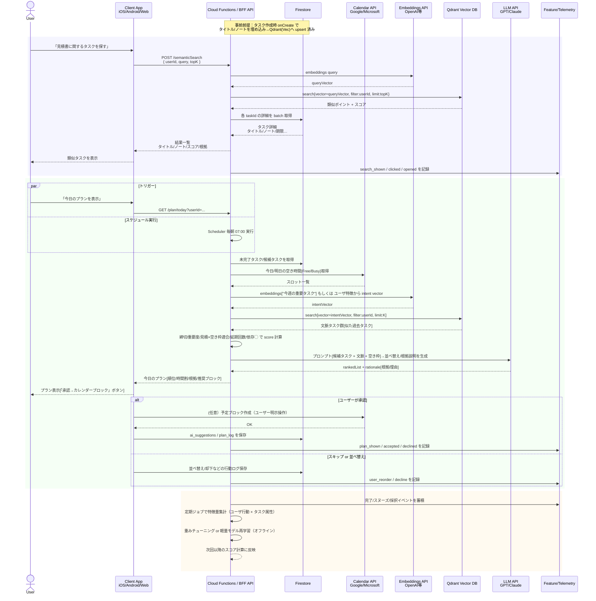

# タスク管理AIシステム


```
flowchart LR
  %% ===== クライアント層 =====
  subgraph Client[Clients]
    iOS[iOS App<br/>SwiftUI + Firebase SDK]
    Android[Android App<br/>Compose + Firebase SDK]
    Web[Web App]
  end

  %% ===== Firebase層 =====
  subgraph Firebase[Firebase Backend]
    Auth[Firebase Auth]
    FS[Cloud Firestore, タスク/プロジェクト/ユーザ設定]
    Storage[(Cloud Storage<br/>添付ファイル・画像)]
    CF[Cloud Functions / Cloud Run<br/>HTTP API / AI連携 / バッチ]
  end

  Client --> Auth
  Client --> FS
  Client --> Storage

  Client --> CF
  CF --> FS
  CF --> Storage

  %% ===== AI / 推薦・RAG 層 =====
  subgraph AI[AI & Recommendation Services]
    Orchestrator[LLM Orchestrator<br/>NL→タスク構造化 / プロンプト制御]
    RecSvc[Recommendation Logic<br/>今日のプラン / スヌーズ提案]
    VecDB[(Vector Store<br/>タスク/メモ埋め込み)]
  end

  CF --> Orchestrator
  CF --> RecSvc
  Orchestrator --> VecDB
  RecSvc --> VecDB

  %% ===== 外部サービス =====
  subgraph External[External Services]
    Cal[Calendar API<br/>Google / Microsoft]
    Mail[Mail API<br/>Gmail / Outlook]
    LLMAPI[LLM Provider<br/>GPT / Claude 等]
    Analytics[BigQuery / GA4<br/>ログ・分析]
  end

  CF <--> Cal
  CF <--> Mail
  Orchestrator <--> LLMAPI
  CF --> Analytics
```

### ベクトル検索
- MVP: Firestore＋Qdrant
- 高速・スケーラブル: Weaviate Cloud / Qdrant Cloud＋RAG層


## MVP
### タスク検索・推薦
```
flowchart LR
  App[Client<br>iOS/Android/Web] -->|Firestore SDK| FS[(Cloud Firestore)]
  FS -- onCreate trigger --> CF[Cloud Functions(TypeScript)]
  CF -->|Embeddings API| OpenAI[OpenAI Embeddings]
  CF -->|/collections/points| Qdrant[Qdrant (Cloud/自前)]
  App -->|HTTP| CF
  CF -->|read| FS
```

```
sequenceDiagram
    actor User as User
    participant App as Client App<br/>(iOS/Android/Web)
    participant FS as Firestore
    participant CF as Cloud Functions<br/>(TypeScript)
    participant OpenAI as OpenAI API<br/>Embeddings
    participant Qdrant as Qdrant<br/>Vector DB

    %% --- タスク作成 ---
    User->>App: 新しいタスクを作成
    App->>FS: setDoc("users/{uid}/tasks/{taskId}", {...})
    Note over FS: ドキュメントが作成される

    %% --- 自動インデックス (onCreate) ---
    FS-->>CF: onDocumentCreated Trigger<br/>users/{uid}/tasks/{taskId}
    CF->>CF: Firestoreデータを読み込み<br/>title + note を連結
    CF->>OpenAI: POST /v1/embeddings<br/>モデル: text-embedding-3-small
    OpenAI-->>CF: embedding ベクトル (1536次元)
    CF->>Qdrant: upsert(points=[{id, vector, payload}])
    Qdrant-->>CF: OK (登録完了)
    CF-->>FS: （必要なら status 更新）

    Note over CF,Qdrant: これで類似検索が可能になる

    %% --- 意味検索API呼び出し ---
    User->>App: 「見積書関連のタスクを探す」
    App->>CF: POST /semanticSearch {query, userId}
    CF->>OpenAI: embeddings(query)
    OpenAI-->>CF: query vector
    CF->>Qdrant: search(vector=query, filter=userId)
    Qdrant-->>CF: 類似タスク一覧 + スコア
    CF->>FS: 各 taskId の詳細を取得
    FS-->>CF: タスクデータ
    CF-->>App: 検索結果(JSON)
    App-->>User: 類似タスクを表示（タイトル/ノート/スコア）

```

### タスク作成
```
sequenceDiagram
    actor User as User
    participant App as Client App<br/>(iOS/Android/Web)
    participant CF as Cloud Functions<br/>NL Orchestrator
    participant FS as Firestore
    participant RAG as Vector DB<br/>(Qdrant/他)
    participant Cal as Calendar API<br/>(Google/Microsoft)
    participant LLM as LLM API<br/>(GPT/Claude)

    %% --- 入力 ---
    User->>App: 「金曜までに見積書、30分くらい」(自然言語)
    App->>CF: POST /nl/parse-task { text, tz:"Asia/Tokyo", now }

    %% --- 文脈収集 & RAG ---
    CF->>FS: 直近の関連タスク/プロジェクトを取得
    CF->>RAG: 類似ノート/タスクの検索（任意）
    RAG-->>CF: 近縁ドキュメント（スニペット）

    %% --- 予定考慮（任意） ---
    CF->>Cal: 本日の空き時間スロット取得（任意）
    Cal-->>CF: 空き枠/既存予定

    %% --- LLMで構造化 ---
    CF->>LLM: プロンプト: {text + 文脈 + 予定要約}<br/>→ タイトル/期限/見積/優先度/タグ/プロジェクト
    LLM-->>CF: 構造化ドラフト {title, due_at, estimate_min, priority, project, rationale}

    %% --- 正規化 & 返却 ---
    CF->>CF: 日付正規化(Asia/Tokyo)/バリデーション/デフォルト補完
    CF-->>App: Draft JSON + 根拠（引用/RAG参照/理由）

    %% --- ユーザー確認 ---
    App-->>User: プレビュー表示（編集可）
    User->>App: 「作成」確定

    %% --- 登録 ---
    App->>FS: setDoc("users/{uid}/tasks/{taskId}", Draft修正後データ)
    FS-->>App: OK

    %% --- 付随インデックス（別トリガー） ---
    FS-->>CF: onDocumentCreated Trigger（タスク新規）
    CF->>LLM: Embeddings API（タイトル+ノート）
    LLM-->>CF: embedding ベクトル
    CF->>RAG: upsert(points=[{id, vector, payload}])
    RAG-->>CF: OK

    %% --- 完了 ---
    App-->>User: 作成完了 &（任意）カレンダーにブロック提案

```


### 検索・推薦シーケンス




ユーザーについてのコンテキストをある程度入力して、推薦に使いたい。