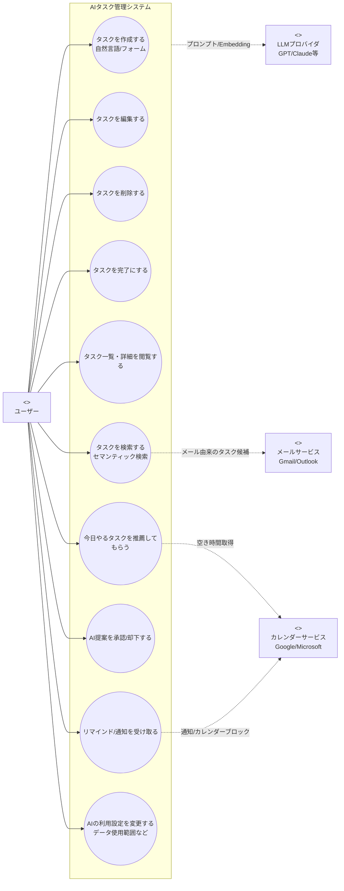
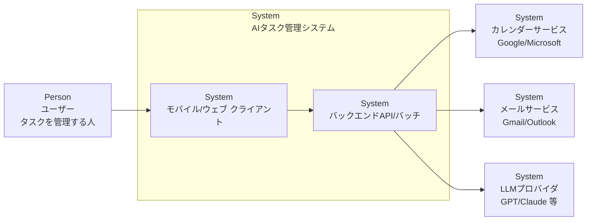
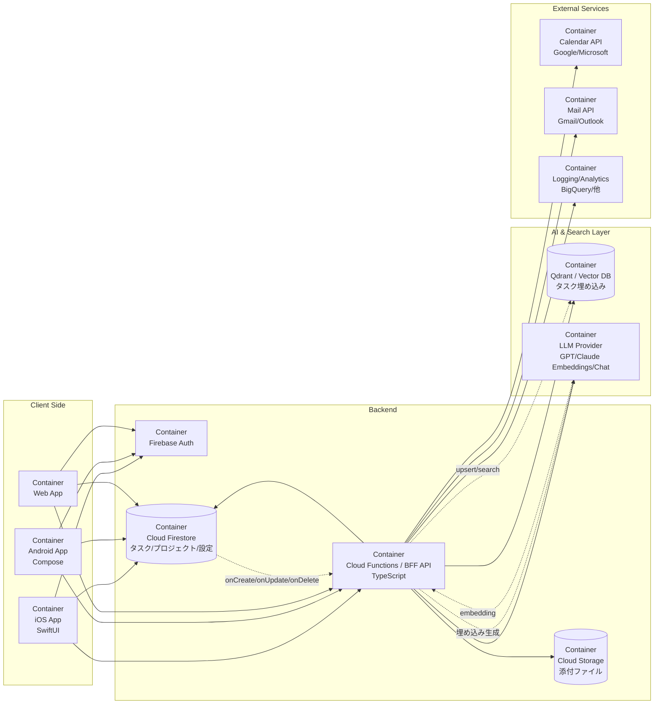

# タスク管理 - 論理設計

### ユースケース図

```mermaid
flowchart LR
    %% アクター
    user[<<Actor>><br>ユーザー]
    cal[<<Actor>><br>カレンダーサービス<br>Google/Microsoft]
    mail[<<Actor>><br>メールサービス<br>Gmail/Outlook]
    llm[<<Actor>><br>LLMプロバイダ<br>GPT/Claude等]

    %% システム境界
    subgraph System[AIタスク管理システム]
        UC1((タスクを作成する<br>自然言語/フォーム))
        UC2((タスクを編集する))
        UC3((タスクを削除する))
        UC4((タスクを完了にする))
        UC5((タスク一覧・詳細を閲覧する))
        UC6((タスクを検索する<br>セマンティック検索))
        UC7((今日やるタスクを推薦してもらう))
        UC8((AI提案を承認/却下する))
        UC9((リマインド/通知を受け取る))
        UC10((AIの利用設定を変更する<br>データ使用範囲など))
    end

    %% 関連
    user --> UC1
    user --> UC2
    user --> UC3
    user --> UC4
    user --> UC5
    user --> UC6
    user --> UC7
    user --> UC8
    user --> UC9
    user --> UC10

    %% 外部システムとの連携
    UC7 -. 空き時間取得 .-> cal
    UC9 -. 通知/カレンダーブロック .-> cal
    UC6 -. メール由来のタスク候補 .-> mail

    %% LLM は外部サービスとして明示
    System -. プロンプト/Embedding .-> llm

```

### C1 - Context

```mermaid
flowchart LR
    user[Person<br>ユーザー<br>タスクを管理する人]

    subgraph System[System<br>AIタスク管理システム]
        app[System<br>モバイル/ウェブ クライアント]
        backend[System<br>バックエンドAPI/バッチ]
    end

    cal[System<br>カレンダーサービス<br>Google/Microsoft]
    mail[System<br>メールサービス<br>Gmail/Outlook]
    llm[System<br>LLMプロバイダ<br>GPT/Claude 等]

    user --> app
    app --> backend

    backend --> cal
    backend --> mail
    backend --> llm
```

### C2 - Container

```mermaid
flowchart LR
    %% クライアント
    subgraph ClientSide[Client Side]
        ios[Container<br>iOS App<br>SwiftUI]
        android[Container<br>Android App<br>Compose]
        web[Container<br>Web App]
    end

    %% バックエンド（Firebase中心）
    subgraph Backend[Backend]
        bff[Container<br>Cloud Functions / BFF API<br>TypeScript]
        auth[Container<br>Firebase Auth]
        fs[(Container<br>Cloud Firestore<br>タスク/プロジェクト/設定)]
        storage[(Container<br>Cloud Storage<br>添付ファイル)]
    end

    %% AI & 検索
    subgraph AI[AI & Search Layer]
        vecdb[(Container<br>Qdrant / Vector DB<br>タスク埋め込み)]
        llmapi[Container<br>LLM Provider<br>GPT/Claude Embeddings/Chat]
    end

    %% 外部サービス
    subgraph External[External Services]
        cal[Container<br>Calendar API<br>Google/Microsoft]
        mail[Container<br>Mail API<br>Gmail/Outlook]
        analytics[Container<br>Logging/Analytics<br>BigQuery/他]
    end

    %% 接続
    ios --> auth
    android --> auth
    web --> auth

    ios --> fs
    android --> fs
    web --> fs

    ios --> bff
    android --> bff
    web --> bff

    bff --> fs
    bff --> storage
    bff --> vecdb
    bff --> llmapi
    bff --> cal
    bff --> mail
    bff --> analytics

    %% Firestore トリガーから AI 層へ
    fs -. onCreate/onUpdate/onDelete .-> bff
    bff -. 埋め込み生成 .-> llmapi
    llmapi -. embedding .-> bff
    bff -. upsert/search .-> vecdb

```