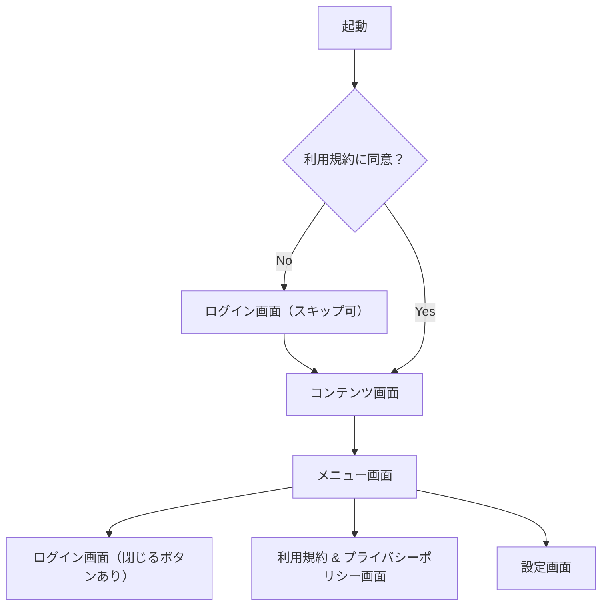

# 画面遷移マップ

- 起動時、利用規約に同意していなければ、「ログイン画面（スキップ可）」を出す
- 利用規約に同意しているorログインしていればコンテンツ画面を出す
- コンテンツからメニュー画面に遷移できる
- メニュー画面からは、ログイン画面・利用規約&プライバシーポリシー画面に移動できる
- メニュー画面から、設定画面に移動できる

```mermaid
flowchart TD

    Start[起動] --> CheckTerms{利用規約に同意？}

    %% 起動直後のログイン（スキップ可）
    CheckTerms -- No --> LoginSkip[ログイン画面（スキップ可）]
    LoginSkip --> Content[コンテンツ画面]

    %% 条件を満たしている場合
    CheckTerms -- Yes --> Content

    %% コンテンツからメニューへ
    Content --> Menu[メニュー画面]

    %% メニューからの遷移
    Menu --> LoginClose[ログイン画面（閉じるボタンあり）]
    Menu --> Terms[利用規約 & プライバシーポリシー画面]
    Menu --> Settings[設定画面]

```