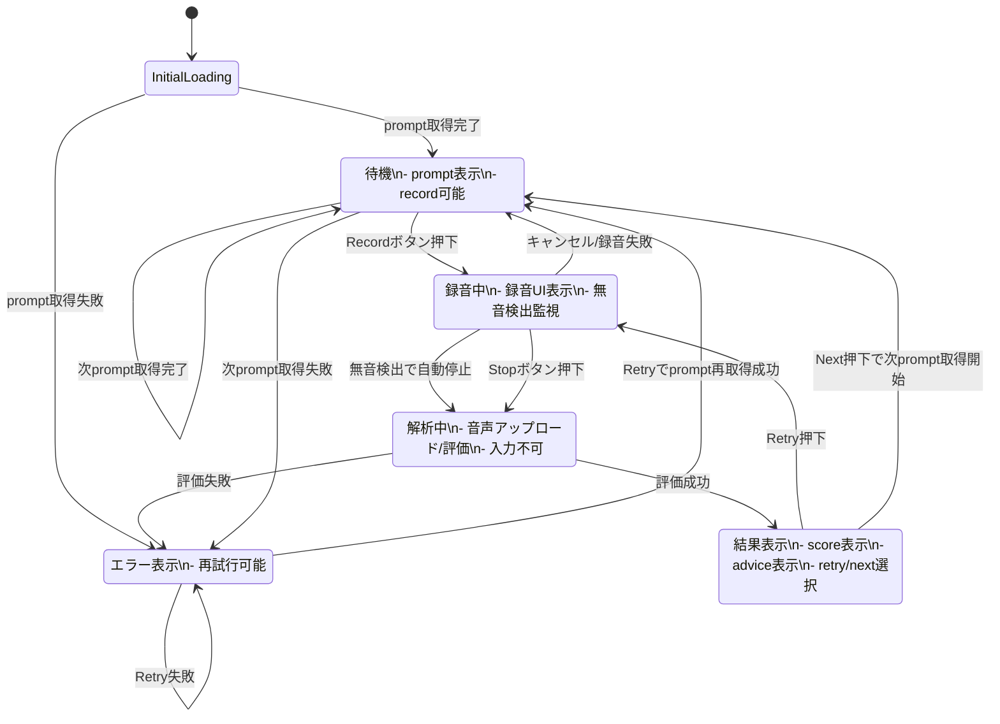
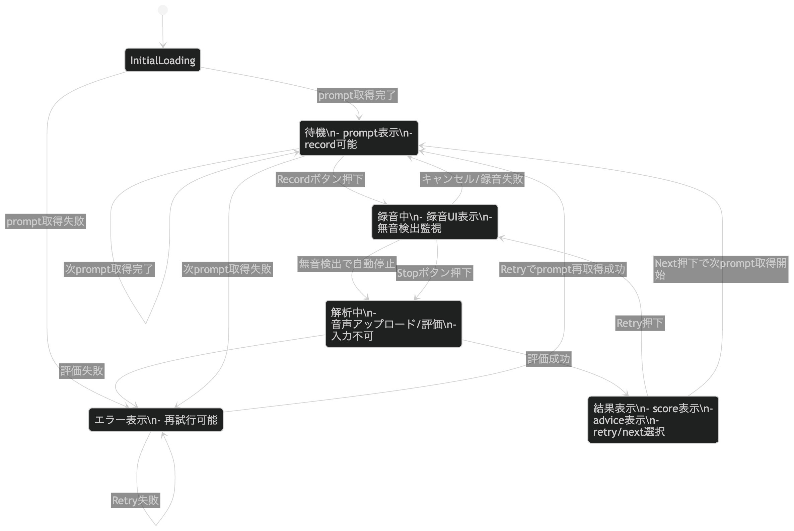

# MVP ユーザーストーリー v0.1


# ① 設計方針（重要）

今回の特徴：

- 完全1画面
- 状態駆動UI（State Machine型）
- 即時フィードバックが価値の中心

→ よってユーザーストーリーは  
👉 **「状態遷移ベース」で定義するのが最も実装に直結します**

***

# ② 状態モデル（UIのコア）

まずこれを明確にします：

```
Idle（待機）
↓
Recording（録音中）
↓
Processing（解析中）
↓
Result（結果表示）
↓
Idle（次の問題）
```

***

# ③ ユーザーストーリー（状態ベース再設計）

## 🟢 STATE 1: Idle（待機）

### US-1: すぐ始めたい

> As a user,  
> I want to immediately see a prompt,  
> so that I can start without thinking.

**UI状態**

- Prompt表示済み
- Recordボタン強調

***

### US-2: 迷わず録音したい

> As a user,  
> I want a clear recording entry point,  
> so that I don’t hesitate.

**受け入れ条件**

- 中央に大きな録音ボタン
- 他のUIは最小限

***

## 🔴 STATE 2: Recording（録音中）

### US-3: 発話に集中したい

> As a user,  
> I want to focus only on speaking,  
> so that I can perform naturally.

**受け入れ条件**

- UIノイズ最小
- 録音状態が明確（波形 or アニメーション）

***

### US-4: 自動で終わってほしい

> As a user,  
> I want recording to stop automatically,  
> so that I don’t need to manage timing.

**受け入れ条件**

- 無音検出で自動停止（メイン）
- 手動停止も可能（サブ）

👉 ここはUXのキモ（かなり重要）

***

## 🟡 STATE 3: Processing（解析中）

### US-5: 待ち時間を感じたくない

> As a user,  
> I want feedback quickly,  
> so that I stay engaged.

**受け入れ条件**

- ローディング短い
- スピナー or 軽いアニメーション

***

## 🔵 STATE 4: Result（結果）

### US-6: 一瞬で結果を理解したい（最重要）

> As a user,  
> I want to instantly understand my performance,  
> so that I can decide what to do next.

**受け入れ条件**

- Score（0–100）を大きく表示
- 色 or サイズで直感的理解

***

### US-7: 良いか悪いか知りたい

> As a user,  
> I want a clear judgment,  
> so that I know if I should retry.

**受け入れ条件**

- スコア帯ごとのメッセージ
- 95閾値で明確に変化

***

### US-8: 軽いヒントが欲しい

> As a user,  
> I want a simple hint,  
> so that I can improve without thinking too much.

**受け入れ条件**

- 1文のみ
- phonemeベース（例：R/L）

👉 深掘りしないのがMVPとして正しい

***

### US-9: 次の行動を選びたい

> As a user,  
> I want to retry or continue,  
> so that I control my learning.

**受け入れ条件**

- Retry（主 or 弱）
- Next（主 or 副）

***

# ④ UXのコア設計（かなり重要）

あなたの仕様だと、UXの質はここで決まります👇

## スコア別UI分岐

### 🔴 低スコア（〜85）

- Retry：強
- Next：弱
- メッセージ：改善促進

***

### 🟡 中スコア（85〜94）

- Retry：強
- Next：通常
- メッセージ：あと少し

***

### 🟢 高スコア（95〜）

- Next：強
- Retry：弱（テキストリンク）

***

👉 これはプロダクトの“性格”を決める重要設計

***

# ⑤ MVPの体験の本質

この設計を一言で言うと：

> **「判断 → 即行動」ループ**

ユーザーは毎回これを回します：

```
発話 → スコアを見る → 判断 → 再挑戦 or 次へ
```

***

# ⑥ 実装との対応（SwiftUI的に）

このユーザーストーリーはそのまま：

```
enum PracticeState {
    case idle
    case recording
    case processing
    case result(ResultData)
}
```

にマッピングできます。

***

# ⑦ かなり重要な改善提案（1つだけ）

ここはUXとして強くおすすめです👇

## 🔥 Result表示を「アニメーション付き」にする

理由：

- 即フィードバックでも「感情のピーク」を作る必要がある
- スコアがパッと出るだけだと弱い

例：

- 0 → スコアまでカウントアップ
- 色変化（赤→緑）

👉 習慣化に効く

***



