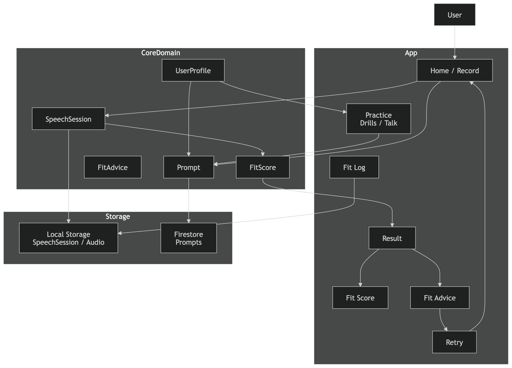

# [Product] Core Architecture


これは今後

- 機能追加
- DB設計
- AI評価設計
- クライアント実装

すべての基準になります。



# 1. 最重要のコアループ

Accent Fit の **唯一の核心**はこれです。

```
Speak
 ↓
Fit Score
 ↓
Advice
 ↓
Retry
```

これをアプリ設計では

```
Record
 ↓
Result
 ↓
Advice
 ↓
Retry
```

として実装します。