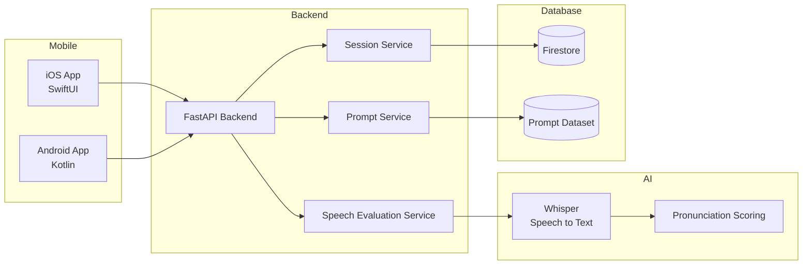
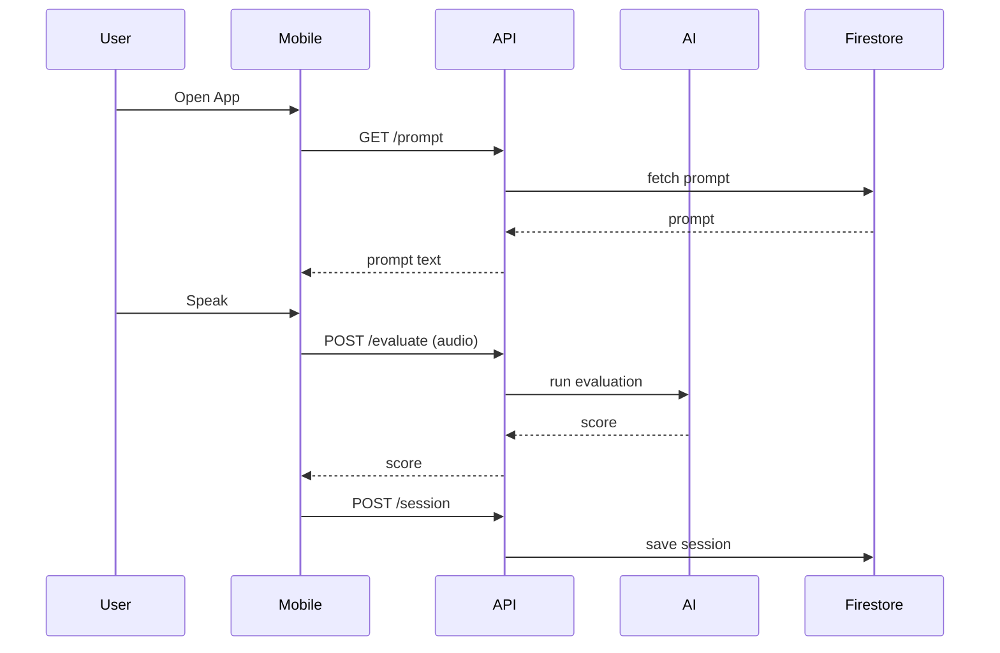

# [System] MVP System Architecture

**Option A：Mobile → Backend → AI** で進めます。

これは将来の

- Pronunciation Map

- Recommendation engine

- Prompt personalization

を実装する上でも正しい選択です。  
AIロジックをBackend側に集中させる設計になります。pasted

***

# Step 3

# System Architecture

まず **MVPの最小構成**を決めます。

## 全体構成

```
Mobile (iOS / Android)
        │
        │ REST API
        ▼
Backend (FastAPI)
        │
        ├ Speech evaluation
        │
        ▼
AI pipeline
Whisper + wav2vec2
        │
        ▼
Firestore
```


### High Level Architecture



.png)

### Request Flow


.png)


***

# システム構造

## Mobile

役割

```
UI
Audio recording
API call
State management
```

送信するもの

```
audio file
promptId
```

***

## Backend (FastAPI)

役割

```
Prompt delivery
Speech evaluation
Session storage
```

MVPではBackendが

```
AI orchestrator
```

になります。

***

# AI Evaluation Pipeline

MVPでは **非常にシンプルにします。**

```
Audio
 ↓
Whisper
 ↓
Transcript
 ↓
Compare with prompt
 ↓
Score
```

***

## スコアリング方法（MVP）

例

Prompt

```
I really like reading books
```

Transcript

```
I rery like reading books
```

評価

```
WER (Word Error Rate)
```

スコア

```
Score = (1 - WER) * 100
```

***

# 将来の拡張

Coreでは

```
wav2vec2
```

で

```
phoneme alignment
```

を行います。

***

# Backend API

MVP APIは **3つだけ**

***

## 1 Prompt API

```
GET /prompt
```

Response

```
{
  "id": "p_001",
  "text": "I really like reading books."
}
```

***

## 2 Evaluate API

```
POST /evaluate
```

Request

```
multipart/form-data

audio.wav
promptId
```

Response

```
{
  "score": 72,
  "transcript": "I rery like reading books"
}
```

***

## 3 Session API

```
POST /session
```

Request

```
{
  "promptId": "p_001",
  "score": 72,
  "duration": 8
}
```

***

# Firestore構造

MVPは **3コレクション**

```
prompts
speechSessions
users
```

***

## prompts

```
prompts
 └ promptId
      text
      difficulty
```

***

## speechSessions

```
speechSessions
 └ sessionId
      userId
      promptId
      score
      duration
      createdAt
```

***

## users

```
users
 └ userId
      createdAt
```

anonymous user

***

# Audioデータ

MVPでは **保存しない方が良い**

理由

- storageコスト

- privacy

送信のみ

***

# 音声フォーマット

推奨

```
wav
16kHz
mono
```

理由

Whisper / wav2vec2互換

***

# リクエストフロー

```
Mobile
 ↓
GET /prompt
 ↓
Show prompt
 ↓
User speaks
 ↓
POST /evaluate
 ↓
Score returned
 ↓
POST /session
```

***

# レイテンシ

目標

```
< 2 sec
```

Whisper small modelで

```
~1 sec
```

***

# MVPインフラ

最小構成

```
Cloud Run
FastAPI
Firestore
```

***

# ここまでで決まったこと

### UX

```
Single screen
```

### Backend

```
FastAPI
```

### AI

```
Whisper scoring
```

### DB

```
Firestore
```

***

# 次のステップ

次は **Step 4：詳細設計**です。

ここから

```
Mobile
Backend
AI pipeline
Firestore schema
```

を **実装レベルまで落とします。**

具体的には

- Firestore schema 完全版

- API request/response schema

- Mobile architecture

- Backend module構造

を決めます。

***

進める前に **1つ重要な設計決定**があります。

### Promptの供給方法

どちらにしますか？

***

### Option A（おすすめ）

```
Prompt dataset
1000 sentences
Firestore
```

Backendがランダム配信

***

### Option B

```
AI generated prompts
```

毎回生成

***

**MVPは A が良いです。**

理由

- 安定

- 評価しやすい

- AIコストなし

***

どちらにしますか？

```
A
Dataset prompts
```

or

```
B
AI prompts
```

情報源
