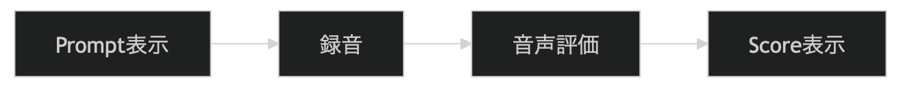

# [System] MVP実装順序


ここでは \*\*Accent Fit を実際に作るときの「最小プロダクト構成（実装順序）」\*\*を整理します。  
目的はこれです。

```
できるだけ早く動くアプリを作る
```

つまり

```
最短でリリース
```

です。

あなたはモバイル開発経験があるので  
**実装の難易度順 + UX価値順**で並べます。

***

# 1. 最初の完成形（超最小）

まず最初に目指すのはこれです。




これだけです。

つまり

```
Prompt → Speak → Score
```

***

# 2. Step1 Prompt表示

最初は **固定データでOK**です。

例

```
Could you send the report?
Please review the document.
Let's start the meeting.
```

Swift

```
struct Prompt {
    let text: String
}
```

まだ

```
Firestore不要
```

***

# 3. Step2 Recording

iOS

```
AVAudioRecorder
```

録音UI

```
Could you send the report?

[Start Recording]
```

録音終了

```
Stop
```

保存

```
tmp/audio.m4a
```

***

# 4. Step3 Evaluation API

ここは最初は **ダミーでもOK**です。

例

```
{
 "score": 80,
 "rhythm": 78,
 "stress": 70,
 "clarity": 90,
 "advice": "Try stressing 'report'."
}
```

つまり

```
mock API
```

***

# 5. Step4 Result画面

例

```
Fit Score

82

Rhythm   80
Stress   75
Clarity  90

Advice
Try stressing the word "report".
```

***

# 6. Step5 Practice Again

結果のあと

```
Practice Again
```

ボタン

これが

```
UXの核心
```

です。

***

# 7. Step6 SpeechSession保存

次に履歴を保存します。

モデル

```
struct SpeechSession {
    let prompt: String
    let score: Int
    let date: Date
}
```

保存

```
local DB
```

***

# 8. Step7 History画面

例

```
Mar 10
Could you send the report?
Score 82
```

***

# 9. Step8 Prompt API

ここで初めて

```
Firestore
```

を導入。

Prompt JSON

```
{
 "id":"p1",
 "text":"Could you send the report?",
 "difficulty":1
}
```

***

# 10. Step9 Recommendation

簡単な推薦

```
random prompt
```

次に

```
weakness based
```

***

# 11. Step10 Pronunciation Map

ここで

```
Pronunciation Profile
```

を作ります。

例

```
Stress   72
Rhythm   81
Clarity  85
```

***

# 12. 実装順序

重要です。

| 順序 | 機能                |
| -- | ----------------- |
| 1  | Prompt表示          |
| 2  | Recording         |
| 3  | Result            |
| 4  | Practice Again    |
| 5  | SpeechSession保存   |
| 6  | History           |
| 7  | API接続             |
| 8  | Recommendation    |
| 9  | Pronunciation Map |

***

# 13. 最小画面

本当に必要なのは

| Screen   |
| -------- |
| Practice |
| Result   |
| History  |

つまり

```
3 screens
```

***

# 14. MVPコード量

目安

| 部分        | 行数   |
| --------- | ---- |
| UI        | 2000 |
| Recording | 200  |
| Session保存 | 300  |
| API       | 200  |

合計

```
3000行程度
```

***

# 15. 開発スケジュール

現実的には

| 週 | 作業        |
| - | --------- |
| 1 | UI        |
| 2 | recording |
| 3 | result    |
| 4 | API       |
| 5 | history   |
| 6 | polish    |

***

# 16. 最初のリリース

最初のバージョンは

```
Prompt
Recording
Score
History
```

だけでOKです。

***

# 17. 追加する機能

次に追加

```
Pronunciation Map
```

***

# まとめ

Accent Fit の最小構成

```
Prompt
Recording
Score
History
```

画面

```
Practice
Result
History
```

これだけで

```
リリース可能
```

です。

***

最後に1つ重要な話があります。

このアプリの場合、**技術よりも先に決めるべきもの**があります。

それは

```
Prompt Dataset
```

です。

実はこれが

```
発音アプリの品質の70%
```

を決めます。

もしよければ次に  
\*\*Accent Fit 用の Prompt Dataset（最初の100個）\*\*を作ります。
