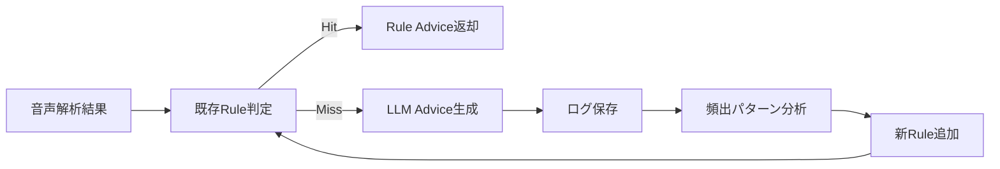

# LLMによるAdviceのRule化

# 全体像（おすすめ運用）



.png)


つまり：

- 最初はRule少ない
- MissしたものはLLMに投げる
- よく出るものを分析
- Rule化してコスト削減・速度向上・品質安定

***

# 実運用フロー（かなり現実的）

## Step1. LLM結果を全部保存する

保存項目例：

```
{
  "prompt": "three",
  "score": 78,
  "features": {
    "th": weak,
    "rhythm": ok,
    "stress": weak
  },
  "llmAdvice": "Tongue slightly forward for TH. Release air softly.",
  "timestamp": "2026-04-26"
}
```

重要なのは：

- 入力特徴量
- LLM出力文
- 最終採用されたか
- ユーザー反応（retryしたか）

***

# Step2. 集計する

例えば1000件たまったら見る。

## 頻出例

| 条件          | 出力                               |
| ----------- | -------------------------------- |
| TH weak     | Tongue slightly forward for TH.  |
| R weak      | Round lips slightly for R.       |
| Stress weak | Make the first syllable clearer. |

ここで同じ意味のものが大量に出る。

→ Rule化候補。

***

# Step3. Ruleテンプレート化する

例：

```
if thScore < 0.6 {
   return "Tongue slightly forward for TH."
}
```

または：

```
if thWeak && rhythmGood {
   return "TH first. Keep your rhythm as it is."
}
```

***

# Step4. LLM対象を減らす

初期：

- Rule 20%
- LLM 80%

成熟後：

- Rule 75%
- LLM 25%

これが理想です。

***

# Accent Fit向け Rule化優先順位

## 優先してRule化すべきもの

### 1. 日本人に頻出する音素

- R/L
- TH
- V/B
- F/H
- S/SH

### 2. ストレス

- first syllable weak
- ending weak

### 3. リズム

- monotone
- every syllable equal

***

# Rule化しない方がいいもの

## 複雑ケース

例：

- THもRも弱い
- Promptごとに違う問題
- score高いが自然さ低い

これはLLMに残す。

***

# 実装アーキテクチャ（おすすめ）

```
AdviceEngine
 ├ RuleAdviceEngine
 └ LLMAdviceEngine
```

```
func generate(input: AnalysisResult) -> String {
   if let advice = ruleEngine.match(input) {
      return advice
   }
   return llmEngine.generate(input)
}
```

***

# Rule追加の判断基準（重要）

以下3つ満たしたらRule化。

### 出現頻度高い

月100回以上

### 修正文が短く安定

毎回ほぼ同じ意味

### 再現可能

解析特徴量で判定できる

***

# LLMログ分析の自動化

毎週バッチで：

```
- advice clustering
- phrase frequency
- score pattern
- new rule suggestion
```

出力：

```
New Rule Candidates:
1. TH weak -> Tongue slightly forward for TH.
2. Stress weak -> Hit the first syllable more clearly.
```

***

# Accent Fitなら最終形はこれ

```
Rule:
高速・安い・一貫性あり

LLM:
例外対応・自然文・複合判断
```

つまり、

**Ruleが主役、LLMが補助**

これが収益性もUXも強いです。

***

# 正直に言うとMVPではこう始めるのが最強

```
初期Rule 15本
LLM fallback
毎週 Rule追加
3ヶ月でRule 80本
```

かなり現実的です。

***

# 私ならAccent Fit用に次にやること

## 「Rule候補50個（日本人英語学習者向け）」を先に作ります

するとMVPかなり強いです。

必要なら次に  
**Accent Fit向け 発音アドバイスRule 50個一覧（優先度付き）**  
作れます。
