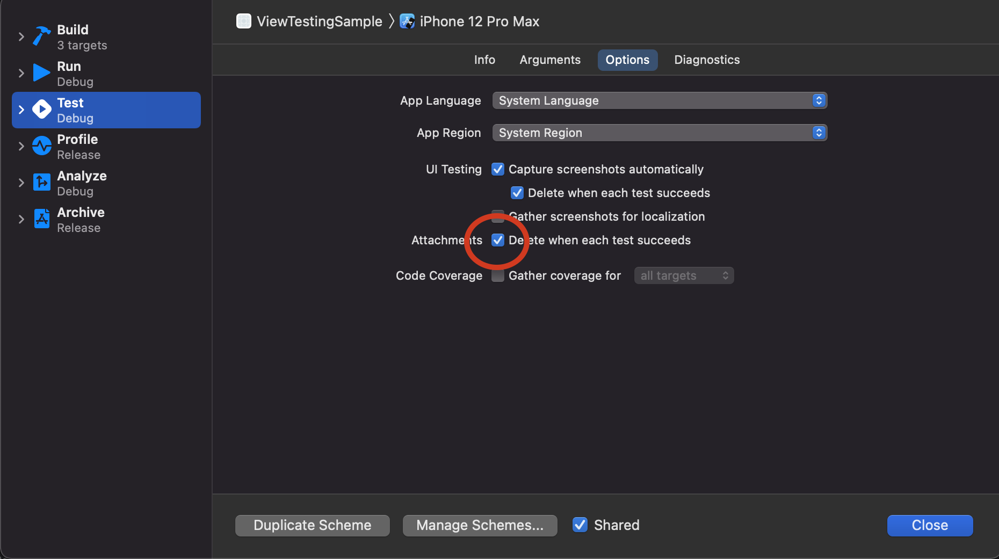

# UITest


## XCUITest

`XCUITest`は、ユーザーの代わりにターゲットアプリに対して操作を行います。
- XCUIApplication: ターゲットアプリの起動・終了
- XCUIElementQuery: ターゲットアプリで表示中の要素を特定するための問い合わせ
- XCUIElement: ターゲットアプリのUI要素
- XCUIScreenshot: スクリーンショット
- XCTAttachment: 結果などに添付する画像など


## 要素の取得

*textField*に対してテキストを入力することをテストするには
```swift
let textField = app.textFields.firstMatch
textField.tap() //focus keyboard
textField.typeText("abc")
```

TextFieldに対して、*tap*が必要。キーボードが表示される
また、キーボードを表示している場合、`app.buttons`には、キーボードに関連するボタンがいくつか入っている。
```
  ↪︎Find: Descendants matching type Button
    Output: {
      Button, {{2.9, 859.8}, {76.9, 65.5}}, label: 'Next keyboard', value: 日本語かな
      Button, {{348.2, 859.5}, {76.9, 65.5}}, identifier: 'dictation', label: 'Dictate'
      Button, {{2.0, 744.0}, {51.7, 49.0}}, identifier: 'shift', label: 'shift', Selected
      Button, {{54.7, 800.0}, {54.0, 49.0}}, label: 'Emoji'
      Button, {{320.3, 800.0}, {105.7, 49.0}}, identifier: 'Return', label: 'return'
      ...
    }
```
なので、ボタンを見つける際には気をつける。

## Accessibility Identifierの活用
`SwiftUI`では`accessibilityIdentifier`を使用する。
```swift
Button.init("Button") {

}.accessibilityIdentifier("Button")
```


## スクショの撮り方
```swift
let app = XCUIApplication()
app.launch()

.....

let screenshot: XCUIScreenshot = app.screenshot()
let attachment = XCTAttachment(screenshot: screenshot)
add(attachment)

```


## スクショを保存する
デフォルトの設定では、スクショを撮ってもテストが成功すると破棄されてしまいます。
成功した場合でもスクショを残す場合の設定を行います。

以下のメニューを選択します。
Xcodeメニュー＞Product＞Scheme＞Edit Scheme

下図の`Attachment`の項目のチェックを外します。

## 画面遷移を行う

ボタンを設置して画面遷移を行い、`Text`を表示してみます。

```swift
NavigationLink.init("Next", destination: Text("Destination"))
  .accessibilityIdentifier("Next")
```

画面遷移

```swift
app.buttons["Next"].tap()
```

## 画面遷移が完了するまで待つ

```swift
let destination = app.staticTexts["Destination"]
XCTAssert(destination.waitForExistence(timeout: 2))
```

## Cellをタップ
```swift
app.cells.element(boundBy: 0).tap()
```

## ScrollViewをスワイプとか

- swipeUp()
- swipeDown()

など

## xcresult

https://engineering.mercari.com/blog/entry/20201218-61f7110851/
深くまでは見ない。
https://github.com/KaneCheshire/xcresultviewer

Bitriseで十分かな。

## 結果をHTML表示
https://docs.fastlane.tools/getting-started/ios/screenshots/
→後で試してみる。

## TODO
* [x] ログインフォーム
* [x] セグメント
* [x] タブ
* [x] スイッチ→完全にはできていない
* [x] スワイプ
* [x] argumentsを使う


## Environment

```swift
        let app = XCUIApplication()
        app.launchArguments.append("XCUITest")
        app.launchEnvironment["login_name"] = "sample@example.com"
        app.launchEnvironment["login_pass"] = "test1234"
```

## XCUIApplicationを保持した場合
```swift
let app = XCUIApplication()
```
とした場合の挙動

## ２つのTextField
```swift
Failed to synthesize event: Neither element nor any descendant has keyboard focus.
```

これが原因かな。
https://stackoverflow.com/questions/58648283/xcuielementtypetext-fails-for-two-text-fields
https://stackoverflow.com/questions/38010494/is-it-possible-to-toggle-software-keyboard-via-the-code-in-ui-test
キーボードの`Toggle Software Keyboard`をできれば良いのかな。

https://stackoverflow.com/questions/55381560/force-software-keyboard-in-ios-simulator-for-xcuitest
https://github.com/fastlane/fastlane/issues/16083

Provide Build Setting from: `***UITests`

```
killall Simulator
defaults write com.apple.iphonesimulator ConnectHardwareKeyboard -bool false
```

## Cell内のUISwitchが操作できない

```swift
struct SwitchView: View {
    
    @State private var isOn1: Bool = false
    @State private var isOn2: Bool = false

    var body: some View {
        
//        VStack {
//            Toggle("Switch 1", isOn: $isOn1)
//            Toggle("Switch 2", isOn: $isOn2)
//        }
        List {
            Toggle("Switch 1", isOn: $isOn1)
            Toggle("Switch 2", isOn: $isOn2)
        }
        
    }
}
```

### 聞いてみる

Can not toggle UISwitch in cell through XCUITest

I'm implementing XCUITest with some UI elements.
I found that UISwitch can not be toggle when it placed in table cell.

Here is my code:

### SwiftUI
```swift
import SwiftUI

struct SwitchView: View {
    
    @State private var isOn1: Bool = false
    @State private var isOn2: Bool = false

    var body: some View {
        
        //success
//        VStack {
//            Toggle("Switch 1", isOn: $isOn1)
//            Toggle("Switch 2", isOn: $isOn2)
//        }.padding()
        
        //failed
        List {
            Toggle("Switch 1", isOn: $isOn1)
            Toggle("Switch 2", isOn: $isOn2)
        }
        
    }
}
```

### XCUITest
```swift
    func testSwitch() throws {
        
        app.launch()
                
        app.switches.element(boundBy: 0).tap()

        sleep(2)
        
        app.switches.element(boundBy: 1).tap()
        
        sleep(2)

    }
```

### What's happen

In SwiftUI code, 
- UISwitch without Table(List) : No problem
- UISwitch with Table(List) : No toggle animation


### Sample Code
https://github.com/usk-sample/ViewTestingSample