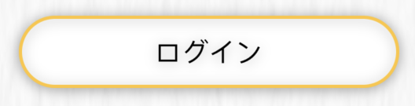
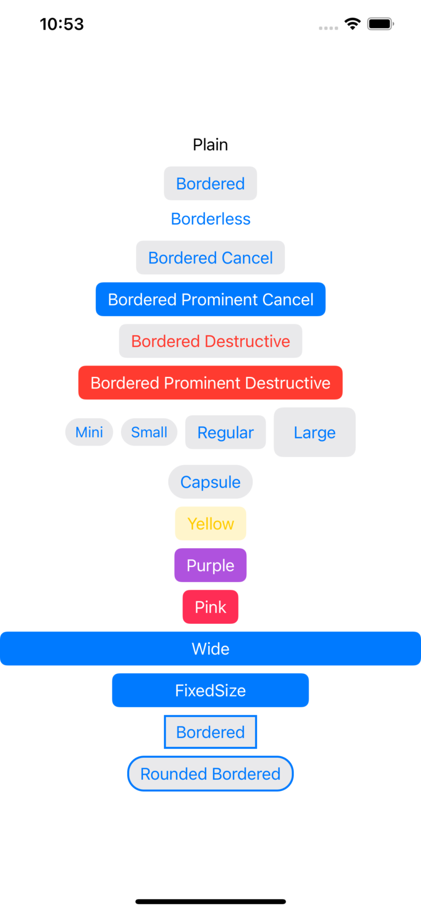

# Button Border


[ios - Button border with corner radius in Swift UI - Stack Overflow](https://stackoverflow.com/questions/58928774/button-border-with-corner-radius-in-swift-ui)

[ButtonBorderShape | Apple Developer Documentation](https://developer.apple.com/documentation/swiftui/buttonbordershape)

- 角丸
- ボーダー
- 中身とボーダーの色が違う
- 

上記のボタンを作るときは


```swift
  Button("ログイン", action: { })
            .frame(width: 240, height: 44)
            .foregroundColor(.black)
            .overlay(
                RoundedRectangle(cornerRadius: 22)
                    .stroke(Color.orange, lineWidth: 2)
            )
            .background(RoundedRectangle(cornerRadius: 22).foregroundColor(.white))
            .shadow(radius: 4, x: 0, y: 1)
```

- 高さは固定したほうが良い
- overlayで角丸の囲い線（オレンジ）
- backgroundで背景の白（角丸）
- shadowでドロップシャドウ
- ViewModifierでまとめておいた方が良い

他の実現方法
[How to draw a border around a view - a free SwiftUI by Example tutorial](https://www.hackingwithswift.com/quick-start/swiftui/how-to-draw-a-border-around-a-view)


[SwiftUI 3.0 で追加されたButtonの引数やプロパティを色々試してみた – .NET ゆる〜りワーク](https://www.yururiwork.net/archives/1845)

一通りの形状がある

