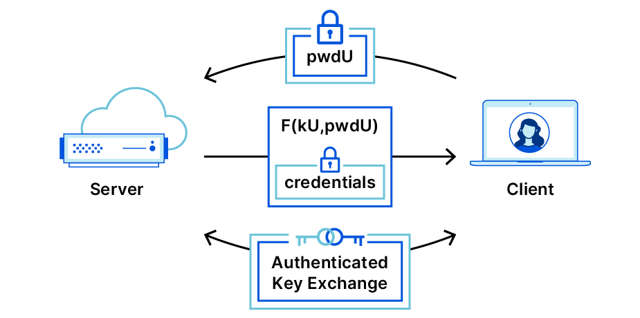

# PAKE encryption

[Password-authenticated key agreement - Wikipedia](https://en.wikipedia.org/wiki/Password-authenticated_key_agreement)
[産総研 RISEC: パスワード認証に関する研究](https://www.risec.aist.go.jp/project/PAKE-ja.html)

[OPAQUE: The Best Passwords Never Leave your Device](https://blog.cloudflare.com/opaque-oblivious-passwords/)

