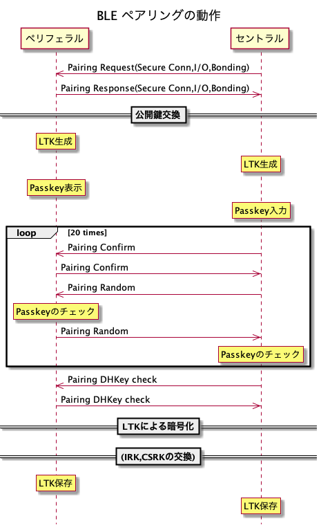

# BLEペアリング

[Bluetooth Low Energyのペアリングとボンディングについて - フィールドデザイン](https://fielddesign.jp/technology/ble/blespec_pairing/)

- ペアリング: セントラル-ペリフェラルで暗号化の鍵の交換をすること
- ボンディング: ペアリングで交換した鍵を保存すること

ペアリング方法
- LE Legacy Pairing: Bluetooth 4.0以下
- LE Secure Conenctions: Bluetooth 4.2以上
  - 公開鍵暗号方針

* Passkey Entry: ６桁の数字を入力するか、表示をするか
* Out of Band(OOB): NFC等の他の手段でPasskeyに相当するデータを交換する
* Numeric Comparison: 毎回ランダムな数字を双方で表示し、同じであればそれぞれボタンを押す

[Use same LTK for peripheral and central and avoid pairing twice? IOS/Android - Bluetooth forum - Bluetooth®︎ - TI E2E support forums](https://e2e.ti.com/support/wireless-connectivity/bluetooth-group/bluetooth/f/bluetooth-forum/456314/use-same-ltk-for-peripheral-and-central-and-avoid-pairing-twice-ios-android)
→Peripheral次第では、２系統目もできる。iOS側ではどうするのか？

[Bluetooth low energy Security Fundamentals](https://dev.ti.com/tirex/explore/content/simplelink_academy_cc13xx_cc26xxsdk_6_40_00_00/modules/ble5stack/ble_02_security/ble_02_sec_funds.html)

### ペアリング時の挙動

[Peripheral Connection Options | Apple Developer Documentation](https://developer.apple.com/documentation/corebluetooth/cbcentralmanager/peripheral_connection_options)
オプションがいくつかあるが、セキュリティ関係の設定ができない

[ios - BLE send passkey programmatically - Stack Overflow](https://stackoverflow.com/questions/23603083/ble-send-passkey-programmatically)
セキュリティ関係のPasskeyなどは、OSで設定されている。

### L2CAP

[CBL2CAPChannel | Apple Developer Documentation](https://developer.apple.com/documentation/corebluetooth/cbl2capchannel)
このストリームも使えるが、ペアリングとは関係ない。

