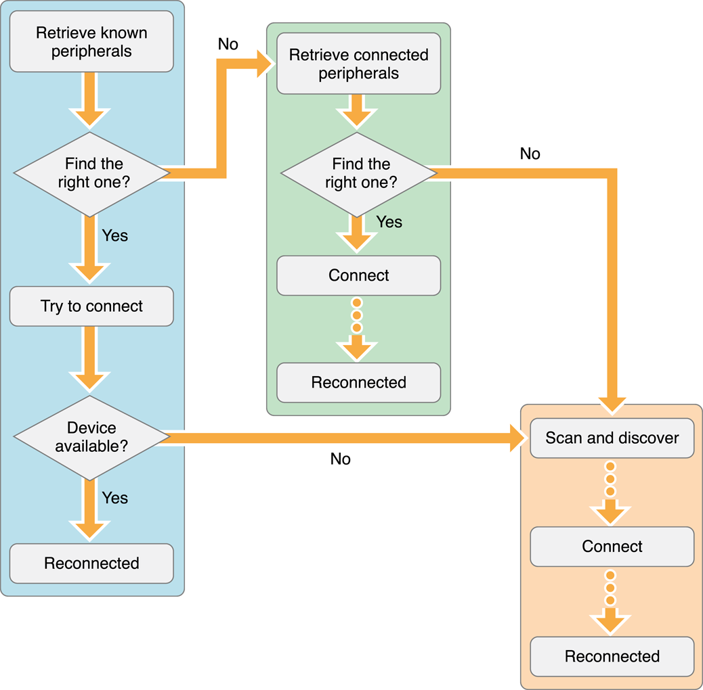

# Bluetoothの基礎知識

[ESP32・BLE通信「基礎知識」](http://marchan.e5.valueserver.jp/cabin/comp/jbox/arc212/doc21201.html)

- indicate: サーバがクライアントにcharacteristicの変更を検知できる
  - クライアントからのレスポンスを要求する

[Swift – Bluetooth Low Energy – how to get paired devices?](https://wojciechkulik.pl/ios/swift-bluetooth-low-energy-how-to-get-paired-devices)

全体的なフロー

[ios - How to reconnect BLE device in background after turn off and then turn on? - Stack Overflow](https://stackoverflow.com/questions/19091643/how-to-reconnect-ble-device-in-background-after-turn-off-and-then-turn-on)

→`BLE turn on/off`で行う場合
