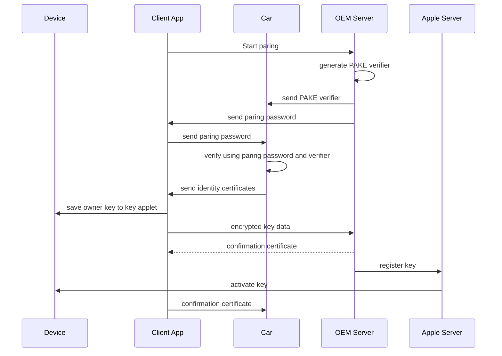
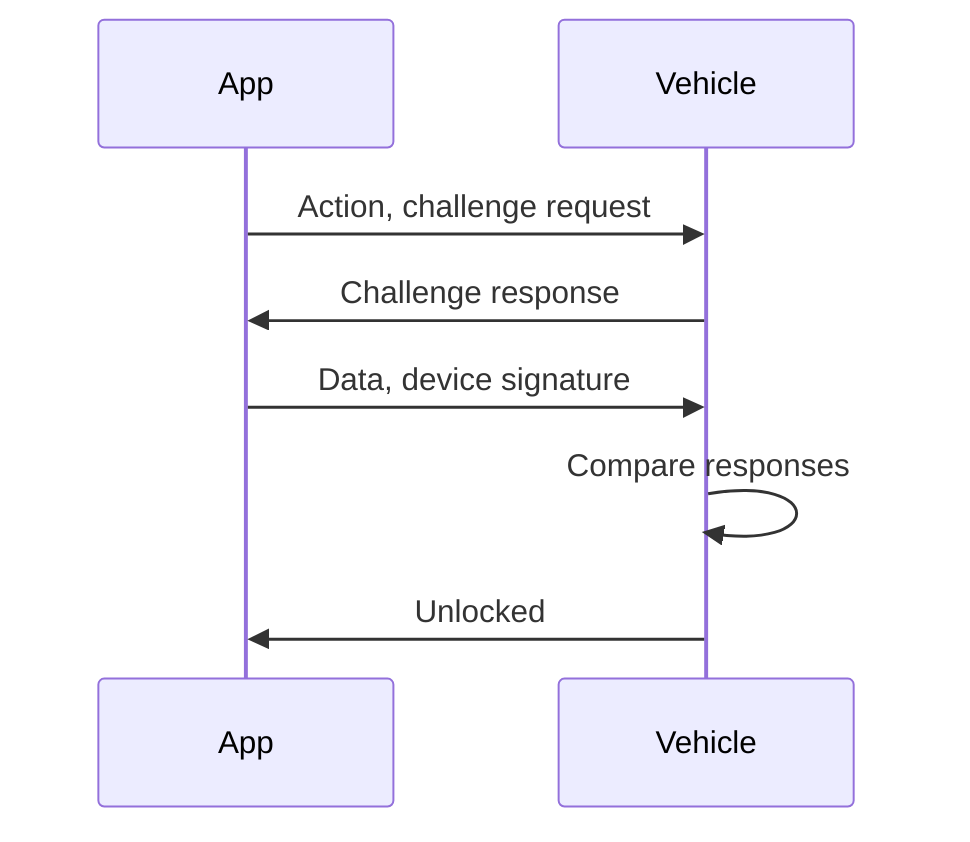

# Apple CarKey


[iPhone や Apple Watch の Apple ウォレットに車のキーを追加する - Apple サポート (日本)](https://support.apple.com/ja-jp/HT211234)
[CarKey | Apple Developer Documentation](https://developer.apple.com/documentation/CarKey)

[AppleのCar Key Testsアプリが公開。デジタルキー対応車種増の印か - iPhone Mania](https://iphone-mania.jp/news-525162/)

-> iOSについてはEntitlementがないとtestもできなさそう

Car Key frameworkに加え、PasKitでもCarKeyに関連する機能がある
https://developer.apple.com/documentation/passkit/pkaddcarkeypassconfiguration

テストアプリがあるみたい。
[AppleのCar Key Testsアプリが公開。デジタルキー対応車種増の印か - iPhone Mania](https://iphone-mania.jp/news-525162/)

Androidはpublicな情報がなさそう
[自動車用デジタルキーを設定または管理する - Android ヘルプ](https://support.google.com/android/answer/12060041?hl=ja)
[自動車用デジタルキーの概要  |  アクセス  |  Google for Developers](https://developers.google.com/wallet/access/digital-car-key/overview)

他の会社
[デジタルキー | トヨタ自動車WEBサイト](https://toyota.jp/digital_key/)
[BMWデジタル・キー | BMW.co.jp](https://www.bmw.co.jp/ja/topics/offers-and-services/bmw-digital-services-and-connectivity/digital-key.html)
[Googleのスマホによる「デジタルキー」、BMW以外のブランドにも拡大へ…CES 2023 | レスポンス（Response.jp）](https://response.jp/article/2023/01/10/366101.html)


WWDC資料
https://developer.apple.com/videos/play/wwdc2020/10006/
- Car Key: unlock/lock, startが可能
- iPhoneとApple Watchで利用が可能
- セキュアエレメントに保存される
- iCloudを介して削除ができる
- 友人とのシェア
- 遠隔操作
- NFC
  - 
- power reserve?
- OEMが知るべき3つの機能
  - Owner Paring
    - NFCを使う
    - ペアリングはOEM Appの方が良い→Walletでもできるということ？
  - Transactions: unlock/lock, startなど
  - Server interfaces


### Owner pairing
1. Prove ownership of car
- 証明することはOEMの仕事。OEMが要件を定義
3. Initiate pairing
- OEM Appを使うことが簡単。OEMアプリから車に開始トリガーを送る。
  - Waiting状態にするにはどうするか。相手はIVIか。→Key fob or IVI
- 車にペアリング開始のリンクを含むメールを送ることもできる
4. Place iPhone near car's NFC reader
- ダッシュボードのNFCリーダーに置く
  - フォールバックとして、車内からオーナーのペアリングを開始することも
  - 手動でペアリングパスコードの入力が可能
→ Walletに表示される

### Transactions
- ドアハンドルとダッシュボードにNFCが必須
- ドアハンドルに近づけると開く
- エクスプレスモードがデフォルトでON
  - ユーザーはオフにすることもできる
  - その場合、それぞれの操作で認証(Face ID, パスコード)が必要になる。
- オフラインで動作
  - 車側で操作履歴を取ってBackendにアップロードしている？

## Server interfaces
幾つかの機能はサーバとの通信が必要
### Key sharing
- Messagesを通してキーシェアできる
- アクセスレベルの設定が可能
  - 設定はOEM次第

### Key Management
- オーナーは、iPhone/Carからキー(シェア含む)の管理ができる
- iCloudの機能で紛失モードにしたり、遠隔でカード（キー）を削除できる
- デバイスを簡単に変えることができる
  - ペアリングは必要

## System architecture
- コア機能はペアリング・共有・廃止
- キー共有にOEM Appは必要ない

### Owner pairing flow



1. (OEM Server)generate PAKE Verifier and send to car: when car production or via cloud
2. (OEM Server)send pairing password to client
3. (Client)paring with car using paring password
4. (Car)create channel with Client using paring password and verifier
5. (Car)identity certificates to client's device.
6. (Client)save owner key to key applet(SE: secure element)
7. (Client)send encrypted key data to OEM Server, receive confirmation certificate
8. (OEM Server)register key to Apple Server
9. (Apple Server)activate key in device, it appears to Wallet app
10. (Client)To enable key, device sends confirmation certificate to car via NFC.

- OEMサーバに対して、開始トリガーが必要かどうか
- 


Walletを使う時
[Wallet | Apple Developer Documentation](https://developer.apple.com/documentation/passkit/wallet)

ここら辺のクラスを使いそう
[PKAddCarKeyPassConfiguration | Apple Developer Documentation](https://developer.apple.com/documentation/passkit/pkaddcarkeypassconfiguration)

- Apple Watchでも使えるの？→使えそう

- Key fobが必要か？IVIの操作が必要か？
  - →Makerによる


## WWDC2021
https://developer.apple.com/videos/play/wwdc2021/10084

### main new features
- passive entry
- remote keyless entry controls
- personalized settings


### Technology
- UWB
  - 車のキーの正確な位置
  - リプレイリレーアタックに対応
- セキュアエレメント
  - 車のキー
  - クレデンシャル
  - UWBレンジキーのためのセッション
- BLE
  - セキュアレンジセッションのデータ交換と管理
  - セキュアレンジタイムグリッド初期化のアンカーポイント
- CCC
  - クロスプラットフォームでの標準化


### Secure and private
- session-based keys
- link layer encryption
- UWB and BLE identifiers randomized
  - セッションキーのランダム識別子を使用
- Secure ranging→UWB
  - Scrumble Time Stamp
  - 3way: iPhone - Car - iPhone - Car
  - 暗号化・タイムバウンド
- Zones
  - Welcome features: 少し離れたところ
  - Control Area: すぐ近く。出たり入ったり。
- Steps
  - BLEでユーザー接近を検知
  - 車がデバイスを認証（？）し、レンジングキーが引き出される
    - セッション毎のキー
  - UWBトランシーバーで距離・方向・軌道を測定する
  - 車内にいれば、エンジンスタートが可能
  - 低電力モードでも可能（Express Cardのように？）
- Remote keyless entry controls
  - Handsfree
  - Wallettからでもできる
  - 車の情報を確認できる
  - BLE base
  - Control Flow



- Personalized Settings
  - Keyによりユーザーを判定

- System Architecture
  - BLE/UWBの位置や性能
- System Latency
  - キーの管理のための暗号化Processor
  - ECUとUWB/BLEを結ぶBusもLow latency
  - Software Architecutre
- Time Sync
  - Slotを狭めることで、セキュリティを確保
  - 自国同期が重要
- Transceiver sync
  - １つ接続したUWBがあれば、その情報を他のUWBにも共有する
- Localization algorithm: 局所化アルゴリズム
  - ECU内


### キーの削除

```swift
import PassKit

func removeDigitalKey(identifier: String) {
    let passLibrary = PKPassLibrary()
    let passes = passLibrary.passes(of: .key) // デジタルキーのリストを取得

    if let passToRemove = passes.first(where: { $0.serialNumber == identifier }) {
        passLibrary.removePass(passToRemove)
        print("デジタルキーが削除されました。")
    } else {
        print("指定されたデジタルキーが見つかりません。")
    }
}
```