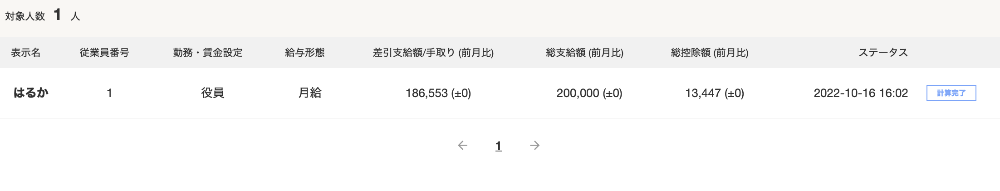

# 人事労務

[役員を登録する（役員の情報を編集する](https://support.freee.co.jp/hc/ja/articles/360000639683-%E5%BD%B9%E5%93%A1%E3%82%92%E7%99%BB%E9%8C%B2%E3%81%99%E3%82%8B-%E5%BD%B9%E5%93%A1%E3%81%AE%E6%83%85%E5%A0%B1%E3%82%92%E7%B7%A8%E9%9B%86%E3%81%99%E3%82%8B-)

[給与明細・賞与明細の合計金額について](https://support.freee.co.jp/hc/ja/articles/206138650)
[給与・役員報酬の支払いを記帳する](https://support.freee.co.jp/hc/ja/articles/202847360)

[給与明細の確定時にfreee会計に登録される取引](https://support.freee.co.jp/hc/ja/articles/202849620)

[給与明細の確定時にfreee会計に登録される取引](https://support.freee.co.jp/hc/ja/articles/202849620-%E7%B5%A6%E4%B8%8E%E6%98%8E%E7%B4%B0%E3%81%AE%E7%A2%BA%E5%AE%9A%E6%99%82%E3%81%ABfreee%E4%BC%9A%E8%A8%88%E3%81%AB%E7%99%BB%E9%8C%B2%E3%81%95%E3%82%8C%E3%82%8B%E5%8F%96%E5%BC%95)
[給与明細の取引をfreee会計で決済する](https://support.freee.co.jp/hc/ja/articles/203072054)

給与は20万として登録している→支払額総額
給与の支払いの方法が間違っているのではないか

基本的な項目を調べる
月々払っている厚生年金料金の内訳を確認する
会社はどこに払うか調べる